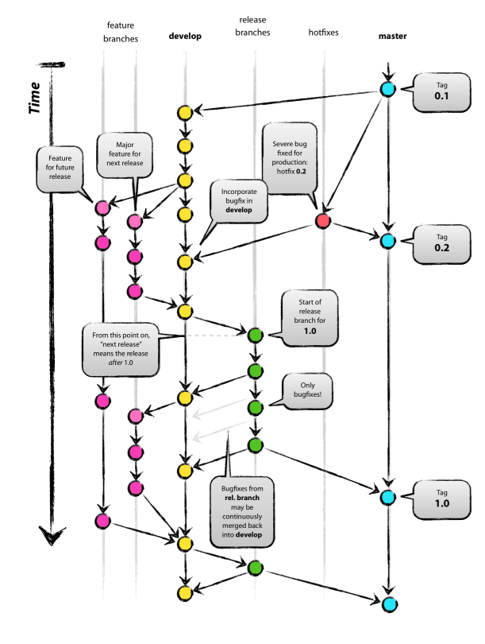

Git 最大的优点同时也是它的最大的缺点：极具灵活性。这种灵活抬高了初学者的学习门槛。为此，有经验的程序员和大型机构结合软件开发的流程为 git 总结-提炼出了固定的使用方式，这中特定的使用顺序和方法被称为 **工作流** 。

最早诞生，并被广泛认可和使用的的工作流是荷兰程序员 Vincent Driessen 于 2010 年在其博客《A successful Git branching model》中提出的 **Git Flow**，这也是第一次出现 Git 工作流的概念。



git-flow 的分支策略引入了 **中央集权型管理系统** 的长处来整合分布式开发的优点，进而结合双方的优点。<small>毕竟当年是 2010 年，Subversion 是主流，程序员仍普遍认为必须要有一个中央仓库。</small>

git-flow 提议以固定的模式在中央代码库中建立 **两个主分支（长存分支）**，在各个开发人员的代码库中建立 **三个辅助分支（临时分支）**。

三个辅助分支都是短期分支，一旦完成就会被合并进 develop 或 master 分支，然后被删除。相对应的是，两个主分支是长期分支，一直都存在。

- 主分支/长存分支

  - **Master 分支**：为发布而建的分支。每次发布时都打上标签。

  - **Develop 分支**：开发用的分支。发布之前的最新版本。

- 辅助分支/临时分支

  - **feature 分支**：从 Develop 分支中分离出来，用于开发特定功能的分支。功能开发结束后被合并到 Develop 分支。

  - **release 分支**：从 Develop 分支中分离出来，为发布作准备的分支（即，测试分支）。该分支不能再添加新功能，只有bug修复。测试结束后被合并到 Master 和 Develop 分支。

  - **hotfix 分支**：主要在发布后的产品发生故障时紧急建立的分支。直接从 Master 分离，bug 修正后再合并到 Master 并打上标签。于此同时，它还要合并到 Develop 分支 和 release 分支。

1. 从 `develop-分支` 创建 `feature-分支`，进行日常编码工作。
2. `feature-分支`的编码结束后，与 `develop-分支` 进行合并。
3. 重复上述 1 和 2 ，不断实现功能直至准备发布。
4. 创建 `release-分支`，进行发布前的各项工作（例如，测试和Bug修正）
5. 测试及debug工作完成后，`release-分支` 与 `master-分支` 合并，打上版本标签（Tag）进行发布上线（即，代表软件发布了一个新的版本）。另外，`release-分支` 还需要和 `develop-分支` 合并。
6. 如果软件的线上版本出现 Bug，以打了标签的 `master-分支` 的版本为基础，创建 `hotfix-分支` 进行 debug，debug 结束后合并至master分支和develop分支。

git-flow 的优点在于非常清晰易懂，按照其规则，管理起来十分简单。但是，它的问题在于有些复杂，

- 需要记忆的内容较多，在实施之前需要对整个流程进行系统地学习。
- 程序员必须理解自己正在进行的修改会对那些分支造成影响，
- 一个分支的工作结束后，有时需要与多个目标分支合并。
- git-flow 提供的 git-flow 脚本可以简化对 git-flow 的使用，但是使用 GUI 工具的情况下，有些工具无法支持 git-flow 脚本。


## 1. 主要分支介绍

- <small>长存分支：</small>**master 分支**

  主分支，产品的功能全部实现后，最终在 master 分支对外发布。

- <small>长存分支</small>：**develop 分支**

  开发分支，基于 master 分支克隆，产品的编码工作在此分支进行。

- <small>临时分支</small>：**feature 分支**
  
  功能特征分支，基于 develop 分支克隆，主要用于多人协助开发场景或探索性功能验证场景，功能开发完毕后合并到develop 分支。feature 分支可创建多个，属于临时分支，目的实现后可删除分支。

- <small>临时分支</small>：**release 分支**
  
  测试分支，基于 delevop 分支克隆，产品编码工作完成后，发布到本分支测试，测试过程中发现的小 bug 直接在本分支进行修复，修复完成后合并到 develop 分支。本分支属于临时分支，目的实现后可删除分支。

- <small>临时分支</small>：**bugfix 分支**

  Bug 修复分支，基于 master 分支或发布的里程碑Tag克隆，主要用于修复对外发布的分支，收到客户的Bug反馈后，在此分支进行修复，修复完毕后分别合并到develop分支和master分支。本分支属于临时分支，目的实现后可删除分支。


## 2. 新功能开发工作流

- step 1. **切换到本地仓库工作区**

  ```shell
  cd /home/xxx/workspace
  ```

- step 2. **从远程仓库克隆代码到本地**

  ```shell
  git clone https://xxxx@localhost:8443/r/valve/V5-Lora.git
  ```

- step 3. **基于 master，创建 develop**

  - 3.1. 切换到 master 分支  

    ```
    git checkout master
    ``` 

  - 3.2. 基于 master 克隆 develop 并跳转 

    ```shell
    git checkout -b develop
    ```

  - 3.3. 推送 develop 到远端 

    ```shell
    git push origin develop
    ```

- step 4. **在本地仓库的开发流程**

  完成一个功能点或者一天的工作结束时，将代码提交到本地仓库

  ```shell
  # 提交修改到缓冲区
  git add .
  
  # 提交修改到本地仓库
  git commit -m "Bug#123,456 修改说明"
  git commit -m "Task#654,321 任务说明"

  # 每完成一个功能点可以对代码进行打包
  git tag -m "简要说明增加/修复/删除了什么功能" v0.0.0.170718
  ```

  > 注：<small>不是每一个 Tag 都需要提交到远程仓库，比如可以在完成一个功能点的编码工作后未编译就打一个包，仅存储于本地仓库，在编译成功&测试通过后，再打一个新的 Tag 包（里程碑  Tag 包），仅将里程碑 Tag 包推送到远程仓库</small>

- step 5. **推送代码到远程仓库**

  当完成一个功能点或阶段工作时，将代码推送到远程仓库 develop 分支

  ```shell
  git pull                # 执行代码拉取操作，防止代码冲突
  git push origin develop # 解决代码冲突后，推送代码到远程仓库
  ```
    
  注：<small>禁止将未编译或编译不通过的代码提交到远程仓库，如果编码工作进行未完成可以提交到本地仓库中，等待该功能点全部实现后再将代码推送到远程仓库中。</small>

- step 6. **将代码发布到测试分支**

  阶段性的开发工作已完成，启动小批量测试工作，将代码发布到测试分支release

  ```shell
  git checkout develop
  git checkout -b release
  git push origin release
  ```

- step 7. **测试工程师提交 Bug 后修复**

  修复流程同开发流程。

  注意在 `git commit` 时的修复说明中添加 *Bug#BugID* 关键字

  完成一个 Bug 修复或完成阶段性工作后，将代码推送到远程分支


- step 8. **测试工作完成后，合并代码到 develop 分支**

  ```shell
  git checkout develop    # 切换到 develop 分支 
  git merge release       # 执行合并操作,将 release 分支代码合并到 develop 分支 
    
  # 如果合并报错，则解决冲突，冲突解决后继续再次执行合并 
  ```

- step 9. **开发工作和测试工作都完毕后，将 develop 分支合并到主线**

  ```shell
  git checkout master
  git merge develop
  ```

- step 10. **阶段开发完毕，打一个里程碑 Tag 包**

  ```shell
  # 创建里程碑Tag */
  git tag -m "Task#003 v1.0.0 首版发布" v1.0.0.170718     

  # 推送里程碑Tag到远程仓库 */
  git push origin v1.0.0.170718
  ```

## 3. 发布后的产品 Bug 修复工作流

- step 1. **获取 Bug 产品的软件发布版本号**

- step 2. **查找里程碑 Tag**

  ```shell
  # 查询里程碑及其提交说明
  git tag -n1 -l v*   
  ```

- step 3. **基于里程碑 Tag 创建分支**

  ```shell
  # git checkout -b [创建的分支名称] [里程碑Tag名称]
  git checkout -b bugfix-v1.0.0.170718 v1.0.0.170718
  ```

- step 4. **修复代码后可以查询修改过的地方**

  ```shell
  git diff
  ```

- step 5. **修复完毕后分别合并到 develop 分支和 master 分支**

  ```shell
  # 合并到 develop
  git checkout develop
  git merge hotfix-v1.0.0.170718
    
  # 提交到远程仓库 develop 分支
  git push origin develop
    
  # 合并到 master
  git checkout master
  git merge hotfix-v1.0.0.170718
    
  # 提交到远程仓库 master 分支 
  git push origin master
  ```

- step 6. **创建新的里程碑 Tag**

  ```shell
  git tag -m "Bug#002 修复某某Bug" v1.0.1.170719
    
  /* 推送到远程仓库 */
  git push origin v1.0.1.170719
  ``` 

- step 7. **删除 bugfix 分支**

  ```shell
  # 删除本地分支-git branch -d [本地分支名]
  git branch -d bugfix-v1.0.0.170718
    
  # 删除远程分支-git push origin :[远程分支名] 
  git push origin :bugfix-v1.0.0.170718
  ``` 

