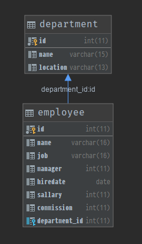

<span class="title">素材 1</span>


```sql
DROP DATABASE IF EXISTS scott;
CREATE DATABASE scott DEFAULT CHARACTER SET utf8mb4;
USE scott;
```

```sql
set foreign_key_checks = off;

DROP TABLE IF EXISTS department;
CREATE TABLE department
(
  id        INT  AUTO_INCREMENT COMMENT '部门ID',
  name      VARCHAR(15)         COMMENT '部门名称',
  location  VARCHAR(13)         COMMENT '部门所在地',
  PRIMARY KEY (id)
) ENGINE = InnoDB
  DEFAULT CHARSET = utf8mb4
  COMMENT '部门信息表'; 

DROP TABLE IF EXISTS employee;
CREATE TABLE employee
(
  `id`            INT AUTO_INCREMENT COMMENT '员工ID',
  `name`          VARCHAR(16)        COMMENT '员工姓名',
  `job`           VARCHAR(16)        COMMENT '员工岗位名称',
  `manager_id`    INT                COMMENT '员工上级领导编号',
  `hiredate`      DATE               COMMENT '入职日期',
  `sallary`       INT                COMMENT '工资',
  `commission`    INT                COMMENT '佣金/奖金',
  `department_id` INT                COMMENT '所属部门编号',
  PRIMARY KEY (id)
) ENGINE = InnoDB
  DEFAULT CHARSET = utf8mb4
  COMMENT '雇员信息表'; 

# ALTER TABLE employee DROP FOREIGN KEY fk_employee_department_id
ALTER TABLE employee 
    ADD CONSTRAINT fk_employee_department_id 
    FOREIGN KEY employee(department_id) 
    REFERENCES department(id);

INSERT INTO department VALUES 
    (1, 'ACCOUNTING', 'NEW YORK'),
    (2, 'RESEARCH', 'DALLAS'),
    (3, 'SALES', 'CHICAGO'),
    (4, 'OPERATIONS', 'BOSTON');

INSERT INTO employee VALUES 
    (1, 'SMITH', 'CLERK', 7902, '1980-12-17', 800, NULL, 2),
    (2, 'ALLEN', 'SALESMAN', 6, '1981-02-20', 1600, 300, 3),
    (3, 'WARD', 'SALESMAN', 6, '1981-02-22', 1250, 500, 3),
    (4, 'JONES', 'MANAGER', 9, '1981-04-02', 2975, NULL, 2),
    (5, 'MARTIN', 'SALESMAN', 6, '1981-09-28', 1250, 1400, 3),
    (6, 'BLAKE', 'MANAGER', 9, '1981-05-01', 2850, NULL, 3),
    (7, 'CLARK', 'MANAGER', 9, '1981-06-09', 2450, NULL, 1),
    (8, 'SCOTT', 'ANALYST', 4, '1987-07-13', 3000, NULL, 2),
    (9, 'KING', 'PRESIDENT', NULL, '1981-11-17', 5000, NULL, 1),
    (10, 'TURNER', 'SALESMAN', 6, '1981-09-08', 1500, NULL, 3),
    (11, 'ADAMS', 'CLERK', 8, '1987-07-13', 1100, NULL, 2),
    (12, 'JAMES', 'CLERK', 6, '1981-12-03', 950, NULL, 3),
    (13, 'FORD', 'ANALYST', 4, '1981-12-03', 3000, NULL, 2),
    (14, 'MILLER', 'CLERK', 7, '1982-01-23', 1300, NULL, 1);

set foreign_key_checks = on;
```

