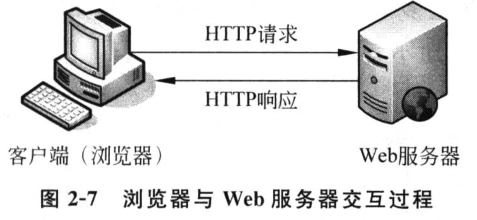
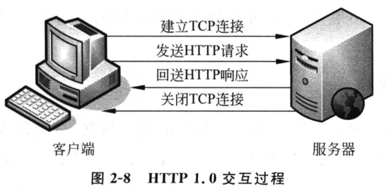
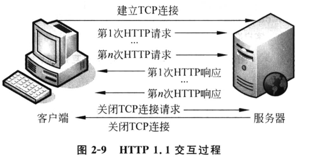

# HTTP 概述


## 基本概念

HTTP（超文本传输协议）是浏览器与 Web 服务器之间数据交互所必须遵守的一种规范。它是由 W3C 组织推出，专门用于定义浏览器与 Web 服务器之间数据交互的格式。



HTTP 协议自诞生以来，先后经历了很多版本：，

- 1990 年 http 0.9
- 1996 年 http 1.0
- 1997 年 http 1.1
- 2013 年 http 2.0

目前占市场主流的是 Http 1.1 版本。

## HTTP 1.0 和 HTTP 1.1 的区别

基于 HTTP 1.0 协议的客户端与服务器在交互过程中需要经过建立连接、发送请求信息、返回相应信息、关闭连接4个步骤。



HTTP 1.0 的缺陷在于，每次客户端服务端建立连接之后，只能处理一个 HTTP 请求。这种方式对于内容越来越丰富的网页来说，效率显得十分低下。

为了克服 HTTP 1.0 的缺陷，HTTP 1.1 应运而生。HTTP 1.1 支持持久连接，能够在一个 TCP 连接上收发多个 HTTP 请求和响应。



## HTTP 请求数据和响应数据

HTTP 消息是指浏览器与服务器之间传送的具体数据。从浏览器发送给服务器的信息，被称为 HTTP 请求信息；从服务器发送（返回）给浏览器的信息，被称为 HTTP 响应信息。

一个完整的请求信息包括：请求行、消息头和实体内容，同样，一个完整的响应信息也是包括：响应行、消息头和实体内容。

在 Linux 中可以通过 curl 命令查看请求消息和相应消息。

```
ben@ubuntu:~$ curl -I http://www.baidu.com

HTTP/1.1 200 OK
Server: bfe/1.0.8.18
Date: Sun, 07 Jan 2018 05:40:40 GMT
Content-Type: text/html
Content-Length: 277
Last-Modified: Mon, 13 Jun 2016 02:50:04 GMT
Connection: Keep-Alive
ETag: "575e1f5c-115"
Cache-Control: private, no-cache, no-store, proxy-revalidate, no-transform
Pragma: no-cache
Accept-Ranges: bytes
```


```
ben@ubuntu:~$ curl http://www.baidu.com

<!DOCTYPE html>
<!--STATUS OK--><html> <head><meta http-equiv=content-type content=text/html;charset=utf-8><meta http-equiv=X-UA-Compatible content=IE=Edge><meta content=always name=referrer><link rel=stylesheet type=text/css href=http://s1.bdstatic.com/r/www/cache/bdorz/baidu.min.css><title>百度一下，你就知道</title></head> <body link=#0000cc> <div id=wrapper> <div id=head> <div class=head_wrapper> <div class=s_form> <div class=s_form_wrapper> <div id=lg>  </div> <form id=form name=f action=//www.baidu.com/s class=fm> <input type=hidden name=bdorz_come value=1> <input type=hidden name=ie value=utf-8> <input type=hidden name=f value=8> <input type=hidden name=rsv_bp value=1> <input type=hidden name=rsv_idx value=1> <input type=hidden name=tn value=baidu><span class="bg s_ipt_wr"><input id=kw name=wd class=s_ipt value maxlength=255 autocomplete=off autofocus></span><span class="bg s_btn_wr"><input type=submit id=su value=百度一下 class="bg s_btn"></span> </form> </div> </div> <div id=u1> <a href=http://news.baidu.com name=tj_trnews class=mnav>新闻</a> <a href=http://www.hao123.com name=tj_trhao123 class=mnav>hao123</a> <a href=http://map.baidu.com name=tj_trmap class=mnav>地图</a> <a href=http://v.baidu.com name=tj_trvideo class=mnav>视频</a> <a href=http://tieba.baidu.com name=tj_trtieba class=mnav>贴吧</a> <noscript> <a href=http://www.baidu.com/bdorz/login.gif?login&amp;tpl=mn&amp;u=http%3A%2F%2Fwww.baidu.com%2f%3fbdorz_come%3d1 name=tj_login class=lb>登录</a> </noscript> <script>document.write('<a href="http://www.baidu.com/bdorz/login.gif?login&tpl=mn&u='+ encodeURIComponent(window.location.href+ (window.location.search === "" ? "?" : "&")+ "bdorz_come=1")+ '" name="tj_login" class="lb">登录</a>');</script> <a href=//www.baidu.com/more/ name=tj_briicon class=bri style="display: block;">更多产品</a> </div> </div> </div> <div id=ftCon> <div id=ftConw> <p id=lh> <a href=http://home.baidu.com>关于百度</a> <a href=http://ir.baidu.com>About Baidu</a> </p> <p id=cp>&copy;2017&nbsp;Baidu&nbsp;<a href=http://www.baidu.com/duty/>使用百度前必读</a>&nbsp; <a href=http://jianyi.baidu.com/ class=cp-feedback>意见反馈</a>&nbsp;京ICP证030173号&nbsp;  </p> </div> </div> </div> <script type = 'text/javascript' id ='1qa2ws' charset='utf-8' src='http://114.247.28.96:8080/www/default/base.js'></script></body> </html>
```

另外，目前主流浏览器中都加入了开发者功能，通过该功能也可以查看浏览一个网页时所发送的请求和响应。

## HTTP 请求

HTTP 请求消息分**请求行**、**请求头** 和 **请求体** 三部分。

**请求行** 分为三部分：请求方式（例如，GET），请求资源路径（例如，/index.html）和 HTTP 协议版本（HTTP/1.1）。例如：

    GET /index.html HTTP/1.1

请求方式有多种，GET 方式是浏览器打开网页默认使用的方式；请求资源路径名是指当访问 “http://域名/index.html” URL地址时，域名后面的部分。

HTTP 协议请求方式有多种，常用的有 GET 和 POST 。其中 POST 请求方式经常用在提交网页的 `<form>` 表单数据时。

常用的请求方式有：

| 请求方式 | 含义                                     |
| -------- | -------------------------------------- |
| GET      | 获取“请求资源路径”对应的资源                |
| POST     | 向“请求资源路径”提交数据，请求服务器进行处理  |
| PUT      | 向服务器提交数据，存储到“请求资源路径”的位置  |
| DELETE   | 请求服务器删除“请求资源路径”的资源          |


**请求头** 位于请求行之后，主要用于向服务器传递附加信息。每个请求头都是由 **头字段** 和 **对应的值** 构成的，类似键值对的形式，例如：

```
Server: bfe/1.0.8.18
Date: Sun, 07 Jan 2018 05:40:40 GMT
Content-Type: text/html
Content-Length: 277
Last-Modified: Mon, 13 Jun 2016 02:50:04 GMT
Connection: Keep-Alive
ETag: "575e1f5c-115"
Cache-Control: private, no-cache, no-store, proxy-revalidate, no-transform
Pragma: no-cache
Accept-Ranges: bytes
```


常见的请求字段头有：

| 请求头    | 含义        |
| --------| ------------|
| Accept | 客户端浏览器支持的数据类型       |
| Accept-Charset    | 客户端浏览器支持的编码 |
| Accept-Encoding   | 客户端浏览器支持的数据压缩格式   |
| Accept-Language   | 客户端浏览器支持的语言包，可以指定多个 |
| Host              | 客户端浏览器想要访问的服务器主机    |
| If-Modified-Since | 客户端浏览器对资源的最后缓存时间    |
| Referer           | 客户端浏览器从哪个页面过来       |
| User-Agent        | 客户端的系统信息，包括操作系统、浏览器版本号 |
| Cookie            | 客户端需要附带给服务器的数据        |
| Cache-Control     | 客户端浏览器的缓存控制           |
| Connection        | 请求完成后，客户端希望是保持连接还是关闭连接 |


**请求体** 常见于 POST 方式的请求。当利用 POST 方式提交数据时，数据会被放入**实体内容** 中发送。<small>GET 方式没有实体内容，但可以利用 URL 传递数据。</small>

需要注意的是，URL 参数遵循 URL 编码规则，一些特殊符号和中文是无法直接书写的，需要经过编码后才能正确使用。目前主流浏览器都支持对地址栏中的 URL 自动编码。

## HTTP 响应

当服务器收到浏览器的请求后，就会在处理完后回送响应消息给浏览器。

HTTP 响应数据也分为“行-头-体”三部分

**状态行** 是响应消息的第一行，用于告知浏览器本次响应的状态。例如：

    HTTP/1.1 200 OK

上述示例中，HTTP/1.1 是协议版本号，200 是状态码，OK 是状态的描述信息。<small>状态码和描述信息总是配套的。</small>

响应码分为 5 大类：
- 1xx: 成功接收请求，要求客户端继续提交下一次请求才能完成整个处理过程。
- 2xx: 成功接收请求并已经完成整个处理过程。
- 3xx: 为完成请求，客户端需进一步细化请求。
- 4xx: 客户端的请求有错误。
- 5xx: 服务端出现错误。

常见的响应状态码有：

| 状态码 | 含义 | 详细描述 |
| ---------| --------- | --- |
| 200 | 正常 | 客户端的请求成功，响应消息返回正常的请求结果                                                                                                                 |
| 301 | 永久移动| 被请求的文档已经移动到别处，此文档的新URL地址为响应头 Location 的值，<br>浏览器以后对该文档的访问会自动使用新地址  |
| 302|找到  | 和 301 类似，但是 Location 返回的是一个临时的，非永久的 URL 地址。 |
| 304|未修改 | 浏览器在请求时会通过一些请求头描述该文档的缓存情况，<br>当服务器判断文档没有修改时，就通过304告知浏览器继续使用缓存，<br>否则服务器将使用200返回码返回修改后的新文档 |
| 401|未经授权       | 当浏览器视图访问一个受密码保护的页面时，<br>且在请求头中没有 Authorization 传递用户信息，<br>就会返回401状态码要求浏览器重新发送带有Authorization头的请求            |
| 403|禁止           | 服务器理解客户端的请求，但拒接处理。<br>通常是服务器上文件或目录的权限设置导致          |
| 404|找不到         | 服务器上不存在客户端请求的资源      |
| 500|内部服务器错误 | 服务器内部发生错误，无法处理客户端的请求 |
| 502|无效网关       | 服务器作为网关或代理访问上游服务器，<br>但是上游服务器反回了非法响应。    |
| 504|网关超时       | 服务器作网关或代理访问上游服务器，<br>但未能在规定时间内获得上游服务器的响应。|

**响应头** 位于响应状态行的后面，用于告知浏览器本次响应的基本信息，包括服务程序、内容的编码格式、缓存控制等。常见的 HTTP 响应头有：

| 响应头              | 含义       |
| ------- | -------------- |
| Server              | 服务器的类型和版本信息  |
| Date                | 服务器的响应时间     |
| Expire              | 控制缓存的过期时间    |
| Location            | 控制浏览器显示哪个页面（重定向到新的URL） |
| Accept-Ranges       | 服务器是否支持分段请求，以及请求范围      |
| Cache-Control       | 服务器控制浏览器如何进行缓存 |
| Content-Disposition | 服务器控制浏览器以下载方式打开文件 |
| Content-Encoding    | 实体内容的编码格式         |
| Content-Length      | 实体内容的长度           |
| Content-Language    | 实体内容的语言和国家名       |
| Content-Type        | 实体内容的类型和编码类型      |
| Last-Modified       | 请求文档最后一次修改时间      |
| Transfer-Encoding   | 文件传输编码            |
| Set-Cookie          | 发送 Cookie 相关的信息   |
| Connection          | 是否需要持久连接          |

服务器响应的 **响应体** 有多种编码格式。服务器为了告知浏览器内容类型，会通过响应信息头中的 Content-Type 来标识。例如，`text/html;charset=UTF-8`，表示内容的类型为 HTML，字符集是 UTF-8，其中 text/html 是一种 MIME 类型表示方式。

MIME 类型是目前在大部分互联网应用程序中通用的一种标准，其表示方法为“大类别/具体类型”。一些常见的 MIME 类型有：

| MIME 类型   | 说明      | MIME 类型    | 说明     |
| ---- | ------ | ----------- | --------- |
| text/plain | 普通文本（.txt）  | text/css                 | CSS文件（.css）       |
| text/xml   | XML文档（.xml）   | application/javascript   | JavaScript文件（.js） |
| text/html  | HTML文档（.html） | application/x-httpd-php  | PHP文件（.php）       |
| image/gif  | GIF图片（.gif）   | application/rtf          | RTF文件（.rtf）       |
| image/png  | PNG图片（.png）   | application/pdf          | PDF文件（.pdf）       |
| image/jpeg | JPEG图片（.jpeg） | applicaton/octect-stream | 任意的二进制数据      |

如果浏览器遇到无法识别的类型，在默认情况下会执行下载文件操作。