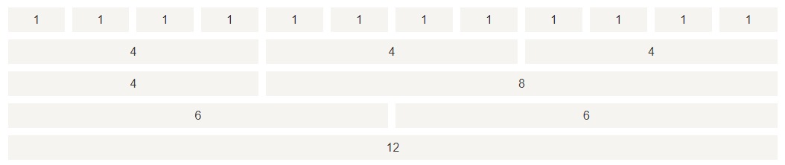

# Bootstrap 网格系统

Bootstrap 提供了一套响应式、移动设备优先的流式网格系统，随着屏幕或视口（viewport）尺寸的增加，系统会自动分为最多 12 列<small>（记住这个数字）</small>。



## Bootstrap 网格系统（Grid System）的工作原理

网格系统通过一系列包含内容的行和列来创建页面布局。下面列出了 Bootstrap 网格系统是如何工作的：

- 行必须放置在 *`.container`* class 内，以便获得适当的对齐（alignment）和内边距（padding）。
- 使用行来创建列的水平组。
- 内容应该放置在列内，且唯有列可以是行的直接子元素。
- 预定义的网格类，比如 *`.row`* 和 *`.col-xs-4`*，可用于快速创建网格布局。
- 列通过内边距（padding）来创建列内容之间的间隙。该内边距是通过 *`.rows`* 上的外边距（margin）取负，表示第一列和最后一列的行偏移。
- 网格系统是通过指定您想要横跨的十二个可用的列来创建的。例如，要创建三个相等的列，则使用三个 *`.col-xs-4`* 。

## 网格选项

| 使用场景 | 超小设备手机（<768px）	| 小型设备平板电脑（≥768px）	| 中型设备台式电脑（≥992px）	| 大型设备台式电脑（≥1200px） |
| :-: |:-: | :-: | :-: | :-: |
| 行为 | 一直是水平的	| 以折叠开始，断点以上是水平的	| 以折叠开始，断点以上是水平的	| 以折叠开始，断点以上是水平的 |
| container 宽度 | None (auto)	| 750px	| 970px	| 1170px |
| class 前缀 | `.col-xs-` | `.col-sm-` | `.col-md-` | `.col-lg-` |

## 基本的网格结构

下面是 Bootstrap 网格的基本结构：

```html
<div class="container">
   <div class="row">
      <div class="col-*-*"></div>
      <div class="col-*-*"></div>      
   </div>
   <div class="row">...</div>
</div>
<div class="container">....
```

## 偏移列

略