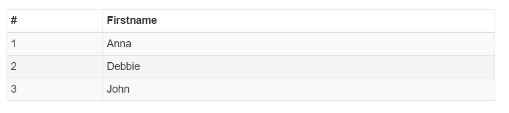

# Bootstrap 表格

Bootstrap 提供了一个清晰的创建表格的布局。下表列出了 Bootstrap 支持的一些表格元素：


| 标签	| 描述 |
| :- | :- |
| `<table>`	| 为表格添加基础样式。 |
| `<thead>`	| 表格标题行的容器元素（`<tr>`），用来标识表格列。 |
| `<tbody>`	| 表格主体中的表格行的容器元素（`<tr>`）。 |
| `<tr>`	| 一组出现在单行上的表格单元格的容器元素（`<td>` 或 `<th>`）。 |
| `<td>`	| 默认的表格单元格。|
| `<th>`	| 特殊的表格单元格，用来标识列或行（取决于范围和位置）。必须在 `<thead>` 内使用。|
| `<caption>`	| 关于表格存储内容的描述或总结。|

## `<table>` 类

### `.table`	

`<table class="table">` 为任意 `<table>` 添加 **基本** 样式 (只有横向分隔线)	


### `.table-striped`

`<table class="table table-striped">` 在 `<tbody>` 内添加斑马线形式的 **条纹背景** <small>（IE8 不支持）</small>。


### `.table-bordered`

`<table class="table table-bordered">` 为所有表格的单元格添加 **边框**


### `.table-hover`

`<table class="table table-hover">` 在 `<tbody>` 内的任一行启用鼠标悬停状态	


### `.table-condensed`

`<table class="table table-condensed">` 让表格更加紧凑


### 联合使用所有表格类

```html
<table class="table table-striped table-bordered table-hover table-condensed">
   ...
</table>
```




## `<tr>`, `<th>` 和 `<td>` 类

### `.active`

`<tr class="active">` 将悬停的颜色应用在行或者单元格上	


### `.success`

`<tr class="success">` 表示成功的操作。


### `.info`

`<tr class="info">` 表示信息变化的操作。


### `.warning`

`<tr class="warning">` 表示一个警告的操作。


### `.danger` 

`<tr class="danger">` 表示一个危险的操作。


