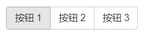

# Bootstrap 按钮组

按钮组允许多个按钮被堆叠在同一行上。当你想要把按钮对齐在一起时，这就显得非常有用。您可以通过 Bootstrap 按钮（Button） 插件 添加可选的 JavaScript 单选框和复选框样式行为。

## 基本的按钮组



下面的实例演示了上面表格中讨论到的 class *`.btn-group`* 的使用：

```html
<div class="btn-group">
  <button type="button" class="btn btn-default">按钮 1</button>
  <button type="button" class="btn btn-default">按钮 2</button>
  <button type="button" class="btn btn-default">按钮 3</button>
</div>
```


## 按钮工具栏


简单来说 `btn-toolbar` 是 `btn-group` 的 group 。

下面的实例演示了上面表格中讨论到的 class *`.btn-toolbar`* 的使用：

```html

<div class="btn-toolbar" role="toolbar">
  <div class="btn-group">
	<button type="button" class="btn btn-default">按钮 1</button>
	<button type="button" class="btn btn-default">按钮 2</button>
	<button type="button" class="btn btn-default">按钮 3</button>
  </div>
  <div class="btn-group">
	<button type="button" class="btn btn-default">按钮 4</button>
	<button type="button" class="btn btn-default">按钮 5</button>
	<button type="button" class="btn btn-default">按钮 6</button>
  </div>
  <div class="btn-group">
	<button type="button" class="btn btn-default">按钮 7</button>
	<button type="button" class="btn btn-default">按钮 8</button>
	<button type="button" class="btn btn-default">按钮 9</button>
  </div>
</div>
```

## 按钮的大小

下面的实例演示了上面表格中讨论到的 class `.btn-group-*` 的使用：

```html
<div class="btn-group btn-group-lg"> ... </div>
<div class="btn-group btn-group-sm"> ... </div>
<div class="btn-group btn-group-xs"> ... </div>
```

## 嵌套


