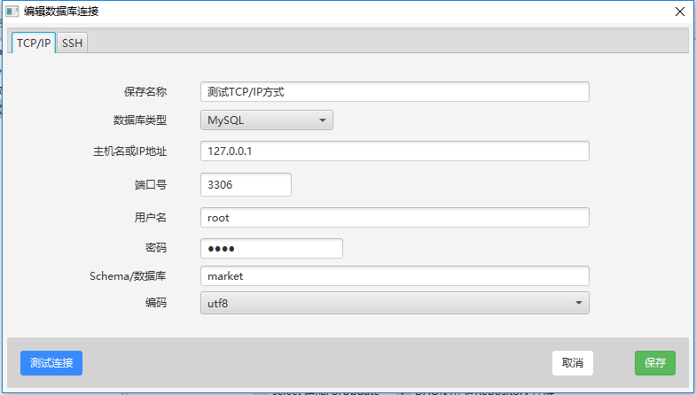

<span class="title">MyBatis Generator 和 Example 对象</span>

# Mybatis Generator

Mybatis 属于 **半自动 ORM 框架**，在使用这个框架中，工作量最大的就是书写 Mapping 的映射文件，由于手动书写很容易出错，为此 Mybatis 官方提供了个 Mybatis-Generator 来帮我们自动生成文件。

早期的 Mybatis Generator 的使用十分原始，使用起来非常麻烦，在开源社区的努力下，截止目前为止，已经出现了图形化界面的使用方式，已经变得十分便捷（屏蔽掉了大量繁琐的生涩的配置操作）。

现在使用较多的图形化工具是 [mybatis-generator-gui](https://github.com/zouzg/mybatis-generator-gui)


使用方式十分简单：

```bash
git clone https://github.com/zouzg/mybatis-generator-gui
cd mybatis-generator-gui
mvn jfx:jar
cd target/jfx/app/
java -jar mybatis-generator-gui.jar
```

本工具由于使用了 Java 8 的众多特性，所以要求 <font color="#0088dd">**JDK 1.8.0.60**</font> 以上版本，另外 <font color="#0088dd">**JDK 1.9 及更高版本**</font> 暂时还不支持。





# Mybatis Example 对象

Example 对象是一种简化条件查询的方案。通过它，你避免去编写大量的 DAO 中的 `selectByXxx()` 方法。

## 简单的情况（没有，或只有 and 关系）：

  ```java
  EmployeeExample example = new EmployeeExample();

  example.createCriteria()
    .andEmpnoEqualTo(7369)
    .andSalGreaterThanOrEqualTo(1500)
    .andSalLessThan(2000);

  List<Employee> list = dao.selectByExample(example);
  System.out.println(list.size());
  ```

`or()` 方法是一个更通用的形式，可以用于实现任意的查询条件。其原理在于，任何一个复杂的查询语句，总能写成如下形式：

```sql
where (... and ... and ...) or (... and ... and ...) or (...)
```


## 复杂的情况（有 or 关系，甚至是 and 和 or 混用）：

  ```java
  TestTableExample example = new TestTableExample();

  // 第 1 个括号中的两个并列条件
  example.or()
    .andAaaEqualTo(5)
    .andBbbIsNull();

  // 第 2 个括号中的两个并列条件
  example.or()
    .andCccNotEqualTo(9)
    .andDddIsNotNull();

  // 第 3 个括号中的唯一的条件
  List<Integer> list = new ArrayList<Integer>();
  list.add(8);
  list.add(11);
  list.add(14);
  list.add(22);
  example.or()
    .andEeeIn(field5Values);

  // 第 4 个括号中的唯一的条件
  example.or()
    .andFffBetween(3, 7);
  ```

相当于

```sql
where (aaa = 5 and bbb is null)
     or (ccc != 9 and ddd is not null)
     or (eee in (8, 11, 14, 22))
     or (fff between 3 and 7);
```