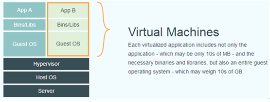
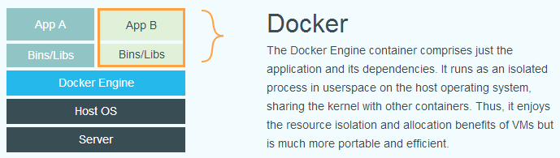

## 基本概念

Docker 是一个开源的应用容器引擎，让开发者可以打包他们的应用以及依赖包到一个可移植的容器中，然后发布到任何流行的Linux机器上，也可以实现虚拟化。

容器是完全使用沙箱机制，相互之间不会有任何接口（类似 iPhone 的 app）。几乎没有性能开销,可以很容易地在机器和数据中心中运行。最重要的是,他们不依赖于任何语言、框架或包括系统。

## 实现方式

Docker 项目的目标是实现轻量级的操作系统虚拟化解决方案。 Docker 的基础是 Linux 容器（LXC）、Cgroup 等技术。

在 LXC 的基础上 Docker 进行了进一步的封装，让用户不需要去关心容器的管理，使得操作更为简便。用户操作 Docker 的容器就像操作一个快速轻量级的虚拟机一样简单。

## Docker 和传统虚拟化方式的不同

容器是在操作系统层面上实现虚拟化，直接复用本地主机的操作系统，而传统方式则是在硬件的基础上，虚拟出自己的系统，再在系统上部署相关的 APP 应用。

传统虚拟化方案：

Docker虚拟化方案：

Docker虚拟化有三个概念需要理解，分别镜像、容器、仓库。
- 镜像：docker的镜像其实就是模板，跟我们常见的ISO镜像类似，是一个样板。
- 容器：使用镜像常见的应用或者系统，我们称之为一个容器。
- 仓库：仓库是存放镜像的地方，分为公开仓库（Public）和私有仓库（Private）两种形式。

## Docker虚拟化特点

- 操作启动快

  运行时的性能可以获取极大提升，管理操作（启动，停止，开始，重启等等） 都是以秒或毫秒为单位的。

- 轻量级虚拟化

  你会拥有足够的“操作系统”，仅需添加或减小镜像即可。在一台服务器上可以布署100~1000个Containers容器。但是传统虚拟化，你虚拟10-20个虚拟机就不错了。

- 开源免费

  开源的，免费的，低成本的。由现代Linux内核支持并驱动。注* 轻量的Container必定可以在一个物理机上开启更多“容器”，注定比VMs要便宜。

