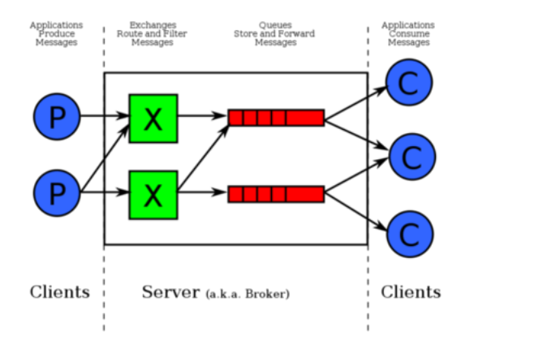
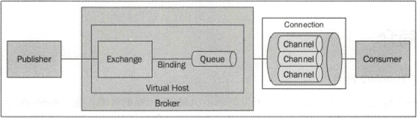

消息队列

# 消息队列功能介绍

分布式消息队列可以提供应用解耦、流量削峰、消息分发等功能，已经成为大型互联网服务架构里标配的中间件。

## 应用解耦

复杂的应用里会存在多个子系统，如果各个子系统之间的耦合性太高，整体系统的可用性就会大幅降低。<small>多个低错误率的子系统强耦合在一起，得到的是一个高错误率的整体系统。</small>

通过消息队列，可以将强耦合的 `A - B` 子系统，改造成  `A - 消息队列 - B`。当 B 子系统发生故障时<small>（需要几分钟时间来修复）</small>，A 子系统需要 B 子系统所处理的信息/数据/内容被存储在了消息队列中，当 B 系统恢复后，B 系统可以补充处理消息队列中的相关请求。在整个过程中，A 子系统（或者说，A 系统的用户）感知不到 B 子系统发生过几分钟的故障。

## 流量削峰

使用消息队列进行流量削峰，很多时候不是因为能力不够，而是处于经济性的考虑。

对于觉得大多数系统，一年之中最忙碌的往往至少某个时间段<small>（例如电商的双 11）</small>。甚至，一天之中，最忙碌的也只是某个时间段<small>（例如美团饿了么）</small>。

假设，一个系统的流量最高峰也不过一万 QPS，而平时只有一千左右。这种情况下，只需要用个普通性能的服务器<small>（支持以前 QPS）</small>，然后加个消息队列作为高峰期的缓冲，无须花费大笔资金部署支持上万 QPS 的服务器。

## 消息分发

在大数据时代，数据对很多公司来说就是金矿，公司需要产生的数据进行多角度多层次的『充分』的利用。简单来说，你不知道现在整个系统中有哪些子系统对你产生的数据『感兴趣』；你更不清楚未来在整个系统中有哪些子系统对你所产生的数据『感兴趣』。

这个时候有个消息队列就非常重要。数据的产生放<small>（你）</small>只需要把数据写入一个消息队列中，其他各方<small>（子系统）</small>根据仔细的需要决定订阅这些数据。

# JMS 规范

JMS 即 Java 消息服务<small>（Java Message Service）</small>应用程序接口，是一个 Java 平台中关于面向消息中间件的 API，用于在两个应用程序之间，或分布式系统中发送消息，进行异步通信。Java 消息服务是一个与具体平台无关的 API，绝大多数消息中间件提供商都对 JMS 提供支持。

ActiveMQ 是 JMS 的最常见的实现。

# 基本概念

## 消息传送模型

- 点对点（Point to Point）模型

  使用 <strong>**队列**（Queue）</strong>作为消息通信载体，满足生产者与消费者模式，一条消息只能被一个消费者所使用，未被消费的消息在消息队列中保留，直到被消费或超时。

- 发布/订阅（Pub/Sub）模型

  使用 <strong>主题（Topic）</strong>作为消息通信载体，类似于广播模式，发布者发布一条消息，该消息通过主题传递给所有的订阅者，在一条消息被广播之后才订阅的用户是收不到该消息的。

## 基本组件

JMS 的基本组件有：

- Broker<small>（消息代理）</small>

  表示消息队列服务器实体，接收客户端连接，提供消息通信的核心服务。

- Producer<small>（消息生产者）</small>

  业务的发起方，负责生产消息并传递给 Broker 。

- Consumer<small>（消息消费者）</small>

  业务的处理方，负责从 Broker 获取消息并进行业务逻辑处理。

- Topic<small>（主题）</small>

  在发布/订阅模式下消息的统一汇集地，不同的生产者向 Topic 发送消息，由 Broker 分发给不同的订阅者，实现消息的广播。

- Queue<small>（队列）</small>

  在点对点模式下特定生产者向特定队列发送消息，消费者订阅特定队列接收消息并进行业务逻辑处理。

- Message<small>（消息）</small>

  根据不同的通信协议的固定格式进行编码的数据包，封装业务数据，实现消息的传输。

## 消息存储

在 JMS 规范中对消息的发送方式有两种：

| 消息存储 | 说明 |
| :- | :- |
| 持久化 | 用于看重 <strong>可靠性</strong> 场景。   不允许消息丢失。   可接受一定的吞吐量损耗。 |
| 非持久化 | 用于看重 <strong>性能</strong> 场景。   允许一定概率的消息丢失。 |

<small>补充说明，由于 JMS 规范本身的原因，实现 JMS 规范的消息队列的吞吐量都比较一般<small>（比如 ActiveMQ）</small>。因此，真正对吞吐量有要求有期望有要求的场景下，也轮不到 ActiveMQ 这样 JMS 消息中间件。因此，JMS 的非持久化/非持久化对性能的影响实际上对于 ActiveMQ 技术选型影响不大。</small>

<small>另外，持久化消息是 JMS 2.0 规范中新增的特性，在 JMS 1.1 规范中消息全部都是非持久化消息。</small>

持久化消息发送到消息服务器后，如果当前消息的消费者并没有运行，则该消息继续存在，只有等到消息被处理并被消费者确认之后，消息才会被从消息服务器中删除。

# AMQP 规范

AMQP，即 Advanced Message Queuing Protocol，一个提供统一消息服务的应用层标准高级消息队列协议，是应用层协议的一个开放标准，为面向消息的中间件设计。基于此协议的客户端与消息中间件可传递消息，并不受客户端/中间件不同产品，不同的开发语言等条件的限制。

RabbitMQ 是 AMQP 最常见的实现。

AMQP 在 JMS 的概念的基础上，主要多出来【路由】和【绑定】的概念。

- Exchange（交换器，上图中的 **`X`**）：用来接收消息生产者发送的消息，并将这些消息路由给服务器中的队列。

- Binding（绑定）：用于交换器和消息队列之间的关联。一个绑定就是基于路由键将交换器和消息队列连接起来的路由规则。

出了上述两个【新】概念，AMQP 中还引入了其它的概念，比如：

- Channel（信道）：多路复用连接中的一条独立的双向数据流通道。信道是建立在真是的 TCP 连接内的虚拟连接。不管是发布消息、订阅队列还是接收消息，这些动作都是通过连接中的某个信道完成的。

- Virtual Host（虚拟主机）：一批交换机、队列（及其之间绑定关系）的逻辑『总称』。某个交换机和队列必定属于某个虚拟主机，而 Rabbit MQ 中可以由多个虚拟主机。Rabbit MQ 默认的 vhost 是 *`/`* 。

# 各个消息队列中间件的缺点

## ActiveMQ

1. 性能是硬伤。

2. ActiveMQ 有一种内嵌运行模式看似很有特色，但是有其它的消息队列专注于此：ZeroMQ 。<small>甚至有些 java 库都能实现类似的功能。</small>

## RabbitMQ

1. 对消息堆积的支持不友好<small>（它认为消息堆积现象是一种不正常的现象，应该避免发生，而非发生后再靠消息队列来解决）</small>。

2. 性能够应付企业级应用，但不足以应付互联网项目。

3. Erlang 语言偏小众，不方便二次开发。

## RocketMQ

1. 没有显著优点，就是最大的缺点。没有指标垫底，同样也没有指标独占鳌头。<small>样样都老二也是很尴尬。</small>

2. 作为国内开源项目，国外使用较少，因此看起来声势不大。

## Kafka

1. 理论上，有消息丢失的可能。<small>（据说，新版本已经解决了该问题）</small>

2. 采用异步+批处理的方式，提升了性能的同时，也带来了消息处理的延迟。

## 总结

ActiveMQ 基本上不太可能用到。

企业级项目如果仅专注于消息队列本身的功能，则可以使用 RabbitMQ 。毕竟，资料多，够简单，路由灵活。

互联网项目 RocketMQ 和 Kafka 二选一。在意延迟<small>（响应速度）</small>的项目选用 RocketMQ；追求极致吞吐量的选择 Kafka 。

