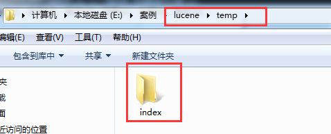
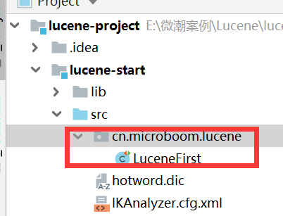
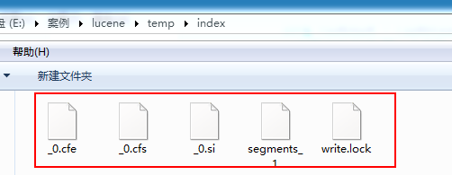
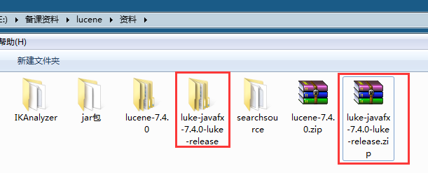
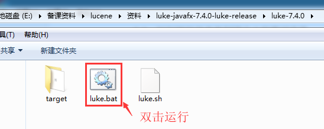
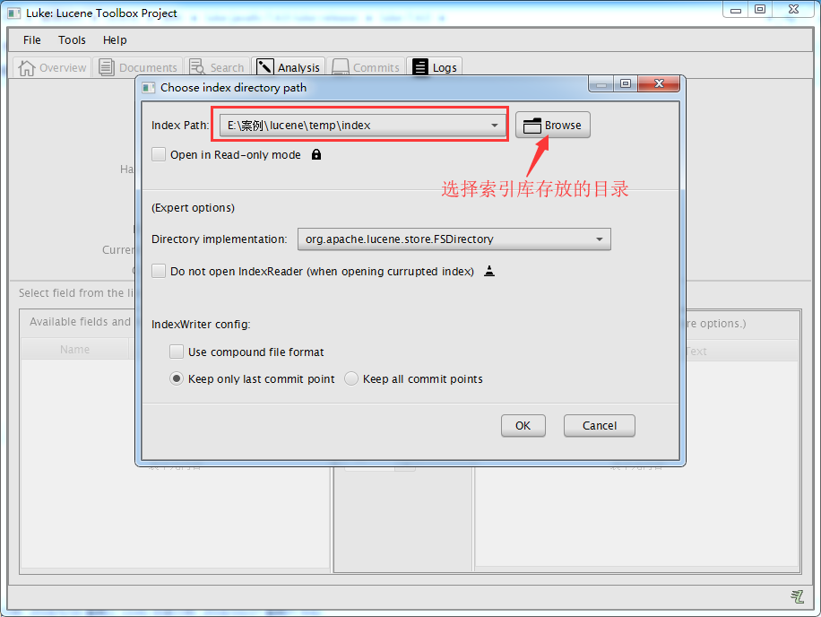

## 下载 Lucene

```xml
 <!-- 它被 lucene-analyzers-common 依赖，所以此处可以省略 -->
<dependency>
    <groupId>org.apache.lucene</groupId>
    <artifactId>lucene-core</artifactId>
    <version>7.4.0</version>
</dependency>

<dependency>
    <groupId>org.apache.lucene</groupId>
    <artifactId>lucene-analyzers-common</artifactId>
    <version>7.4.0</version>
</dependency>

<!-- 非必须，本例中用于简化测试代码的编写 -->
<dependency>
    <groupId>commons-io</groupId>
    <artifactId>commons-io</artifactId>
    <version>2.6</version>
</dependency>
```

> 高版本的 Lucene 依赖于 高版本的 JDK 。所以，通常使用的 Lucene 的版本并非最高版本。

## 创建索引库

### 创建索引步骤分析

| # | 说明 |
| :- | :- |
| 1 | 创建一个 **`indexwriter`** 对象。 |
| 2 | 创建 **`Document`** 对象。 |
| 3 | 创建 **`Field`** 对象，将 field 添加到 Document 对象中。|
| 4 | 使用 indexwriter 对象将 Document 对象写入索引库，此过程进行索引创建。并将索引和 Document 对象写入索引库。|
| 5 | 关闭 IndexWriter 对象。|


### 编码实现创建索引

在磁盘中创建一个目录用来存放创建出来的索引文件(目录名称随意)



创建类并编写创建索引方法



```java
/**
 * 创建索引
 */
@Test
public void createIndex() throws IOException {
    // 创建一个 Director 对象，指定索引库的位置,FSDirectory 为存入到磁盘上
    Directory directory = FSDirectory.open(new File("E:/微潮案例/Lucene/temp/index").toPath());
    // 索引库还可以存放到内存中：Directory directory = new RAMDirectory();
    // 创建 indexwriterCofig 对象
    IndexWriterConfig config = new IndexWriterConfig();
    // 创建 lindexwriter 对象
    IndexWriter indexWriter = new IndexWriter(directory, config);

    // 读取磁盘上的文件，每个文件创建一个文档对象
    File dir = new File("E:/微潮课程/Lucene/资料/searchsource");
    for (File f : dir.listFiles()) {
        // 文件名
        String fileName = f.getName();
        // 文件内容
        String fileContent = FileUtils.readFileToString(f);
        // 文件路径
        String filePath = f.getPath();
        // 文件的大小
        long fileSize = FileUtils.sizeOf(f);
        // 创建文件名域:第一个参数：域的名称,第二个参数：域的内容,第三个参数：是否存储
        Field fileNameField = new TextField("filename", fileName, Field.Store.YES);
        // 文件内容域
        Field fileContentField = new TextField("content", fileContent, Field.Store.YES);
        // 文件路径域（不分析、不索引、只存储）
        Field filePathField = new TextField("path", filePath, Field.Store.YES);
        // 文件大小域
        Field fileSizeField = new TextField("size", fileSize + "", Field.Store.YES);

        // 创建 Document 对象
        Document document = new Document();
        document.add(fileNameField);
        document.add(fileContentField);
        document.add(filePathField);
        document.add(fileSizeField);

        // 创建索引，并写入索引库
        indexWriter.addDocument(document);
    }

    // 关闭indexwriter
    indexWriter.close();
}
```

### 运行项目并查看创建出来的索引文件



### 使用 Luke 工具查看索引文件

解压资料文件夹中的 `luke-javafx-7.4.0-luke-release.zip`







> 我们使用的 luke 的版本是 luke-7.4.0，跟 lucene 的版本对应的。可以打开 7.4.0 版本的 lucene 创建的索引库。需要注意的是此版本的 Luke 是 jdk9 编译的，所以要想运行此工具还需要 jdk9 才可以

## 查询索引

### 查询索引步骤分析

1. 创建一个 Director 对象，指定索引库的位置 
2. 创建一个 IndexReader 对象 
3. 创建一个 IndexSearcher 对象，构造方法中的参数 indexReader 对象。 
4. 创建一个 Query 对象，TermQuery 
5. 执行查询，得到一个 TopDocs 对象 
6. 取查询结果的总记录数 
7. 取文档列表 
8. 打印文档中的内容 
9. 关闭 IndexReader 对象

### 编写代码实现查询索引功能

在 LuceneFirst 类中增加查询索引方法

```java
/**
 * 查询索引
 * @throws Exception
 */
@Test
public void searchIndex() throws Exception {
    // 1、创建一个Director对象，指定索引库的位置
    Directory directory = FSDirectory.open(new File("E:\\案例\\lucene\\temp\\index").toPath());
    // 2、创建一个IndexReader对象
    IndexReader indexReader = DirectoryReader.open(directory);
    // 4、创建一个IndexSearcher对象，构造方法中的参数indexReader对象。
    IndexSearcher indexSearcher = new IndexSearcher(indexReader);
    // 4、创建一个Query对象，TermQuery,第一个参数为要查询的域，第二个参数为要查询的内容
    Query query = new TermQuery(new Term("content", "web"));
    // 5、执行查询，得到一个TopDocs对象
    //参数1：查询对象 参数2：查询结果返回的最大记录数
    TopDocs topDocs = indexSearcher.search(query, 10);
    // 6、取查询结果的总记录数
    System.out.println("查询总记录数：" + topDocs.totalHits);
    // 7、取文档列表
    ScoreDoc[] scoreDocs = topDocs.scoreDocs;
    // 8、打印文档中的内容
    for (ScoreDoc doc : scoreDocs) {
        //取文档id
        int docId = doc.doc;
        //根据id取文档对象
        Document document = indexSearcher.doc(docId);
        System.out.println("文件名:"+document.get("filename"));
        System.out.println("文件路径:"+document.get("path"));
        System.out.println("文件大小:"+document.get("size"));
        //System.out.println(document.get("content"));
        System.out.println("-----------------寂寞的分割线");
    }
    // 9、关闭 IndexReader 对象
    indexReader.close();
}
```
