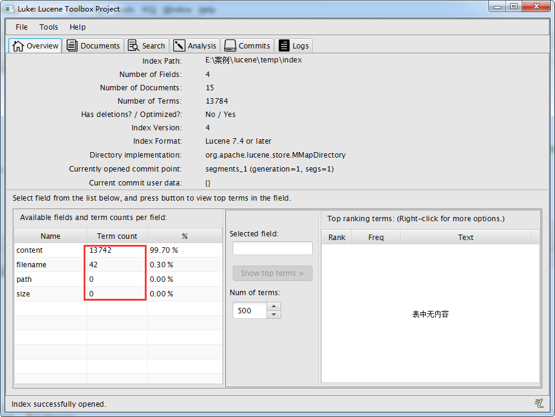
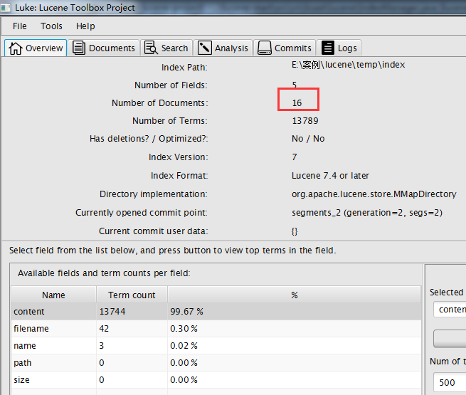
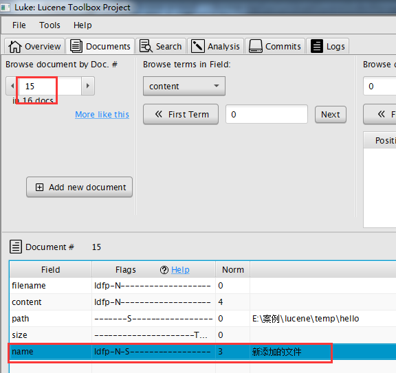
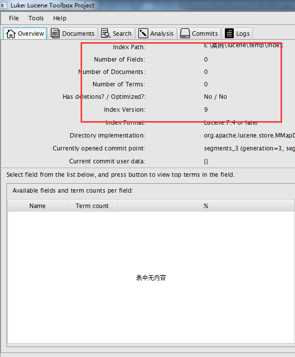
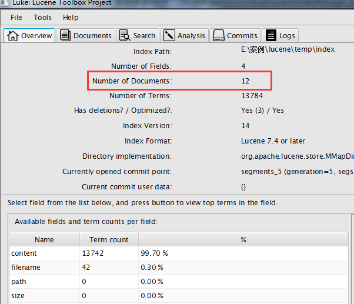
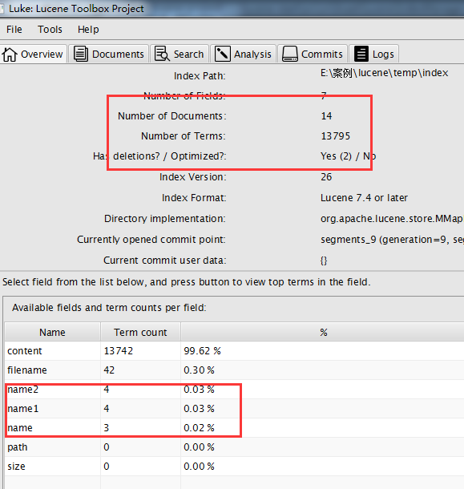

# 索引库的维护

## 域（Field）的设置

> <small>​思考：在我们创建索引的过程中是所有类容都要进行分词吗，比如身份证号、文件大小、文件路径？</small>

|| 说明 | 举例 |
|:-|:-|:-|
| 是否分词 | 是否对域的内容进行分词处理。前提是我们要对域的内容进行查询。| 商品名称、商品简介等信息需要分词后再进行索引 |
| 是否索引 | 将 Field 分词后的词或整个 Field 值进行索引，只有索引方可搜索到。| 订单号、身份证号不用分词但也要索引，因为这些将来都要作为查询条件。|
| 是否存储 | 将 Field 值存储在文档中，存储在文档中的 Field 才可以从Document中获取。是否存储的标准在于未来是否要将该内容展示给用户| 商品名称、订单号，凡是将来要从 Document 中获取的 Field 都要存储。|

三个概念常见的组合有：

- 分词-索引-存储
- 不分词-索引-存储

Field 域的类型如下：

| 数据类型 | Field 类 | 分词 | 索引 | 存储 |
| :- | :- | :- | :- | :- |
| 通用 | `StoredField(..., ...)` | 否 | 否 | 是 |
| 字符串 | **`StringField(..., ..., ...)`** | 否 | 是 | 取决于参数 |
| 字符串 | **`TextField(..., ..., ...)`** | 是 | 是 | 取决于参数 |
| 流 | `TextField(..., ..., ...)` | 是 | 是 | 否 |
| Int | `IntPoint(...)` | 否 | 是 | 否 |
| Long | 同上，略。| | | |

创建索引，参考 `createIndex()` 方法的原始内容：

```java
// 域名："filename"，域值："xxx"。分词-索引-存储。
Field fileNameField = new TextField("filename", fileName, Field.Store.YES);

// 域名："content"，域值："xxx"。分词-索引-存储。
Field fileContentField = new TextField("content", fileContent, Field.Store.YES);

// 域名："path"，域值："xxx"。分词-索引-存储。
// Field filePathField = new TextField("path", filePath, Field.Store.YES);
// 不分词-不索引-存储
Field filepath = new StoredField("path",filePath);

// 域名："size"，域值："xxx"。分词-索引-存储。
// Field fileSizeField = new TextField("size", fileSize + "", Field.Store.YES);
// 不分词-索引-不存储
Field fileSizeField = new LongPoint("size", fileSize);

// 创建document对象
Document document = new Document();
document.add(fileNameField);
document.add(fileContentField);
document.add(filePathField);
document.add(fileSizeField);

// 创建索引，并写入索引库
indexWriter.addDocument(document);
```

重新分词后:



从上图可以看出文件路径和文件大小没有进行分词

## 添加文档（Document）

> <small>如果要强行类比，添加文档（Docuemtn）相当于数据库操作中的向表中新加入一条/一行数据。</small>

```java
/**
 * 添加一条新的索引
 * 一条新的索引信息，也被称为一个 Document 。
 */
public void addDocument() throws Exception {
    // 1. 创建一个 Director 对象，指定索引库的位置。
    Directory directory = FSDirectory.open(new File("E:\\微潮案例\\Lucene\\temp\\index").toPath());

    // 2. 创建 indexwriterCofig 对象。此处需指定分词器。
    IndexWriterConfig config = new IndexWriterConfig(new IKAnalyzer());

    // 3. 创建 indexwriter 对象
    IndexWriter indexWriter = new IndexWriter(directory, config);

    // 4. 创建一个 Document 对象，并向其中添加域名和域值。
    Document document = new Document();
    document.add(new TextField("name", "新添加的文件", Field.Store.YES));
    document.add(new TextField("content", "新添加的文件内容", Field.Store.NO));
    document.add(new StoredField("path", "E:\\微潮案例\\Lucene\\temp\\hello"));

    // 5. 把文档写入索引库
    indexWriter.addDocument(document);

    // 6. 关闭索引库
    indexWriter.close();
}
```






## 删除全部索引

```java
/**
 * 删除索引库中全部索引
 */
public void deleteAllDocument() throws IOException {
    // 1. 创建一个 Director 对象，指定索引库的位置
    Directory directory = FSDirectory.open(new File("E:\\微潮案例\\Lucene\\temp\\index").toPath());

    // 2. 创建 indexwriterCofig 对象
    IndexWriterConfig config = new IndexWriterConfig(new IKAnalyzer());

    // 3. 创建 indexwriter 对象
    IndexWriter indexWriter = new IndexWriter(directory, config);

    // 4. 执行删除操作
    indexWriter.deleteAll();

    // 5. 关闭 indexwriter 对象
    indexWriter.close();
}
```



> 可以看将索引目录的索引信息全部删除，直接彻底删除，无法恢复，将方法慎用。

## 指定查询条件删除

在查询操作中，一个 `域名` 和 `域值` 的组合，被称为一个 **`Term`** 。

```java
/**
 * 根据查询条件删除索引
 */
public void deleteIndexByQuery() throws Exception {
    // 1. 创建一个 Director 对象，指定索引库的位置
    Directory directory = FSDirectory.open(new File("E:\\微潮案例\\Lucene\\temp\\index").toPath());

    // 2. 创建 indexwriterCofig 对象
    IndexWriterConfig config = new IndexWriterConfig(new IKAnalyzer());

    // 3. 创建 indexwriter 对象
    IndexWriter indexWriter = new IndexWriter(directory, config);

    // 4. 创建一个查询条件,查询文件名中包含"apache"关键字的文档
    Query query = new TermQuery(new Term("filename", "apache"));

    // 5. 根据查询条件删除
    indexWriter.deleteDocuments(query);
    // 6. 关闭 indexwriter
    indexWriter.close();
}
```



## 3、索引库的修改

> Lucene 虽然提供了 `updateDocument()` 方法，但 Lucene 中没有真正意义上的修改，所谓的修改实际上就是 `先删除后添加` 。

```java
/**
 * 修改索引
 */
public void updateDocument() throws Exception {
    // 1. 创建一个Director对象，指定索引库的位置
    Directory directory = FSDirectory.open(new File("E:\\微潮案例\\Lucene\\temp\\index").toPath());

    // 2. 创建 indexwriterCofig 对象
    IndexWriterConfig config = new IndexWriterConfig(new IKAnalyzer());

    // 3. 创建 indexwriter 对象
    IndexWriter indexWriter = new IndexWriter(directory, config);

    // 4. 创建一个新的文档对象
    Document document = new Document();

    // 5. 向文档对象中添加域
    document.add(new TextField("name", "更新之后的文档", Field.Store.YES));
    document.add(new TextField("name1", "更新之后的文档2", Field.Store.YES));
    document.add(new TextField("name2", "更新之后的文档3", Field.Store.YES));

    // 6. 更新操作
    indexWriter.updateDocument(new Term("filename", "spring"), document);

    // 7. 关闭索引库
    indexWriter.close();
}
```



