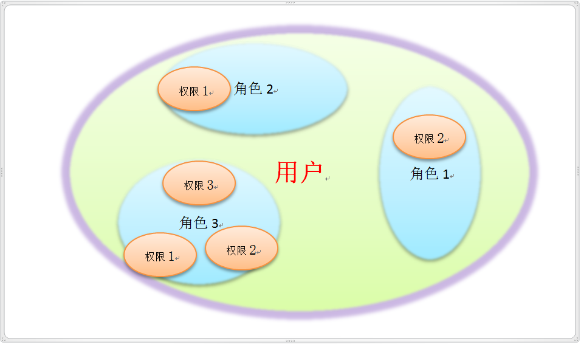

# Shiro 权限认证

Shiro 中的权限认证（Authorization）也称授权，它解决了“用户能干什么”的问题。

权限认证，也就是访问控制，即在应用中控制谁能访问哪些资源。在权限认证中，最核心的三个要素是：**权限**，**角色** 和 **用户** ：

  

角色是权限的集合，而一个用户可以拥有多种角色。

RBAC（Role Base Access Control）

- 『角色』是『权限』的集合。

- 一个人能干什么事情，本质上是因为某个角色能干这个事情，而这个人拥有/充当/扮演了这个角色，所以他才能干这个事情。

## Shiro 中检测角色和权限的方法

- Subject 用于判断角色的方法有：

  | 方法 | 作用 |
  | :-- | :-- |
  | `hasRole(String roleName)` | 判断是否有该角色访问权，返回 boolen |
  | `hasRoles(List<String> roleNames)` | 判断是否有这些这些角色访问权，返回 `boolean[]` |
  | `hasAllRoles(Collection<String> roleNames)` | 判断是否有这些这些角色访问权，返回 boolean   |
  | `checkRole(String roleName)` | 如果判断失败抛出 AuthorizationException 异常  |
  | `checkRoles(String... roleNames)` | 如果判断失败抛出 AuthorizationException 异常  |
  | `checkRoles(Collection<String> roleNames)` | 如果判断失败抛出 AuthorizationException 异常  |

- Subject 用于判断权限的方法有：

  | 方法 | 作用 |
  | :-- | :-- |
  |`isPermitted(String perm)` | 判断是否有该权限，返回 boolen |
  |`isPermitted(List<String> perms)` | 判断是否有这些这些权限，返回 boolean[] |
  | `isPermittedAll(Collection<String> perms)` | 判断是否有这些这些权限，返回 boolean |
  | `checkPermission(String perm)` | 如果判断失败抛出 AuthorizationException 异常 |
  | `checkPermissions(String... perms)` | 如果判断失败抛出 AuthorizationException 异常 |
  | `checkPermissionsAll(Collection<String> perms)` | 如果判断失败抛出 AuthorizationException 异常 |
