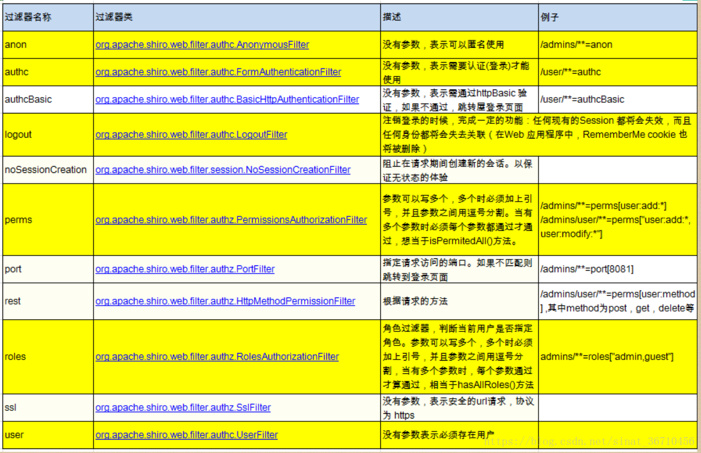

# Shiro 默认过滤器及相关

## 一、Shiro 默认过滤器

## 二、过滤器 URL 匹配模式

- url 模式使用 Ant 风格模式：
  
  支持 `?`、`*`、`**`（注意通配符匹配不包括目录分隔符`/`）

-  `?`：
   
   匹配一个字符，如 `/admin?` 将匹配 `/admin1`，但不匹配 `/admin` 或 `/admin/` ；

- `*`：
  
  匹配零个或多个字符串，如 `/admin*` 将匹配 `/admin`、`/admin123`，但不匹配 `/admin/1`；

- `**`：
  
  匹配路径中的零个或多个路径，如 `/admin/**` 将匹配 `/admin/a` 或 `/admin/a/b`

## 三、unauthorizedUrl 不跳转问题

Shiro 中的过滤器分为两大类：

- 认证相关过滤器：
  
  包括：anon、authcBasic、authc、user 过滤器

- 授权相关过滤器：
  
  包括：perms、roles、ssl、rest、port 过滤器

要通过授权过滤器<small>（至于是哪一个授权过滤器取决于具体的配置）</small>，就先要通过认证过滤器<small>（至于是哪一个认证过滤器取决于具体的配置）</small>。

顾名思义，unauthorizedUrl 是指请求未能通过授权相关过滤器时的跳转页面。

因此，请求未通过认证相关过滤器时的跳转页面跟 `unauthorizedUrl` 半毛钱关系都没有（有关的是 `loginUrl`）。

