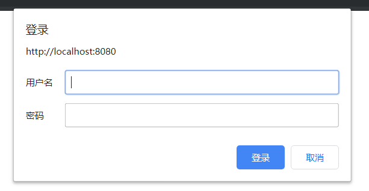

<span class="title">初识 Spring Security</span>

# pom.xml

```xml
<dependency>
    <groupId>org.springframework.security</groupId>
    <artifactId>spring-security-web</artifactId>
    <version>${spring-security.version}</version>
</dependency>

<dependency>
    <groupId>org.springframework.security</groupId>
    <artifactId>spring-security-config</artifactId>
    <version>${spring-security.version}</version>
</dependency>
```

# 创建 Controller 响应 `/` 请求

```java
@Controller
public class HelloController {

	  @GetMapping("/")
	  public String hello() {
		    return "index";
	  }
}
```

```html
<html>
<body>
  <h2>Hello World!</h2>
</body>
</html>
```

上述代码在用户发起 `/` 请求时，向客户端浏览器展现 index.jsp 页面

# SpringSecurityConfig 配置类

新建一个配置类<small>（例如名为 *`SpringSecurityConfig`*）</small>，继承自 *`WebSecurityConfigurerAdapter`* 类，并为其标注 *`@EnableWebSecurity`* 注解。这个类就是 Spring Security 的配置。

```java
@EnableWebSecurity
public class SpringSecurityConfig extends WebSecurityConfigurerAdapter {

    @Override
    protected void configure(HttpSecurity http) throws Exception {
        ...
    }

    @Override
    protected void configure(AuthenticationManagerBuilder auth) throws Exception {
        ...
    }

}
```

由于 *`@EnableWebSecurity`* 注解的功能涵盖了 *`@Configuration`* 注解，因此这个配置类上不用再标注 *`@Configuration`* 注解<small>（当然，你要标注也不会报错）</small>。

对于 Spring Security 的行为的具体配置，我们是要重写 *`configure`* 方法。

<font color="red">**注意：**</font>该配置类下有两个同名不同参的 *`configure()`* 方法。这两个方法中要进行不同方面的配置。注意谁是谁，未来在写代码进行配置时不要写错了地方。

# 两个 configure 的配置代码

再次强调：<strong>请注意两个 *`configure()`* 谁是谁。</strong>

## 一个 configure

```java
@Override
protected void configure(HttpSecurity http) throws Exception {
    http.authorizeRequests()
        .anyRequest()
        .authenticated();   // 1
    http.httpBasic();       // 2
    http.csrf().disable();  // 3
}
```

以上配置的意思是：

1. 让 Spring Security 拦截所有请求。要求所有请求都必须通过认证才能放行，否则要求用户登陆。
2. 要求用户登陆时，是使用 http basic 的方式。
3. 暂且认为是固定写法。后续专项讲解。



这是所有的浏览器都会自带的一个用于登陆认证的弹出框<small>（注意，它不算是一个页面）</small>。

> 注意，有时你看不到这个弹出库那是因为你曾经登陆过之后，相关信息被浏览器缓存了。重开一个窗口即可。

## 另一个 configure

```java
@Override
protected void configure(AuthenticationManagerBuilder auth) throws Exception {
    // String userPassword = "{noop}" + NoOpPasswordEncoder.getInstance().encode("123");
    // String adminPassword = "{noop}" + NoOpPasswordEncoder.getInstance().encode("123");

    auth.inMemoryAuthentication()
        .passwordEncoder(PasswordEncoderFactories.createDelegatingPasswordEncoder())
        .withUser("user").password("{noop}123").roles("USER")
        .and()
        .withUser("admin").password("{noop}123").roles("ADMIN", "USER");
}
```

很容易猜到，上述的代码中配置了登录用户名和密码，以及该用户的身份/权限。

上述配置中，实际上兜兜转转最终是创建并使用到了一个 *`InMemoryUserDetailsManager`* 的对象。 从名字上开，显而易见，`InMemoryUserDetailsManager` 是 `UserDetailService` 的实现类之一，它将用户名和密码的『标准答案』存在了内存中。

在 Spring Security 中，就是由 *`UserDetailService`* 负责提供用户名密码和用户权限的标准答案。Spring Security 从 *`UserDetailService`* 获取标准答案，然后再去匹对用户输入的用户名和密码<small>（及身份）</small>是否合法。

## Password Encoder

Spring Security 升级到 5 版本后提高了安全要求：Spring Security 要求所有的密码的存储<small>（无论是存在内存中，还是存在数据库中）</small>都必须是加密形式的。

Spring Security 需要我们提供<small>（或指定）</small>***`Password Encoder`***，当用户在前端页面输入密码<small>（明文）</small>后，会使用 Password Encoder 将其加密后，再和数据库中的密码进行匹配，以判断用户是否输入正确。

在 Shiro 中，你需要明确指明你所使用的加密算法是什么，而 Spring Security 则不要，它使用一个很巧妙的办法：将加密算法的名字拼在加密后的密码前。例如：

```txt
{bcrypt}$2a$10$dXJ3SW6G7P50lGmMkkmwe.20cQQubK3.HZWzG3YB1tlRy.fqvM/BG
{noop}password
{pbkdf2}5d923b44a6d129f3ddf3e3c8d29412723dcbde72445e8ef6bf3b508fbf17fa4ed4d6b99ca763d8dc
{scrypt}$e0801$8bWJaSu2IKSn9Z9kM+TPXfOc/9bdYSrN1oD9qfVThWEwdRTnO7re7Ei+fUZRJ68k9lTyuTeUp4of4g24hHnazw==$OAOec05+bXxvuu/1qZ6NUR+xQYvYv7BeL1QxwRpY5Pc=
{sha256}97cde38028ad898ebc02e690819fa220e88c62e0699403e94fff291cfffaf8410849f27605abcbc0
```

这样，当 Spring Security 从数据库（或内存）中取得加密后的密码后，通过其头部的内容就能判断除该密码『当初』是使用什么加密算法加密的，从而就使用这种类型的加密器对用户输入的密码进行加密，然后再进行匹对。

我们要做的，就是为 Spring Security 提供一大堆加密器，Spring Security 自然知道何时使用哪个。其实，Spring Security 内置了一个 ***`PasswordEncoderFactories`*** 类，其中就包含了内置的常见的加密器<small>（详情见源码）</small>。我们直接使用它即可。

**注意：**这一切的前提是，<strong>密码『当初』加进数据库的时候必须是加密形式！</strong>另外，给加密密码前面『加东西』是需要我们来做的。

[自定义工具类链接]()

<small>忘记指定 Password Encoder 会导致执行时会出现 `There is no PasswordEncoder mapped for the id "null"` 异常。</small>


# 配置激活 Spring Security 过滤器

注意，如果是在 SSM 中以代码方式整合 Spring Security，需要『多』提供一个『空』的配置类<small>（Spring Boot 中使用 Spring Security 则不需要它）</small>：


```java
public class SecurityWebApplicationInitializer extends AbstractSecurityWebApplicationInitializer {
}
```

项目中配置类的目录结构类似如下<small>（当然，可以进一步优化调整）</small>：

```
config
│── WebApplicationInitializer
│── SecurityWebApplicationInitializer 
└── spring
    ├── SpringDaoConfig
    ├── SpringServiceConfig
    ├── SpringWebConfig
    └── SpringSecurityConfig
```

这个配置类的做作用是：自动注册 ***`SpringSecurityFilterChainFilter`*** 拦截所有的 URL。注意，这些 Filter 不是通过 ***`WebApplicationInitializer`*** 类的 *`.delegatingFilterProxy()`* 注册的<small>（不同于在 *`web.xml`* 中的配置方式）。</small>。
