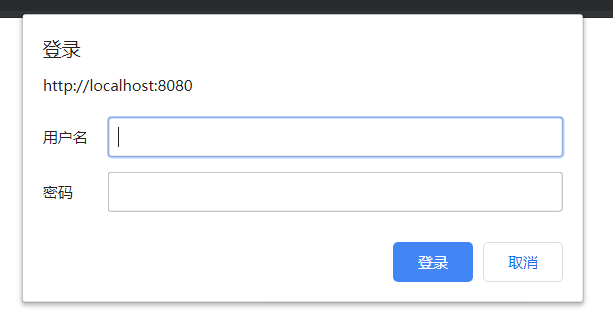

<span class="title">表单认证</span>

Spring Security 的认证方式有三种：

- Http Basic 认证

  ```java
  http.httpBasic();
  ```

- Spring Security 自带的表单认证

  ```java
  http.formLogin();
  ```

- 自定义表单认证

  ```java
  http.formLogin()
      .loginPage("...")
      .loginProcessingUrl("...")
      .xxx()...;
  ```

## Http Basic 认证

- SpringSecurityConfig 类中的配置代码

  ```java
  @Override
  protected void configure(HttpSecurity http) throws Exception {
      http.authorizeRequests()
            .anyRequest()
            .authenticated(); // 1
      http.httpBasic();       // 2
      http.csrf().disable();  // 3
  }
  ```

以上配置的意思是：

| # | 说明 |
| :-: | :- |
| 1 | 让 Spring Security 拦截所有请求。要求所有请求都必须通过认证才能放行，否则要求用户登陆。|
| 2 | 要求用户登陆时，是使用 http basic 的方式。|
| 3 | 暂且认为是固定写法。后续专项讲解。|

所有的 http basic 方式指的就是如下图所示：



浏览器通过这个弹出框收集你所输入的用户名密码，再发送给后台（Spring Security），而 Spring Security （截至目前为止是）以配置文件中配置的信息为基准，判断你的用户名和密码的正确性。

如果认证通过，则浏览器收起弹出框，你将看到你原本的请求所应该看到的响应信息。

> http basic 认证方式有很大的安全隐患，在浏览器将用户所输入的用户名和密码发往后台的过程中，有被拦截盗取的可能。所以我们一定不会通过这种方式去收集用户的用户名和密码。

- 链式调用连写：

  ```java
  http.authorizeRequests()
        .anyRequest().authenticated()
        .and()
    .httpBasic()
        .and()
    .csrf().disable();
  ```

# Spring Security 自带的表单认证

- SpringSecurityConfig 类中的配置代码

  ```java
  @Override
  protected void configure(HttpSecurity http) throws Exception {
      http.authorizeRequests()
          .anyRequest()
          .authenticated(); // 1
      http.formLogin();     // 2   区别在这里
      http.csrf().disable();// 3
  ```

以上配置的意思是：

| # | 说明 |
| :-: | :- |
| 1 | 同上，让 Spring Security 拦截所有请求。要求所有请求都必须通过认证才能放行，否则要求用户登陆。|
| 2 | 要求用户登陆时，是使用表单页面进行登陆。但是，由于我们有意/无意中没有指明登陆页面，因此，Spring Security 会使用它自己自带的一个登陆页面。|
| 3 | 同上，暂且认为是固定写法。后续专项讲解。|

登陆页面效果：


这就是我们上一章所看到并使用的登陆页面。

你在这个页面所输入的用户名密码，在发送给后台（Spring Security）后，Spring Security（截至目前为止是）以配置文件中配置的信息为基准，判断你的用户名和密码的正确性。

- 链式调用连写：

  ```java
  http.authorizeRequests()
        .anyRequest().authenticated()
        .and()
    .formLogin()
        .and()
    .csrf().disable();
  ```


# 自定义表单认证

- SpringSecurityConfig 类中的配置代码

  ```java
  @Override
  protected void configure(HttpSecurity http) throws Exception {
      http.authorizeRequests()
          .anyRequest()
          .authenticated(); // 1
      http.formLogin()
          .loginPage("/myLogin.html")
          .loginProcessingUrl("/login.do")
          .permitAll(); // 2
      http.csrf().disable();// 3
  ```

自定义表单认证的配置和 Spring Security 自带表单认证配置很像。不同点就在于明确指明了登陆页面，以及登陆页面上登陆表单的 `action` 。

不过，这里仍有几处小细节需要明确说明：

- 在 Spring Security 自带的表单验证中，我们不需要指定 *`permitAll()`*，但是在自定义的表单验证中则需要。表示该页面和登陆请求是匿名可访问的<small>（否则，逻辑上说不通）</small>。

- 登陆页面的名字不强求必须是 *`myLogin.html`*，可以自定义。

- *`loginPage()`* 的参数可以是一个非静态页面的通用的 URI<small>（例如，*`.do`*）</small>。Spring Security 会 **重定向** 到这个 URI，触发 Controller 的执行，由 Controller 的代码决定该如何处理。

- 登陆页面上的表单提交方式必须是 `post` 方式。

- *`loginProcessingUrl()`* 的值具体是什么无所谓，但是要和登陆页面<small>（*`myLogin.html`*）</small>上的 *`action="..."`* 值一致。

- *`loginProcessingUrl()`* 的值没有后缀的要求。*`.do`*、*`.action`* 或任意后缀，甚至无后缀都可以。

- 你 <font color="red">**不需要**</font> 自己编写一个 Controller 响应这里的 *`/login.do`*。Spring Security 响应/处理这个请求

- 链式调用的连写:

  ```java
  http.authorizeRequests()
        .anyRequest().authenticated()
        .and()
    .formLogin()
        .loginPage("/myLogin.html")
        .loginProcessingUrl("/login.do")
        .permitAll()
        .and()
    .csrf()
        .disable();
  ```

# 认证成功之后

载某些前后端完全分离，仅靠 JSON 完成所有交互的系统各种，一般会在登陆成功时返回一段 JSON 数据，告知前端，登陆成功与否<small>（特别是『否』）</small>。

在这里，可以通过 *`.successHandler()`* 方法和 *`.failureHandler()`* 指定认证通过之后和认证未通过之后的处理逻辑。

```java
http.formLogin()
    .loginPage("/myLogin.html")
    .loginProcessingUrl("/login.do")
    .successHandler(new AuthenticationSuccessHandlerImpl())
    .failureHandler(new AuthenticationFailureHandlerImpl())
    .permitAll();
```

上面的 *`AuthenticationSuccessHandlerImpl`* 和 *`AuthenticationFailureHandlerImpl`* 类分别是 *`AuthenticationSuccessHandler`* 和 *`AuthenticationFailureHandler`* 接口的实现类，它们负责实现具体的回复逻辑：

```java
class AuthenticationSuccessHandlerImpl implements AuthenticationSuccessHandler {

    @Override
    public void onAuthenticationSuccess(
            HttpServletRequest req,
            HttpServletResponse resp,
            Authentication authentication) throws IOException, ServletException {
        // authentication 对象携带了当前登陆用户名等相关信息
        resp.setContentType("application/json;charset=UTF-8");
        PrintWriter out = resp.getWriter();
        out.write("JSON 格式字符串");
    }
}

class AuthenticationFailureHandlerImpl implements AuthenticationFailureHandler {

    @Override
    public void onAuthenticationFailure(
            HttpServletRequest req,
            HttpServletResponse resp,
            AuthenticationException e) throws IOException, ServletException {
        // e 对象携带了认证的错误原因
        resp.setContentType("application/json;charset=UTF-8");
        PrintWriter out = resp.getWriter();
        out.write("JSON 格式字符串");
    }
}
```
