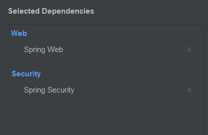
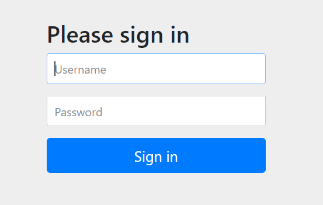

在 Spring Boot 中使用 Spring Security，最小的依赖包括以下两项：




### spring-boot pom.xml

```xml
<dependency>
    <groupId>org.springframework.boot</groupId>
    <artifactId>spring-boot-starter-web</artifactId>
</dependency>
<dependency>
    <groupId>org.springframework.boot</groupId>
    <artifactId>spring-boot-starter-security</artifactId>
</dependency>
```


### 在 `.properties` 配置文件中配置用户名和密码

```properties
spring.security.user.name=tom
spring.security.user.password=123
```

Spring Security 将以上述的用户名和密码作为『标准答案』，将用户输入的用户名和密码与之匹配。

### Spring Security 的『拦截』效果

当我们发起 `/` 请求时，Spring Security 发现用户曾经未登陆过，就会显示一个登陆页面，要求用户输入用户名和密码进行认证。



认证通过后，Spring Security 才允许 `/` 请求通过，用户才能看到 `/` 请求的正常响应结果。

