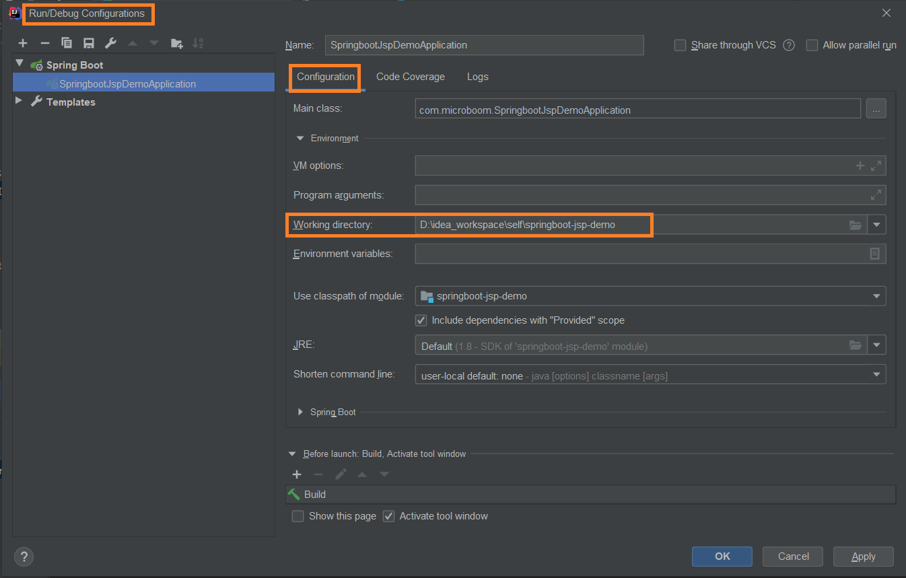

<span class="title">Spring Boot 项目中使用 JSP</span>

想在 Spring Boot 中使用 JSP，需要满足一些特殊要求。

# 项目结构

Spring Boot 项目想要支持 JSP，其项目结构必须如下：

```xml
spring-boot-jsp
│── pom.xml
└── src
    ├── main
    │   ├── java
    │   ├── resouces
    │   └── webapp
    │       └── WEB-INF
    │           └── jsp
    │               └── welcome.jsp
    └── test
```

在配置文件 *`application.properties`* 中进行配置：

```properties
spring.mvc.view.prefix=/WEB-INF/jsp/
spring.mvc.view.suffix=.jsp
```

- `spring.mvc.view.prefix` 指明 jsp 文件在 webapp 下的哪个目录
- `spring.mvc.view.suffix` 指明 jsp 以什么样的后缀结尾


# 引入依赖包

```xml
<dependency>
  <groupId>org.springframework.boot</groupId>
  <artifactId>spring-boot-starter-web</artifactId>
</dependency>
<dependency>
  <groupId>javax.servlet</groupId>
  <artifactId>jstl</artifactId>
</dependency>
<dependency>
  <groupId>org.apache.tomcat.embed</groupId>
  <artifactId>tomcat-embed-jasper</artifactId>
</dependency>
```

- `spring-boot-starter-web` 包依赖了 `spring-boot-starter-tomcat`，因此，后者不再需要单独配置；
- `jstl` 是一个 JSP 的 jstl 标签库；
- `tomcat-embed-jasper` 主要用来支持 JSP 的解析和运行。

# 编写页面和后台

```jsp
<%@ page contentType="text/html; charset=UTF-8" pageEncoding="UTF-8"%>
<!DOCTYPE html>
<html>
<body>
Time: ${time}
<br>
Message: ${message}
</body>
</html>
```

```java
@Controller
public class WelcomeController {

    @GetMapping("/")
    public String welcome(Model model) {
        model.addAttribute("time", new Date());
        model.addAttribute("message", "hello world");
        return "welcome";
    }

}
```

# 运行方式一：Maven 命令运行

cmd 进入项目根路径下，执行：

```sh
mvn clean spring-boot:run
```

补充：Idea 的 Maven 工具窗口中，有个 ***`M`*** 图标，通过点击它在弹出的窗口中可直接手动执行 maven 命令。

# 运行方式二：在 IDEA 中运行

如果像其他项目一样，直接在 IDEA 中通过 main 方法来启动项目，在访问测试的时候会出现 `404 not found` 。

这是因为 Spring Boot JSP 项目需要额外进行一个设置：选择 `Edit Configurations` 选项，打开 `Configuration`，为 `Working directory` 赋值为项目的根目录。




# 运行方式三：打 war 包部署运行


- step 1：在 pom.xml 里设置打包格式为 *`war`* 。

  ```xml
  <packaging>war</packaging>
  ```

- step 2：排除内嵌的 Tomcat 依赖，避免 jar 包冲突。

  ```xml
  <dependency>
      <groupId>org.springframework.boot</groupId>
      <artifactId>spring-boot-starter-web</artifactId>
      <!-- 排除内置容器。导出成 war 包可以让外部容器运行 spring-boot 项目-->
      <exclusions>
          <exclusion>
              <groupId>org.springframework.boot</groupId>
              <artifactId>spring-boot-starter-tomcat</artifactId>
          </exclusion>
      </exclusions>
  </dependency>
  ```

- step 3：添加 Servlet 的支持

  Spring Boot 项目必须实现 **`SpringBootServletInitializer`** 接口的 *`configure()`* 方法才能让外部容器运行 Spring Boot 项目。

  在启动类同目录下创建 **`ServletInitializer`** 类：

  ```java
  public class ServletInitializer extends SpringBootServletInitializer {

      @Override
      protected SpringApplicationBuilder configure(SpringApplicationBuilder application) {
          return application.sources(JspApplication.class);
      }

  }
  ```

- step 4：maven 命令打包

  在项目根目录下执行：

  ```shell
  mvn clean package
  ```

- step 5：发布运行

  将项目 target 目录下的 `.war` 包拷贝到 tomcat 的 `webapps` 目录下，运行 tomcat 的 `bin` 目录下的 `startup.bat` 启动 tomcat 。

  在浏览器中访问即可。

