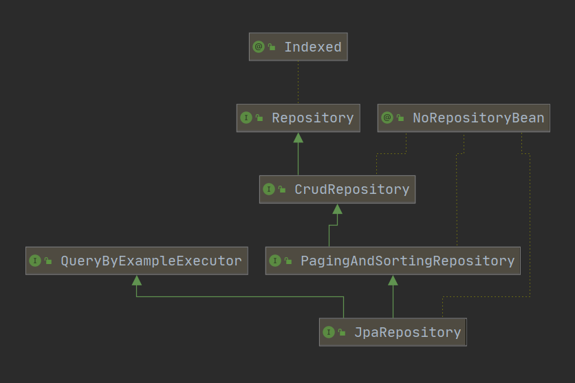

<span class="title">Spring Data JPA 的基本使用</span>

# 基本概念

## JPA 由来

从理论上来说，Mybatis 和 Hibernate 并非同一类框架：Mybatis 是半自动 ORM 框架，而 Hibernate 是全自动的。

而从全自动 ORM 框架的角度来将，Hibernate 也非唯一的一个，跟它同类的竞争对手还有：TopLink、JDO 等<small>（虽然市场占有率十分低）</small> 。

不同的全自动<small>（这里并不包括 Mybatis）</small>之间，功能是是相似的，但是 API 接口的区别十分大。不便于项目在底层技术实现之间迁移。

JPA（Java Persistence API）是 Sun 官方提出的 Java 持久化 <strong>规范</strong>。它的出现主要是为了简化现有的持久化开发工作和整合 ORM 技术，提供统一的 API 接口，结束现在 Hibernate、TopLink、JDO 等 ORM 框架各自为营的局面。

<small>注意：JPA 只是一套规范，不是一套产品。JPA 和 Hibernate、TopLink、JDO 之间的关系，就像 slf4j 和 log4j2、logback 之间的关系一样。</small>

## Spring Data JPA

一个项目直接<small>（或间接）</small>使用 Hibernate 有三种方式：

1. 直接使用 Hibernate。

2. 直接使用 JPA，间接使用 Hibernate；

3. 通过 spring-data-jpa，将 JPA（和 Hibernate）整合进 Spring 项目，以一种特定的方式（sprig data）使用 JPA，从而间接使用 Hibernate 。

Spring Data JPA 是 Spring 基于 ORM 框架、JPA 规范的基础上封装的一套 JPA 应用框架。如果说，JPA 简化了 Hibernate 的使用，那么 spring-data-jpa 则是在这个基础上再一次简化了 hibernate，提高了开发效率。<small>Spring Data JPA 让我们摆脱了 DAO 层的操作，基本上所有 CRUD 都可以依赖于它实现。</small>

Spring Data JPA 其实就是要求在 Spirng Data 的体系下使用 JPA。<small>Spring Data JPA 只是 Spring Data 体系中的一员。</small>


# 快速上手

## 添加依赖

```xml
<dependency>
    <groupId>org.springframework.boot</groupId>
    <artifactId>spring-boot-starter-data-jpa</artifactId>
</dependency>
<dependency>
    <groupId>mysql</groupId>
    <artifactId>mysql-connector-java</artifactId>
</dependency>
```

## 添加配置文件

```properties
spring.datasource.driver-class-name=com.mysql.cj.jdbc.Driver
spring.datasource.url=jdbc:mysql://127.0.0.1:3306/scott\
    ?useUnicode=true\
    &characterEncoding=utf-8\
    &useSSL=true\
    &serverTimezone=UTC
spring.datasource.username=root
spring.datasource.password=123456
spring.jpa.show-sql=true
spring.jpa.properties.hibernate.dialect=org.hibernate.dialect.MySQL5Dialect
spring.jpa.properties.hibernate.format_sql=true
spring.jpa.properties.hibernate.hbm2ddl.auto=update

logging.level.root=INFO
logging.level.hemiao3000.gitee.io=DEBUG
logging.pattern.console=${CONSOLE_LOG_PATTERN:\
    %clr(${LOG_LEVEL_PATTERN:%5p}) \ 
    %clr(|){faint} \
    %clr(%-40.40logger{39}){cyan} \
    %clr(:){faint} \
    %m%n${LOG_EXCEPTION_CONVERSION_WORD:%wEx}}
```

*`hibernate.hbm2ddl.auto`* 参数的作用主要用于：自动创建、更新、验证数据库表结构，有四个值。

| 值 | 说明 |
| :- | :- |
| `create` | 每次加载 Hibernate 时都会删除上一次生成的表，然后根据 model 类再重新来生成新表，哪怕两次没有任何改变也要这样执行，这就是导致数据库表数据丢失的一个重要原因。|
| `create-drop` | 每次加载 Hibernate 时根据 model 类生成表，但是 sessionFactory 一关闭，表就自动删除。|
| **`update`** | 最常用的属性，第一次加载 Hibernate 时根据 model 类会自动建⽴立起表的结构<small>（前提是先建立好数据库）</small>，以后加载 Hibernate 时根据 model 类自动更新表结构，即使表结构改变了，但表中的行仍然存在，不会删除以前的行。要注意的是当部署到服务器后，表结构是不会被马上建立起来的，是要等应用第一次运行起来后才会。|
| `validate` | 每次加载 Hibernate 时，验证创建数据库表结构，只会和数据库中的表进行比较，不会创建新表，但是会插入新值。|

## 实体类

```java
/*
 * DBMS   - catalog  - schema   - table
 * Mysql  - <no>     - database - table
 */
@Entity
@Table(name="表名", schema ="数据库名")
public class User {

    @Id
    @GeneratedValue
    private Long id;

    @Column(nullable = false, unique = true)
    private String userName;

    @Column(nullable = false)
    private String passWord;

    @Column(nullable = false, unique = true)
    private String email;

    @Column(nullable = true, unique = true)
    private String nickName;

    @Column(nullable = false)
    private String regTime;

	// getter / settet ...
}
```

- `@Entity(name="EntityName")` **必须**

  用来标注一个数据库对应的实体，数据库中创建的表名默认和类名一致。其中，name 为可选,对应数据库中一个表，使用此注解标记 JavaBean 是一个 JPA 实体。

- `@Table(name="", catalog="", schema="")` *可选*

  用来标注一个数据库对应的实体，数据库中创建的表名默认和类名一致。通常和 `@Entity` 配合使用，只能标注在实体的 class 定义处，表示实体对应的数据库表的信息。

  在数据库理论领域中，DBMS - Catalog - Schema - Table 是四级概念，但不是所有的数据库系统都支持这四级。MySql 就不支持其中的 catalog ，而 schema 就是 mysql 中的 database 。

- `@Id` **必须**

  `@Id` 定义了映射到数据库表的主键的属性，一个实体只能有一个属性被映射为主键。

- `@GeneratedValue(strategy=GenerationType, generator="")` *可选*

  - `strategy`：表示主键生成策略,有 `AUTO`、`INDENTITY`、`SEQUENCE` 和 `TABLE` 4 种。

  - `generator`：表示主键生成器的名称。

- `@Column(name="user_code", nullable=false, length=32)` *可选*

  `@Column` 描述了数据库表中该字段的详细定义，这对于根据 JPA 注解生成数据库表结构的工具。
  
  - `name`：表示数据库表中该字段的名称，默认情形属性名称一致;
  
  - `nullable`：表示该字段是否允许为 null，默认为 true;
  
  - `unique`：表示该字段是否是唯一标识，默认为 false;
  
  - `length`：表示该字段的大小，仅对 String 类型的字段有效。

- `@Transient` *可选*

  `@Transient` 表示该属性并非一个到数据库表的字段的映射，ORM 框架将忽略该属性。

- `@Enumerated` *可选*

  使用枚举的时候，我们希望数据库中存储的是枚举对应的 String 类型，而不是枚举的索引值，需要在属性上面添加 *`@Enumerated(EnumType.STRING)`* 注解。

# UUID 和 ASSIGNED 主键策略

通常 JPA【背后】是 Hibernate，而 Hibernate 除了和上述的一样的 *`identity`*、*`sequence`* 主键生成策略之外，还有 *`uuid`* 和 *`assigend`* 两种主键生成策略。

在 JPA 中使用 Hibernate 的 uuid 和 assigend 策略，需要【多】使用一个注解：***`@GenericGenerator`*** 。

!FILENAME uuid
```java
@Id
@GeneratedValue(generator = "xxx")
@GenericGenerator(name = "xxx", strategy = "uuid")
private String id;
```

!FILENAME assigend
```java
@Id
@GeneratedValue(generator = "yyy")
@GenericGenerator(name = "yyy", strategy = "assigned")
private Long id;
```


# Repository 构建

> <small>如果是直接使用 Hibernate 或 JPA，即便是最简单的查询操作，都是从获取核心对象 Session 开始。</small>
>
> <small>由于我们是在 Spring Data 体系下使用 JPA，我们对于 JPA 的使用，就如同之前的 spring-data-redis（未来的 spring-data-elasticsearch）一样，继承 Spring Data 体系中的某个 Repository 接口，因此获得一套『现成』的增删改查一套方法。</small>

创建的 ***`Repository`*** 只要继承 ***`JpaRepository`*** 即可，就会帮我们自动生成很多内置方法。

另外还有一个功能非常实用，可以根据方法名自动生产 SQL，比如 *`.findByUserName()`* 会自动生产一个以 `userName` 为参数的查询方法，比如 *`.findAll()`* 会自动查询表里面的所有数据等。

```java
@Repository
public interface UserRepository extends JpaRepository<User, Long> {
    User findByUserName(String userName);
    User findByUserNameOrEmail(String username, String email);
}
```

我们只需要在对应的 Repository 中创建好方法，使用的时候直接将接口注入到类中调用即可。



*`JpaRepository`* 继承 PagingAndSortingRepository 和 QueryByExampleExecutor。PagingAndSortingRepository 又继承了 CrudRepository 。

CrudRepository 内置了我们最常用的增、删、改、查的方法。

PagingAndSortingRepository 类在 CrudRepository 基础上负责排序和分⻚，QueryByExampleExecutor 提供了很多示例的查询方法。

因此使用 JPA 操作数据库时，只需要构建的 Repository 继承了 *`JpaRepository`*，就会拥有了很多常用的数据库操作方法。


# 自定义查询

Spring Data JPA 可以根据接口方法名来实现数据库操作，主要的语法是 findXXBy、readAXXBy、 queryXXBy、countXXBy、getXXBy 后面跟属性名称，利用这个功能仅需要在定义的 Repository 中添加对应的方法名即可，使用时 Spring Boot 会自动帮我们实现，示例如下。

- 根据用户名查询用户：

  ```java
  User findByUserName(String userName);
  ```

- 也可以加⼀一些关键字 And、or：

  ```java
  User findByUserNameOrEmail(String username， String email);
  ```

- 修改、删除、统计也是类似语法：

  ```java
  Long deleteById(Long id);
  Long countByUserName(String userName);
  ```

- 基本上 SQL 体系中的关键词都可以使用，如 LIKE 、IgnoreCase、OrderBy：

  ```java
  List<User> findByEmailLike(String email);
  User findByUserNameIgnoreCase(String userName);
  List<User> findByUserNameOrderByEmailDesc(String email);
  ```

可以根据查询的条件不断地添加和拼接，Spring Boot 都可以正确解析和执行，其他使用示例例可以参考下表。

**具体的关键字，使用方法和生产成 SQL 如下表所示**


| Keyword | Sample | JPQL snippet |
| :- | :- | :- |
| And                | findByLastnameAndFirstname   | … where x.lastname = ?1 and x.firstname  = ?2 |
| Or                 | findByLastnameOrFirstname    | … where x.lastname = ?1 or x.firstname = ?2   |
| Is, Equals         | findByFirstnameIs, <br>findByFirstnameEquals | … where x.firstname = ?1      |
| Between            | findByStartDateBetween       | … where x.startDate between ?1 and ?2    |
| LessThan           | findByAgeLessThan            | … where x.age < ?1    |
| LessThanEqual      | findByAgeLessThanEqual       | … where x.age <= ?1   |
| GreaterThan        | findByAgeGreaterThan         | … where x.age > ?1    |
| GreaterThanEqual   | findByAgeGreaterThanEqual    | … where x.age >= ?1   |
| After              | findByStartDateAfter         | … where x.startDate > ?1 |
| Before             | findByStartDateBefore        | … where x.startDate < ?1 |
| IsNull             | findByAgeIsNull              | … where x.age is null     |
| IsNotNull, NotNull | findByAge(Is)NotNull         | … where x.age not null    |
| Like               | findByFirstnameLike          | … where x.firstname like ?1 |
| NotLike            | findByFirstnameNotLike       | … where x.firstname not like ?1 |
| StartingWith       | findByFirstnameStartingWith  | … where x.firstname like ?1 (parameter bound with appended %)  |
| EndingWith         | findByFirstnameEndingWith    | … where x.firstname like ?1 (parameter bound with prepended %) |
| Containing         | findByFirstnameContaining    | … where x.firstname like ?1 (parameter bound wrapped in %) |
| OrderBy            | findByAgeOrderByLastnameDesc | … where x.age = ?1 order by x.lastname desc |
| Not                | findByLastnameNot            | … where x.lastname <> ?1 |
| In                 | findByAgeIn(Collection ages) | … where x.age in ?1 |
| NotIn              | findByAgeNotIn(Collection age) | … where x.age not in ?1 |
| TRUE               | findByActiveTrue()           | … where x.active = true |
| FALSE              | findByActiveFalse()          | … where x.active = false |
| IgnoreCase         | findByFirstnameIgnoreCase    | … where UPPER(x.firstame) = UPPER(?1) |


# JPA 高级查询： 自定义 SQL 查询

## @Query

使用 Spring Data 大部分的 SQL 都可以根据方法名定义的方式来实现，但是由于某些原因必须使用自定义的 SQL 来查询，Spring Data 也可以完美支持。

在 SQL 的查询方法上面使用 ***`@Query`*** 注解，在注解内写 Hql 来查询内容。

```java
@Query("select u from User u")
Page<User> findALL(Pageable pageable);
```

当然如果感觉使用原生 SQL 更习惯，它也是支持的，需要再添加一个参数 *`nativeQuery = true`* 。

```java
@Query("select * from user u where u.nick_name = ?1", nativeQuery = true)
Page<User> findByNickName(String nickName, Pageable pageable);
```

*`@Query`* 上面的 **`?1`** 代表的是方法参数里面的顺序，如果有多个参数也可以按照这个方式添加 1、2、3....。除了按照这种方式传参外，还可以使用 **`@Param`** 来支持。

```java
@Query("select u from User u where u.nickName = :xxx")
Page<User> findByNickName(@Param("xxx") String nickName, Pageable pageable);
```

如涉及到删除和修改需要加上 *`@Modifying`*，也可以根据需要添加 *`@Transactional`* 对事务的支持、操作超时设置等<small>（以下仅作演示。*`@Transactional`* 注解应该用于 Service 层方法）</small>。

```java
@Transactional(timeout = 10)
@Modifying
@Query("update User set userName = ?1 where id = ?2")
int modifyById(String userName, Long id);

@Transactional
@Modifying
@Query("delete from User where id = ?1")
void deleteById(Long id);
```


## 使用已命名的查询

除了使用 **`@Query`** 注解外，还可以预先定义好一些查询，并为其命名，然后再 Repository 中添加相同命名的方法。

定义命名的 Query：

```java
@Entity
@NamedQueries({
    @NamedQuery(name = "DAO接口名.方法名", query = "HQL语句"),
    @NamedQuery(name = "User.findByPassWord", query = "select u from User u where u.passWord = ?1"),
    @NamedQuery(name = "User.findByNickName", query = "select u from User u where u.nickName = ?1"),
    @namedQuery(name = "...", query = "..."),
    @namedQuery(name = "...", query = "..."),
    @namedQuery(name = "...", query = "..."),
})
public class User {
……
}
```

通过 ***`@NamedQueries`*** 注解可以定义多个命名 Query，***`@NamedQuery`*** 的 name 属性定义了 Query 的名称，注意加上 *`<Entity>.`* 作为前缀，query 属性定义查询语句。

定义对应的方法：

```java
List<User> findByPassWord(String passWord);
List<User> findByNickName(String nickName);
```

# JPA 高级查询： 分页查询和限制查询

Spring Data JPA 已经帮我们内置了分页功能，在查询的方法中，需要传入参数 Pageable，当查询中有多个参数的时候 Pageable 建议 ***作为最后一个参数传入***。

```java
@Query("select u from User u")
Page<User> findALL(Pageable pageable);
Page<User> findByNickName(String nickName, Pageable pageable);

// Pageable pageable = PageRequest.of(0, 3);
```

Pageable 是 Spring 封装的分页实现类，使用的时候需要传入页数、每页条数和排序规则，Page 是 Spring 封装的分页对象，封装了总页数、分页数据等。返回对象除使用 Page 外，还可以使用 Slice 作为返回值。

```java
Slice<User> findByNickNameAndEmail(String nickName, String email, Pageable pageable);
```

Page 和 Slice 的区别如下:

- Page 接口继承自 Slice 接口，而 Slice 继承自 Iterable 接口。

- Page 接口扩展了 Slice 接口，添加了获取总页数和元素总数量的方法，因此，返回 Page 接口时，必须执行两条 SQL，一条复杂查询分页数据，另一条负责统计数据数量。

- 返回 Slice 结果时，查询的 SQL 只会有查询分页数据这一条，不统计数据数量。

- 用途不一样：Slice 不需要知道总页数、总数据量，只需要知道是否有下一页、上一页，是否是首页、尾页等，比如前端滑动加载一页可用；而 Page 知道总页数、总数据量，可以用于展示具体的页数信息，比如后台分页查询。


实例：

```java
@Test
public void testPageQuery() {
    int page=1, size=2;
    Sort sort = new Sort(Sort.Direction.DESC, "id");
    Pageable pageable = PageRequest.of(page, size, sort);
    userRepository.findALL(pageable);
    userRepository.findByNickName("aa", pageable);
}
```

- Sort，控制分页数据的排序，可以选择升序和降序。
- PageRequest，控制分页的辅助类，可以设置页码、每页的数据条数、排序等。

## 限制查询

有时候我们只需要查询前 N 个元素，或者只取前一个实体。

```java
User findFirstByOrderByLastnameAsc();
User findTopByOrderByAgeDesc();
Page<User> queryFirst10ByLastname(String lastname, Pageable pageable);
List<User> findFirst10ByLastname(String lastname, Sort sort);
List<User> findTop10ByLastname(String lastname, Pageable pageable);
```


# JPA 高级查询： 复杂查询

我们可以通过 ***`AND`*** 或者 ***`OR`*** 等连接词来不断拼接属性来构建多条件查询，但如果参数大于 6 个时，方法名就会变得非常的长，并且还不能解决动态多条件查询的场景。到这里就需要给大家介绍另外一个利器 **`JpaSpecificationExecutor`** 了。

**`JpaSpecificationExecutor`** 是 JPA 2.0 提供的 `Criteria API` 的使用封装，可以用于动态生成 Query 来满足我们业务中的各种复杂场景。Spring Data JPA 为我们提供了 **`JpaSpecificationExecutor`** 接口，只要简单实现 **`toPredicate`** 方法就可以实现复杂的查询。

我们来看一下 JpaSpecificationExecutor 的源码：

```java
public interface JpaSpecificationExecutor<T> {
    // 根据 Specification 条件查询单个对象，注意的是，如果条件能查出来多个会报错
    T findOne(@Nullable Specification<T> spec);
    // 根据 Specification 条件查询 List 结果
    List<T> findAll(@Nullable Specification<T> spec);
    // 根据 Specification 条件，分页查询
    Page<T> findAll(@Nullable Specification<T> spec, Pageable pageable);
    // 根据 Specification 条件，带排序的查询结果
    List<T> findAll(@Nullable Specification<T> spec, Sort sort);
    // 根据 Specification 条件，查询数量
    long count(@Nullable Specification<T> spec);
}
```

JpaSpecificationExecutor 的源码很简单，根据 Specification 的查询条件返回 List、Page 或者 count 数据。

在使用 JpaSpecificationExecutor 构建复杂查询场景之前，我们需要了解几个概念：

| 概念 | 说明 |
| :- | :- |
| `Root<T> root` | 代表了可以查询和操作的实体对象的根，可以通过 `get("属性名")` 来获取对应的值。 |
| `CriteriaQuery<?> query` |代表一个 `specific` 的顶层查询对象，它包含着查询的各个部分，比如 `select `、`from`、`where`、`group by`、`order by` 等。|
| `CriteriaBuilder cb` | 来构建 `CritiaQuery` 的构建器器对象，其实就相当于条件或者是条件组合，并以 `Predicate` 的形式返回。 |

## 使用案例

首先定义一个 UserDetail 对象，作为演示的数据模型。

```java
@Entity
public class UserDetail {
    @Id
    @GeneratedValue
    private Long id;
    @Column(nullable = false, unique = true)
    private Long userId;
    private Integer age;
    private String realName;
    private String status;
    private String hobby;
    private String introduction;
    private String lastLoginIp;
}
```

创建 UserDetail 对应的 Repository：

```java
public interface UserDetailRepository 
        extends JpaSpecificationExecutor<UserDetail>, 
                JpaRepository<UserDetail, Long> {
}
```

定义一个查询 Page\<UserDetail> 的接口：

```java
public interface UserDetailService {
    public Page<UserDetail> findByCondition(UserDetailParam detailParam, Pageable pageable);
}
```

在 UserDetailServiceImpl 中，我们来演示 JpaSpecificationExecutor 的具体使用。

```java
@Service
public class UserDetailServiceImpl implements UserDetailService {

    @Autowired
    private UserDetailRepository userDetailRepository;
    
    @Override
    public Page<UserDetail> findByCondition(Map<String, Object> params, Pageable pageable) {
        return userDetailRepository.findAll((root, query, cb) -> {
            List<Predicate> predicates = new ArrayList<Predicate>();
    
            // equal 示例：“introduction = xxx”
            Predicate predicate1 = cb.equal(root.get("introduction"), arg1);
            
            // like 示例：realName like ?
            Predicate predicate2 = cb.like(root.get("realName"), "%" + arg2);
            
            // between 示例：age between (?, ?)
            Predicate predicate3 = cb.between(root.get("age"), arg3, arg4);
            
            // greaterThan 大于等于示例
            Predicate predicate4 = cb.greaterThan(root.get("age"), arg5);
            
            // where A and B and (C or D)
            return cb.and(
                predicate1, 
                predicate2, 
                cb.or(predicate3, predicate4)
            );
        }, pageable);
    }
}
```

上面的示例是根据不同条件来动态查询 UserDetail 分页数据，UserDetailParam 是参数的封装，示例中使用了常用的大于、like、等于等示例，根据这个思路我们可以不断扩展完成更复杂的动态 SQL 查询。

使用时只需要将 UserDetailService 注入调用相关方法即可：

```java
@RunWith(SpringRunner.class)
@SpringBootTest
public class JpaSpecificationTests {

    @Autowreid
    private UserDetailService userDetailService;

    @Test
    public void testFindByCondition() {
        int page=0,size=10;
        Sort sort = new Sort(Sort.Direction.DESC, "id");
        Pageable pageable = PageRequest.of(page, size, sort);
        UserDetailParam param = new UserDetailParam();
        param.setIntroduction("程序员");
        param.setMinAge(10);
        param.setMaxAge(30);
        Page<UserDetail> page1=userDetailService.findByCondition(param, pageable);
        for (UserDetail userDetail:page1){
            System.out.println("userDetail: "+userDetail.toString());
        }
    }
}
```

# JPA 高级查询： 多表查询

多表查询在 Spring Data JPA 中有两种实现方式，第一种是利用 Hibernate 的级联查询来实现，第二种是创建一个结果集的接口来接收连表查询后的结果，这里主要介绍第二种方式。

我们还是使用上面的 UserDetail 作为数据模型来使用，定义一个结果集的接口类，接口类的内容来自于用户表和用户详情表。

```java
public interface UserInfo {
    String getUserName();
    String getEmail();
    String getAddress();
    String getHobby();
}
```

在运行中 Spring 会给接口（UserInfo）自动生产一个代理类来接收返回的结果，代码中使用 `getXXX()` 的形式来获取。

在 **`UserDetailRepository`** 中添加查询的方法，返回类型设置为 UserInfo：

```java
@Query("select 
       u.userName as userName, u.email as email, 
       		d.address as address, d.hobby as hobby 
       from User u, UserDetail d 
       where u.id = d.userId 
       and d.hobby = ?1 ")
List<UserInfo> findUserInfo(String hobby);
```

特别注意这里的 SQL 是 HQL，需要写类的名和属性，这块很容易出错。

测试验证：

```java
@Slf4j
@Test
public void testUserInfo() {
    List<UserInfo> userInfos=userDetailRepository.findUserInfo("钓鱼");
    for (UserInfo userInfo: userInfos) {
        log.info("userInfo: {}-{}-{}-{}", 
            userInfo.getUserName(),
            userInfo.getEmail(),
            userInfo.getHobby(),
            userInfo.getIntroduction());
    }
}
```

运行测试方法后返回：

```
userInfo: aa-aa@126.com-钓鱼-程序员
```

证明关联查询成功，最后的返回结果来自于两个表，按照这个思路可以进行三个或者更多表的关联查询。


# open session in view

启动类<small>（或某个配置类）</small>中加入 

```java
@Bean
public OpenEntityManagerInViewFilter openEntityManagerInViewFilter() {
   return new OpenEntityManagerInViewFilter();
}
```

配置文件中加入 `spring.jpa.open-in-view=true` 。

『The End』
