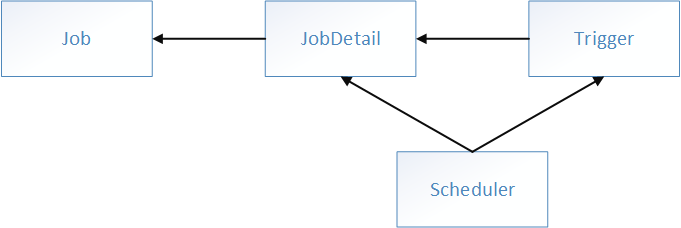

<span class="title">SpringBoot 集成 Quartz</span>

在项目开发中，经常需要定时任务来帮助我们来做一些内容，比如定时派息、跑批对账、业务监控等。

SpringBoot 体系中现在有两种方案可以选择：

- 第一种是 SpringBoot 内置的方式简单注解就可以使用

- 如果需要更复杂的应用场景可以使用 Quartz 
 
Quartz 目前是 Java 体系中最完善的定时方案。

# SpringBoot 内置定时

## pom 包配置

pom 包里面只需要引入 SpringBoot Starter 包即可，SpringBoot Starter 包中已经内置了定时的方法。

```xml
<dependency>
    <groupId>org.springframework.boot</groupId>
    <artifactId>spring-boot-starter</artifactId>
</dependency>
```

## 启动类开启定时

在启动类上面加上 @EnableScheduling 即可开启定时:

```java
@Spring BootApplication
@EnableScheduling
public class Application {
    public static void main(String[] args) {
        SpringApplication.run(Application.class， args);
    }
}
```

## 创建定时任务实现类

使用 SpringBoot 自带的定时非常的简单，只需要在方法上面添加 @Scheduled 注解即可。

### 定时任务1:

```java
@Component
public class SchedulerTask {
    private int count=0;

    @Scheduled(cron="*/6 * * * * ?")
    private void process(){
        System.out.println("this is scheduler task runing " + (count++));
    }
}
```

设置 process() 每隔六秒执行一次，并统计执行的次数。
我们还有另外的一种方案来设置，固定时间周期执行方法。

### 定时任务2:

```java
@Component
public class Scheduler2Task {
    private static final SimpleDateFormat dateFormat = new SimpleDateFormat("HH:mm:ss");

    @Scheduled(fixedRate = 6000)
    public void reportCurrentTime() {
        System.out.println("现在时间:" + dateFormat.format(new Date()));
    }
}
```

启动项目之后，就会在控制台看到打印的结果。

结果如下:

```
this is scheduler
现在时间:09:44:17
this is scheduler
现在时间:09:44:23
this is scheduler
现在时间:09:44:29
this is scheduler
现在时间:09:44:35
task runing 0
task runing 1
task runing 2
task runing 3
```

说明两个方法都按照固定 6 秒的频率来执行。

## 参数说明

@Scheduled 参数可以接受两种定时的设置，一种是我们常用的 `cron="*/6 * * * * ?"`，一种是 `fixedRate = 6000`，两种都可表示固定周期执行定时任务。

fixedRate 说明

- @Scheduled(fixedRate = 6000):上一次开始执行时间点之后 6 秒再执行。
- @Scheduled(fixedDelay = 6000):上一次执行完毕时间点之后 6 秒再执行。
- @Scheduled(initialDelay=1000， fixedRate=6000):第一次延迟 1 秒后执行，之后按 fixedRate 的规则每 6 秒执行一次。

cron 说明

cron 一共有七位，最后一位是年，SpringBoot 定时方案中只需要设置六位即可:

- 第一位，表示秒，取值 0 ~ 59;
- 第二位，表示分，取值 0 ~ 59;
- 第三位，表示小时，取值 0 ~ 23;
- 第四位，日期天/日，取值 1 ~ 31;
- 第五位，日期月份，取值 1~12;
- 第六位，星期，取值 1 ~ 7，星期一，星期二...，注，不是第 1 周、第 2 周的意思，另外，1 表示星期天，2 表示星期一;
- 第七位，年份，可以留空，取值 1970 ~ 2099。

cron 中，还有一些特殊的符号，含义如下:

- `(*)` 星号 
 
  可以理解为每的意思，每秒、每分、每天、每月、每年 ... 。

- `(?)` 问号 
 
  问号只能出现在日期和星期这两个位置，表示这个位置的值不确定，每天 3 点执行，因此第六位星期的位置，是不需要关注的，就是不确定的值;同时，日期和星期是两个相互排斥的元素，通过问号来表明不指定值，比如 1 月 10 日是星期一，如果在星期的位置另指定星期二，就前后冲突矛矛盾了。
- `(-)` 减号 
  
  表达一个范围，如在小时字段中使用“10 ~ 12”，则表示从 10 到 12 点，即 10、11、12。

- `(,)` 逗号 
  
  表达一个列表值，如在星期字段中使用“1、2、4”，则表示星期一、星期二、星期四。

- `(/)` 斜杠 

  如 `x/y`，x 是开始值，y 是步长，比如在第一位(秒)，`0/15` 就是从 0 秒开始，每隔 15 秒执行一次，最后就是 0、15、30、45、60，另 `*/y`，等同于 `0/y` 。

下面列举几个常用的例子子。

| 实例 | 说明 |
| :- | :- |
| `0 0 3 * * ?` | 每天 3 点执行 |
| `0 5 3 * * ?` | 每天 3 点 5 分执行 |
| `0 5 3 ? * *` | 每天 3 点 5 分执行，与上面作用相同 |
| `0 5/10 3 * * ?` |  每天 3 点的 5 分、15 分、25 分、35 分、45 分、55 分这几个时间点执行 |
| `0 10 3 ? * 1` |  每周星期天，3 点 10 分执行，注，1 表示星期天 |
| `0 10 3 ? * 1#3` | 每个月的第三个星期，星期天执行，# 号只能出现在星期的位置 |

# Quartz

Quartz 是一个开源的作业调度框架，它完全由 Java 写成，提供了巨大的灵活性而不牺牲简单性。

当定时任务愈加复杂时，使用 Spring 注解 @Schedule 已经不能满足业务需要。

Quartz 的优点:

- 丰富的 Job 操作 API;
- 支持多种配置;
- SpringBoot 无缝集成;
- 支持久化;
- 支持集群;
- Quartz 还支持开源，是一个功能丰富的开源作业调度库，可以集成到几乎任何 Java 应用程序中。

# Quartz 体系结构

Quartz 有 4 个核心概念：Job(任务)、JobDetail(任务信息)、Trigger(触发器)和 Scheduler(调度器)。

- Job

  是一个接口，只定义一个方法 execute(JobExecutionContext context)，在实现接口的 execute 方法中编写所需要定时执行的 Job(任务)，JobExecutionContext 类提供了调度应用的一些信息; Job 运行时的信息保存在 JobDataMap 实例中。

- JobDetail

  Quartz 每次调度 Job 时，都重新创建一个 Job 实例，因此它不接受一个 Job 的实例，相反它接收一个 Job 实现类(JobDetail，描述 Job 的实现类及其他相关的静态信息，如 Job 名字、描述、关联监听器等信息)，以便运行时通过 newInstance() 的反射机制实例化 Job。


- Trigger

  是一个类，描述触发 Job 执行的时间触发规则，主要有 SimpleTrigger 和 CronTrigger 这两个子类。当且仅当需调度一次或者以固定时间间隔周期执行调度，SimpleTrigger 是最适合的选择;而 CronTrigger 则可以通过 Cron 表达式定义出各种复杂时间规则的调度方案:如工作日周一到周五的 15:00 ~ 16:00 执行调度等。

- Scheduler

  调度器就相当于一个容器，装载着任务和触发器，该类是一个接口，代表一个 Quartz 的独立运行容器，Trigger 和 JobDetail 可以注册到 Scheduler 中，两者在 Scheduler 中拥有各自的组及名称，组及名称是 Scheduler 查找定位容器中某一对象的依据，Trigger 的组及名称必须唯一，JobDetail 的组和名称也必须唯一(但可以和 Trigger 的组和名称相同，因为它们是不同类型的)。Scheduler 定义了多个接口方法，允许外部通过组及名称访问和控制容器中 Trigger 和 JobDetail。


四者其关系如下图所示:



- Job 为作业的接口，为任务调度的对象;
- JobDetail 用来描述 Job 的实现类及其他相关的静态信息;
- Trigger 做为作业的定时管理工具，一个 Trigger 只能对应一个作业实例，而而一个作业实例可对应多个触发器;
- Scheduler 做为定时任务容器器，是 Quartz 最上层的东西，它提携了所有触发器和作业，使它们协调工作，每个 Scheduler 都存有 JobDetail 和 Trigger 的注册，一个 Scheduler 中可以注册多个 JobDetail 和多个
Trigger。

# SpringBoot 和 Quartz

SpringBoot 2.0 提供了 `spring-boot-starter-quartz` 组件集成 Quartz，让我们在项目中使用 Quartz 变得简单。

## 配置 pom.xml

添加 spring-boot-starter-quartz 组件:

```xml
<dependency>
    <groupId>org.springframework.boot</groupId>
    <artifactId>spring-boot-starter-quartz</artifactId>
</dependency>
```

## 简单示例

配置完成之后先来做一个最简单的示例，使用 Quartz 定时输出 Hello World 。

首先定义一个 Job 需要继承 QuartzJobBean，示例中 Job 定义一个变量 Name，用于在定时执行的时候传入。

```java
public class SampleJob extends QuartzJobBean {

    private String name;

    public void setName(String name) {
        this.name = name;
    }

    @Override
    protected void executeInternal(JobExecutionContext context) throws JobExecutionException {
        System.out.println(String.format("Hello %s!"， this.name));
    }
}
```

接下来构建 JobDetail，并且构建时传入 name 属性的值，构建 JobTrigger 和 scheduleBuilder，最后使用 Scheduler 启动定时任务。

```java
@Configuration
public class SampleScheduler {

    @Bean
    public JobDetail sampleJobDetail() {
        return JobBuilder
                .newJob(SampleJob.class)
                .withIdentity("sampleJob")
                .usingJobData("name"， "World")
                .storeDurably()
                .build();
    }

    @Bean
    public Trigger sampleJobTrigger() {
        SimpleScheduleBuilder scheduleBuilder = 
                SimpleScheduleBuilder
                .simpleSchedule()
                .withIntervalInSeconds(2)
                .repeatForever();

        return TriggerBuilder.newTrigger()
                .forJob(sampleJobDetail())
                .withIdentity("sampleTrigger")
                .withSchedule(scheduleBuilder)
                .build();
    }
}
```

- JobBuilder 无构造函数，只能通过 JobBuilder 的静态方法 newJob(Class<? extends Job> jobClass) 生成 JobBuilder 实例。
- withIdentity 方法可以传入两个参数 withIdentity(String name，String group) 来定义 TriggerKey，也可以不设置，像上文示例中会自动生成一个独一无二的 TriggerKey 用来区分不同的 Trigger。

启动项目后每隔两秒输出:Hello World!

```
Hello World!
Hello World!
Hello World!
...
```

## CronSchedule 示例

CronSchedule 可以设置更灵活的使用方式，定时设置可以参考上面的 cron 表达式。

首先定义两个 Job:

```java
public class ScheduledJob implements Job {
    @Override
    public void execute(JobExecutionContext context) throws JobExecutionException {
        System.out.println("schedule job1 is running ...");
    }
}
```

ScheduledJob2 和 ScheduledJob 代码基本一致。

按照使用 Quartz 的逻辑，构建 jobDetail、CronTrigger，最后使用 scheduler 关联 jobDetail 和 CronTrigger。scheduleJob1 设置每间隔 6 秒执行一次。

```java
private void scheduleJob1(Scheduler scheduler) throws SchedulerException{
    JobDetail jobDetail = JobBuilder
            .newJob(ScheduledJob.class)
            .withIdentity("job1"， "group1")
            .build();

    CronScheduleBuilder scheduleBuilder = CronScheduleBuilder
            .cronSchedule("0/6 * * * * ?");

    CronTrigger cronTrigger = TriggerBuilder
            .newTrigger()
            .withIdentity("trigger1"， "group1")
            .withSchedule(scheduleBuilder)
            .build();

    scheduler.scheduleJob(jobDetail，cronTrigger);
}
```

- CronScheduleBuilder.cronSchedule("0/6 * * * * ?")，按照 cron 表达式设置定时任务的执行周期。

ScheduleJob2 的内容和 ScheduleJob1 基本一致，时间设置为间隔 12 秒执行一次。

使用 Scheduler 启动两个定时任务。

```java
public void scheduleJobs() throws SchedulerException {
    Scheduler scheduler = schedulerFactoryBean.getScheduler();
    scheduleJob1(scheduler);
    scheduleJob2(scheduler);
}
```

## 何时触发定时任务

我们有两种方案来触发 CronSchedule 定时任务，一种是启动时调用 scheduleJobs() 来启动定时任务，另外一种方案使用 SpringBoot 自带的 Scheduled 在特定时间触发启动。

第一种方方案，启动时触发定时任务:

```java
@Component
public class MyStartupRunner implements CommandLineRunner {
    @Autowired
    public CronSchedulerJob scheduleJobs;

    @Override
    public void run(String... args) throws Exception {
        scheduleJobs.scheduleJobs();
        System.out.println(">>>> 定时任务开始执行 <<<<");
    }
}
```

定时一个 Runner，继承 CommandLineRunner 并重新 run 方法，在 run 方方法中调用 scheduleJobs() 来启动定时任务。

第二种方案，特定时间启动定时任务:

```java
@Configuration
@EnableScheduling
@Component
public class SchedulerListener {

    @Autowired
    public CronSchedulerJob scheduleJobs;

    @Scheduled(cron="0 30 11 25 11 ?")
    public void schedule() throws SchedulerException {
        scheduleJobs.scheduleJobs();
    }
}
```

启动项目后每隔 6 秒输出 job1 内容，每隔 12 秒输出 job2 内容，再加上面示例每两秒输出的 Hello World，输出内容如下:

```java
Hello World!
Hello World!
Hello World!
schedule job1 is running ...
Hello World!
Hello World!
Hello World!
schedule job1 is running ...
schedule job2 is running ...
...
```

一般情况下，建议使用第一种方案来启动定时任务;第二种方案设置固定日期时，需要考虑重复启动定时任务的情况，重复启动定时任务会报错。

<small>注意，两种启动方案，在项目中选择一种使用即可，否则会导致重复启动定时任务而报错。</small>
