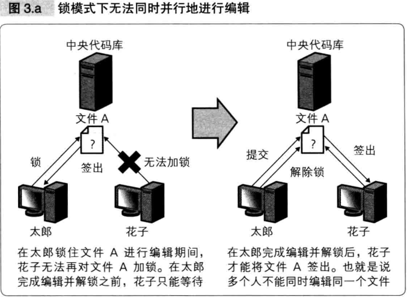
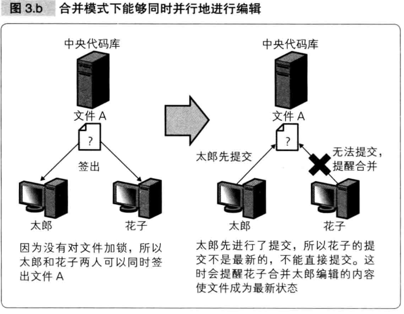

版本控制系统

版本管理系统是将 **什么时候、谁、对什么文件做了怎样的修改** 这样的信息以版本的形式保存并进行管理的系统。

- 使用版本管理系统的好处：
  - 能够保留修改内容这一最基本的记录
  - 能够方便地查看版本之间的差异
  - 能够防止错误地覆盖别人修改的代码
  - 能够还原任何时间点的状态
  - 能够生成多个派生（分支和标签），保留当时项目状态的界面

版本管理系统的两大工作机制：

由多人修改而造成的冲突被称为 **Conflict** 。

- 为了解决冲突问题，版本管理系统提供了两类机制：
  - “锁定 - 修改 - 解锁模式”（简称锁模式）
  - “复制 - 修改 - 合并模式”（简称合并模式）

- 锁模式的做法是：

  - 在某人编辑文件期间，将文件锁住，不允许其他人对此文件进行编辑。
  - 优点是简单粗暴，易于理解操作。
  - 缺点是无法多人同时并发开发，难以提升开发速度。
  - 早期的版本管理系统主要采用这种方式。锁模式基本已经退出历史舞台。
    
    

- 合并模式的做法是：
  - 开发者下载“代码的备份”进行编辑，然后再提交到代码库。提交时确认差异（diff），如果存在差异，要先对差异进行合并，然后再提交。
  - 优点是支持多人同时并发开发，提升开发速度。
  - 缺点是相较于锁模式而言，引入了新的概念，增加了入门难度。
  - 当前的版本管理系统都属于这种模式。
  
    

Subversion 和 Git 是两个最常见的合并模式的版本管理系统。

- Subversion 诞生于 2000 年，2005 成为市场主流。
- Git 诞生于 2005 年，2014 年市场占有率首次超过 Subversion 。

Subversion 和 Git 的最大区别在于：

- Subversion 基于“客户端-服务器”工作方式，存在一个“中央版本库”的概念。
- Git 是一个分布式版本管理系统，它没有“中央版本库”的概念。（当然，你也可以设置个中央仓库）

<small>
Github 是 2008 年诞生的 Git 项目在线托管服务。它提出的 `Fork` 和 `Pull Request` 这两个特色功能最大化利用了 Git 分布式的特性，最大限度地激发了 git **没有中央仓库** 这一特征，进而反过来推动了 Git 的普及，从而使 “社交编程” 这个口号广为人知。
</small>
