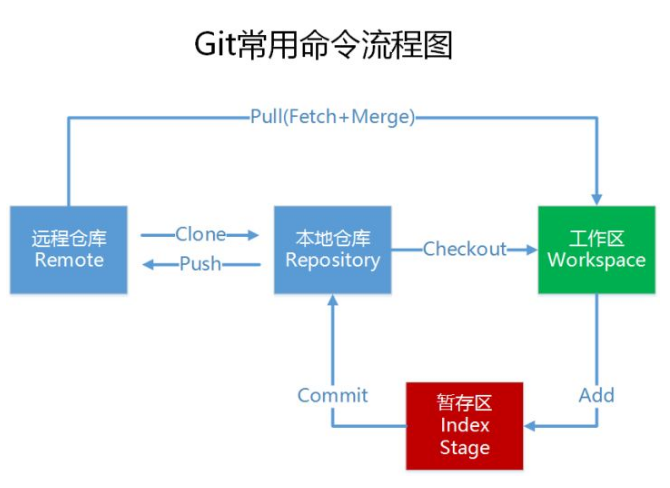
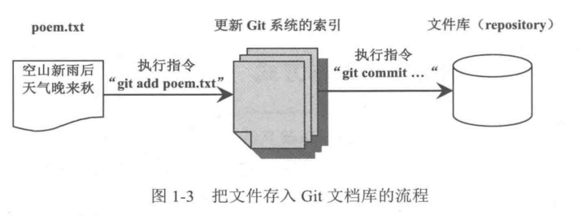

<span class="title">基本概念</span>

# 预备操作

> 再次强调，Git（或者subversion）这样的 VCS 工具的重点并不是管理/记录文件内容本身（任何一个网盘都能实现该功能），而是跟踪记录文件的历史，历史，历史。



在使用 git 之前需要使用 *`config`* 命令配置下用户名和用户邮箱：

```bash
git config --global user.name "<用户名>"
git config --global user.email "<邮箱>"
git config --global push.default simple
git config --global core.editor notepad
```

如何创建 SSH key

```shell
ssh-keygen -t rsa -b 4096 -C "your_email@example.com"
一路回车
cat ~/.ssh/id_rsa.pub
```

# 创建本地仓库

Git 可以管理任何一个文件夹（及其中内容），只要在该文件夹中执行 `git init`，就可以让 Git 完成管理前的准备工作。

```bash
$ git init
```

Git 会在它管理的文件夹下创建名为 `.git` 的子文件夹，这个文件夹也就是逻辑上的<font color="#0088dd">**本地仓库**</font>。它里面会存放被 Git 所管理的文件的相关信息（例如，历史版本）。

操作 Git 的基本流程是：

| 流程 |  操作|
| :-: | :- | 
| 1 | 先修改文件 |
| 2 | 然后执行 `git add` 命令。`git add` 命令会把文件内容加入 Git 系统的暂存<small>（Index）</small>。 |
| 3 | 接着就可以执行 `git commit` 命令，将文件的内容存入文档库<small>（`.git`）</small>。于是文档库中就多出来一份文件的新版本。|



# 新增一个文件的历史版本

Git 会将文件和文件夹分成以下三类：

- 被追踪的（tracked）
  
  `tracked` 状态意味着 Git 正在监控/监管着这个文件，你对这个文件的任何改动，都会被 Git 发现。Git 会进一步要求你提交你的改动，或撤销你的改动。

- **被忽略的（ignored）**
  
  `ignored` 状态意味着 Git 完全不管这个文件。在 Git 看来它就跟不存在一样。

- **不被追踪的（untracked）**

  ` untracked` 状态是 `tracked` 和 `ignored` 状态『之前』的一种状态。你既没有要求 Git 监管它，又没有要求 Git 忽略它。
  
  所有的文件的初始状态都是 `untracked` 。
  
  在正常情况下，文件不应该长期处于 `untracked` 状态，应尽快转变为 `tracked` 或 `ignored` 。


要让 `untracked` 文件文件变成 `ignored` 状态，必须先在文件夹中创建一个名为 **.gitignore** 的文件，然后把要忽略的文件逐一列在这个文件中（一个文件一行，支持通配符）。

要让 `untracked` 文件编程 `tracked` 状态，可以使用 **`git add` + `git commit`** 命令，将它提交给 Git 即可。

`git add` + `git commit` 的作用简单来说，就是将一个文件的当前内容提交给 Git，对于 `untracked` 状态的文件，提交后会变成 `tracked` 状态；对于 `tracked` 状态的文件，其历史版本记录则会演进一步。

```bash
$ git add "readme.txt"
$ git commit -m "message"
```

对于一次“提交而言”，<font color="red">**提交消息<small>（message）</small>是必须的**</font>。否则，Git 会拒绝你的这次提交。

如果同时记录把多个文件的历史，方式有三：

- 可以在 `git add` 命令后面逐一列出这些文件的名字（用空格分隔），
- 可以使用通配符 `*`，
- 多次执行 *`git add`* 后，再统一执行一次 *`git commit`* 。

`git add` 指令后面也可以指定文件夹的名称，这样该文件夹内的文件都会被处理。例如执行 `git add .`，则表示当前文件夹下的所有文件和子文件夹都会被处理。

要新增“一次提交”之所以要同时使用 `git add` 和 `git commit` 是因为在将文件当前的内容添加成至本地仓库之前，要 **先** 将其添加至 **暂存区**（也叫索引区）。

`git commit` **只会** 将暂存区的文件的内容提交至本地仓库进行保存。
