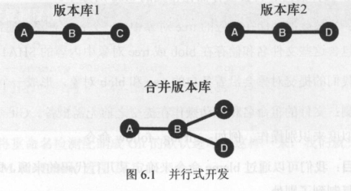
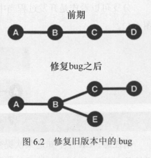
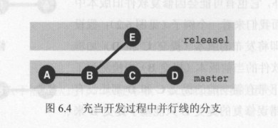

<span class="title">分支</span>


版本的提交不可能“依次进行，以便形成一条直线型的提交历史记录”，原因有二：

- 有两个以上的开发者在对同一个项目进行并行式开发。
- 一方面要修复旧版本中的bug，而与此同时又要创建和发布新的版本。





分支可以看作是开发过程当中的并行线，我们可以把提交图想象成游泳池中的泳道：



在一个 Git 版本库中，总是唯一存在着一个 **活动分支**（也叫 **当前分支**）。我们可以用 branch 命令（不带选项）来列出所有的分支。Git 会用星号（\*）凸显出当前活动分支。

> 对分支（Branch）的灵活高效操作是 Git 的“拳头”特性。

# 查看分支

通过 “`git branch`” 可以看到 Git 仓库的所有分支。

当执行 “`git init`” 指令的时候，Git 就会自动产生一个名为 master 的分支：主分支。

# 创建分支

创建新的分支，也是使用 “`git branch`” 命令。

```
git branch 新分支名 [从当前分支的Commit]
```

如果省略 Commit，那么就是从当前分支的 HEAD 分化出新分支。

# 切换分支

建立分支后，可以通过 `git checkout` 命令来切换当前分支：

```
git checkout <分支名>
```

有个简单的办法可以创建新分支并切换：

```
git checkout -b <新分支名> [Commit节点]`
```

分支指针主要用于指向活动分支（即它总是在当前分支上的），每次提交时，它会移动到最新提交上。

# 删除分支

删除分支使用：

```
git branch -d <被删除分支名>
```

如果在删除一个分支时，自己还未转移到其他分支上，git 会拒绝删除操作。如果坚持要删除的话，则使用 -D 选项替换 -d 选项。

一般情况下，分支应该合并到另一个分支。如果要删除还未合并的分支，Git 会显示错误信息，并拒绝删除。当然你也通过 -D 选项来强制删除。


# 重命名当前

如果要更改分支的名称，需要先切换到该分支，然后执行

```
git branch -m <分支新名字>
```
