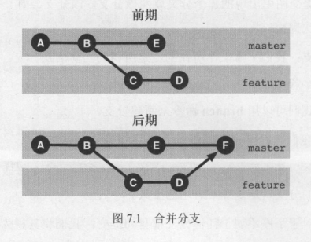

<span class="title">合并分支</span>

分支是 git 的“拳头”特性，使用 *`git merge`* 命令进行分支合并是 Git 中最重要也是最常见的操作之一。

在大多数情况下，项目的分支都会被合并到主要分支。合并项目分支需要使用 `git merge` 命令：

```bash
git merge <另一个分支名>
```

该命令会把 “另一个分支” 合并到当前分支，合并后的 Commit 属于当前分支。



如果合并后想反悔，那么可以执行之前所学的 `git reset --hard HEAD^` 。

分支合并后，在当前分支上会产生一个新的 Commit 节点，也就是新的 HEAD 。这个节点与其他节点不同的是，它有两个父节点，分别表示为：`HEAD^1` 和 `HEAD^2` 。

Git 的设计目标之一就是为了能够让开发者之间的分布式协作变得尽可能容易一些。因此从很大程度上来说，merge 命令能自动对分支进行合并，完全不需要用户交互。

不过，有时候文件的冲突无法被 Git 自动化解决：

- 编辑冲突：两个开发者对 **同一行** 代码做了不同修改的时候。
- 内容冲突：两个开发者对同一份代码的 **不同部分** 作出各自修改的时候。

> 当 Git 遇到了自身无法解决的冲突时，就会显示以下错误信息。
>
> $ git merge a-branch
> Auto-merging foo.txt
> CONFLICT (content): Merge conflict in foo.txt
> Automatic merge failed; fix conflicts and then commit the result.

此时，如果执行 `git status` 命令，会看到 git 提醒你，它无法完成自动合并，需要你手动进行编辑，并且要求你在编辑之后，执行 `git commit` 。

如果配置了 `git mergetool` 那么，在 Git 告知你合并冲突后，通过 `git mergetool` 命令启动 Merge Tool，来进行图形化界面的操作。


```sh
$ git status

On branch master
You have unmerged paths.
  (fix conflicts and run "git commit")

Unmerged paths:
  (use "git add <file>..." to mark resolution)
 
both modified:   foo.txt
 
no changes added to commit (use "git add" and/or "git commit -a")
```

冲突标志通常会描述两组修改。首先这些被修改的行在当前分支（HEAD）中的内容。接下来又列出了他们在另外一个分支的内容，例如：

```txt
第一次修改
<<<<<<< HEAD
第二次修改
=======
在a-branch上进行的修改
>>>>>>> a-branch
```

手动解决完冲突以后，运行 *`git add`* 命令把相关文件添加到暂存区。继续执行 *`git merge --continue`* 命令编辑新生成的提交的 log 信息。然后 merge 完成。

在合并过程中，一个分支是另一个分支的祖先是很常见的，在这种情况下，Git 就只需要将分支指针前移即可，无需去创建合并提交。这被称为快速合并：*`--no-ff`* 。
