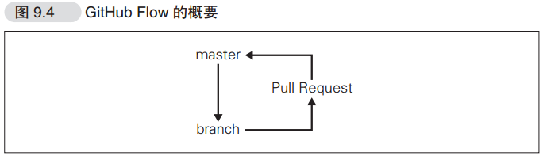

Github 工作流

总体流程非常简单，如下图：

整个开发流程大致如下：

1. 令 `master` 分支时常保持可以部署发布的状态；
2. 进行新的作业时要从 master 分支创建新分支，新分支名称要具有描述性；
3. 在 `2` 新建的本地仓库分支中进行提交；
4. 在功能分支上实现功能后，发起 Pull Request 让其他开发者进行审查。<small>发起 Pull Request 之前可以将 maseter 分支上的最新代码合并到功能分支。</small>；
5. 确认作业完成后与 master 分支合并；
6. 删除作业分支。
