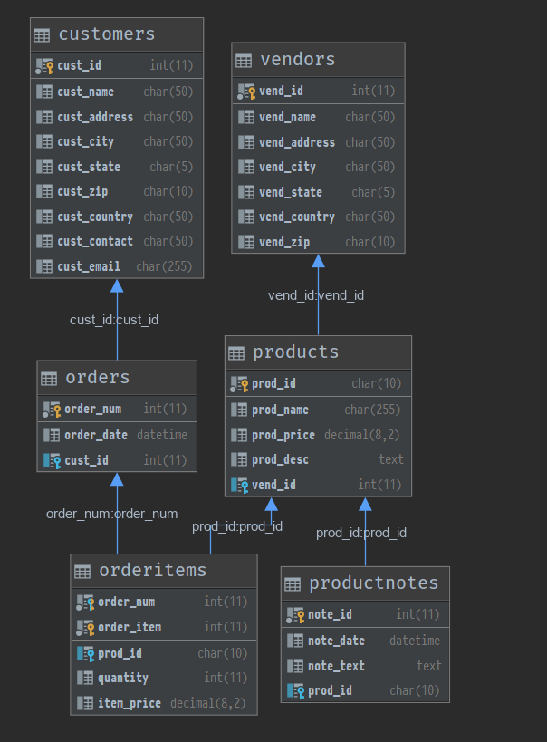

<span class="title">素材 2</span>

```sql
set foreign_key_checks = off;

################
# Create Table #
###############
CREATE TABLE customers
(
  cust_id      int AUTO_INCREMENT COMMENT '客户ID',
  cust_name    char(50)           COMMENT '客户名称',
  cust_address char(50)           COMMENT '地址',
  cust_city    char(50)           COMMENT '市',
  cust_state   char(5)            COMMENT '州/省',
  cust_zip     char(10)           COMMENT '邮编',
  cust_country char(50)           COMMENT '国家',
  cust_contact char(50)           COMMENT '联系方式',
  cust_email   char(255)          COMMENT '邮箱',
  PRIMARY KEY (cust_id)
) ENGINE = InnoDB
  DEFAULT CHARSET = utf8mb4
  COMMENT '客户信息表'; 

CREATE TABLE orderitems
(
  order_num  int            COMMENT '订单编号',
  order_item int            COMMENT '顺序号',
  prod_id    char(10)       COMMENT '商品id',
  quantity   int            COMMENT '数量',
  item_price decimal(8, 2)  COMMENT '单品价格',
  PRIMARY KEY (order_num, order_item)
) ENGINE = InnoDB
  DEFAULT CHARSET = utf8mb4
  COMMENT '客户信息表'; 

CREATE TABLE orders
(
  order_num  int AUTO_INCREMENT COMMENT '',
  order_date datetime           COMMENT '',
  cust_id    int                COMMENT '',
  PRIMARY KEY (order_num)
) ENGINE = InnoDB
  DEFAULT CHARSET = utf8mb4
  COMMENT '订单表'; 

CREATE TABLE products
(
  prod_id    char(10)       COMMENT '主键ID',
  prod_name  char(255)      COMMENT '商品名称',
  prod_price decimal(8, 2)  COMMENT '商品价格',
  prod_desc  text           COMMENT '商品描述',
  vend_id    int            COMMENT '供应商ID',
  PRIMARY KEY (prod_id)
) ENGINE = InnoDB
  DEFAULT CHARSET = utf8mb4;

CREATE TABLE vendors
(
  vend_id      int AUTO_INCREMENT COMMENT '主键ID',
  vend_name    char(50)           COMMENT '供应商名称',
  vend_address char(50)           COMMENT '地址',
  vend_city    char(50)           COMMENT '市',
  vend_state   char(5)            COMMENT '州',
  vend_country char(50)           COMMENT '国家',
  vend_zip     char(10)           COMMENT '邮编',
  PRIMARY KEY (vend_id)
) ENGINE = InnoDB
  DEFAULT CHARSET = utf8mb4;

CREATE TABLE productnotes
(
  note_id   int AUTO_INCREMENT COMMENT '',
  note_date datetime           COMMENT '',
  note_text text     NULL      COMMENT '',
  prod_id   char(10)           COMMENT '',
  PRIMARY KEY (note_id)
) ENGINE = InnoDB
  DEFAULT CHARSET = utf8mb4;

######################
# Define Foreign Key #
######################
# ALTER TABLE orderitems DROP FOREIGN KEY fk_orderitems_order_num;
ALTER TABLE orderitems 
    ADD CONSTRAINT fk_orderitems_order_num 
    FOREIGN KEY (order_num) 
    REFERENCES orders(order_num);

# ALTER TABLE orderitems DROP FOREIGN KEY fk_orderitems_prod_id;
ALTER TABLE orderitems 
    ADD CONSTRAINT fk_orderitems_prod_id 
    FOREIGN KEY (prod_id) 
    REFERENCES products(prod_id);

# ALTER TABLE orders DROP FOREIGN KEY fk_orders_cust_id;
ALTER TABLE orders 
    ADD CONSTRAINT fk_orders_cust_id 
    FOREIGN KEY (cust_id) 
    REFERENCES customers (cust_id);

# ALTER TABLE products DROP FOREIGN KEY fk_products_vend_id;
ALTER TABLE products 
    ADD CONSTRAINT fk_products_vend_id 
    FOREIGN KEY (vend_id) 
    REFERENCES vendors (vend_id);

# ALTER TABLE productnotes drop foreign key fk_productnotes_prod_id;
ALTER TABLE productnotes 
    ADD CONSTRAINT fk_productnotes_prod_id 
    FOREIGN KEY (prod_id) 
    REFERENCES products(prod_id);


###############
# Insert Data #
###############
INSERT INTO customers(cust_id, cust_name, cust_address, cust_city, cust_state, cust_zip, cust_country, cust_contact, cust_email)
VALUES (10001, 'Coyote Inc.', '200 Maple Lane', 'Detroit', 'MI', '44444', 'USA', 'Y Lee', 'ylee@coyote.com'),
       (10002, 'Mouse House', '333 Fromage Lane', 'Columbus', 'OH', '43333', 'USA', 'Jerry Mouse', NULL),
       (10003, 'Wascals', '1 Sunny Place', 'Muncie', 'IN', '42222', 'USA', 'Jim Jones', 'rabbit@wascally.com'),
       (10004, 'Yosemite Place', '829 Riverside Drive', 'Phoenix', 'AZ', '88888', 'USA', 'Y Sam', 'sam@yosemite.com'),
       (10005, 'E Fudd', '4545 53rd Street', 'Chicago', 'IL', '54545', 'USA', 'E Fudd', NULL);

INSERT INTO vendors(vend_id, vend_name, vend_address, vend_city, vend_state, vend_zip, vend_country)
VALUES (1001, 'Anvils R Us', '123 Main Street', 'Southfield', 'MI', '48075', 'USA'),
       (1002, 'LT Supplies', '500 Park Street', 'Anytown', 'OH', '44333', 'USA'),
       (1003, 'ACME', '555 High Street', 'Los Angeles', 'CA', '90046', 'USA'),
       (1004, 'Furball Inc.', '1000 5th Avenue', 'New York', 'NY', '11111', 'USA'),
       (1005, 'Jet Set', '42 Galaxy Road', 'London', NULL, 'N16 6PS', 'England'),
       (1006, 'Jouets Et Ours', '1 Rue Amusement', 'Paris', NULL, '45678', 'France');

INSERT INTO products(prod_id, vend_id, prod_name, prod_price, prod_desc)
VALUES ('ANV01', 1001, '.5 ton anvil', 5.99, '.5 ton anvil, black, complete with handy hook'),
       ('ANV02', 1001, '1 ton anvil', 9.99, '1 ton anvil, black, complete with handy hook and carrying case'),
       ('ANV03', 1001, '2 ton anvil', 14.99, '2 ton anvil, black, complete with handy hook and carrying case'),
       ('OL1', 1002, 'Oil can', 8.99, 'Oil can, red'),
       ('FU1', 1002, 'Fuses', 3.42, '1 dozen, extra long'),
       ('SLING', 1003, 'Sling', 4.49, 'Sling, one size fits all'),
       ('TNT1', 1003, 'TNT (1 stick)', 2.50, 'TNT, red, single stick'),
       ('TNT2', 1003, 'TNT (5 sticks)', 10, 'TNT, red, pack of 10 sticks'),
       ('FB', 1003, 'Bird seed', 10, 'Large bag (suitable for road runners)'),
       ('FC', 1003, 'Carrots', 2.50, 'Carrots (rabbit hunting season only)'),
       ('SAFE', 1003, 'Safe', 50, 'Safe with combination lock'),
       ('DTNTR', 1003, 'Detonator', 13, 'Detonator (plunger powered), fuses not included'),
       ('JP1000', 1005, 'JetPack 1000', 35, 'JetPack 1000, intended for single use'),
       ('JP2000', 1005, 'JetPack 2000', 55, 'JetPack 2000, multi-use');

INSERT INTO orders(order_num, order_date, cust_id)
VALUES (20005, '2005-09-01', 10001),
       (20006, '2005-09-12', 10003),
       (20007, '2005-09-30', 10004),
       (20008, '2005-10-03', 10005),
       (20009, '2005-10-08', 10001);

INSERT INTO orderitems(order_num, order_item, prod_id, quantity, item_price)
VALUES (20005, 1, 'ANV01', 10, 5.99),
       (20005, 2, 'ANV02', 3, 9.99),
       (20005, 3, 'TNT2', 5, 10),
       (20005, 4, 'FB', 1, 10),
       (20006, 1, 'JP2000', 1, 55),
       (20007, 1, 'TNT2', 100, 10),
       (20008, 1, 'FC', 50, 2.50),
       (20009, 1, 'FB', 1, 10),
       (20009, 2, 'OL1', 1, 8.99),
       (20009, 3, 'SLING', 1, 4.49),
       (20009, 4, 'ANV03', 1, 14.99);

INSERT INTO productnotes(note_id, prod_id, note_date, note_text)
VALUES (101, 'TNT2', '2005-08-17', 'Customer complaint: Sticks not individually wrapped, too easy to mistakenly detonate all at once. Recommend individual wrapping.'),
       (102, 'OL1', '2005-08-18', 'Can shipped full, refills not available. Need to order new can if refill needed.'),
       (103, 'SAFE', '2005-08-18', 'Safe is combination locked, combination not provided with safe. This is rarely a problem as safes are typically blown up or dropped by customers.'),
       (104, 'FC', '2005-08-19', 'Quantity varies, sold by the sack load. All guaranteed to be bright and orange, and suitable for use as rabbit bait.'),
       (105, 'TNT2', '2005-08-20', 'Included fuses are short and have been known to detonate too quickly for some customers. Longer fuses are available (item FU1) and should be recommended.'),
       (106, 'TNT2', '2005-08-22', 'Matches not included, recommend purchase of matches or detonator (item DTNTR).'), (107, 'SAFE', '2005-08-23', 'Please note that no returns will be accepted if safe opened using explosives.'),
       (108, 'ANV01', '2005-08-25', 'Multiple customer returns, anvils failing to drop fast enough or falling backwards on purchaser. Recommend that customer considers using heavier anvils.'),
       (109, 'ANV03', '2005-09-01', 'Item is extremely heavy. Designed for dropping, not recommended for use with slings, ropes, pulleys, or tightropes.'),
       (110, 'FC', '2005-09-01', 'Customer complaint: rabbit has been able to detect trap, food apparently less effective now.'),
       (111, 'SLING', '2005-09-02', 'Shipped unassembled, requires common tools (including oversized hammer).'),
       (112, 'SAFE', '2005-09-02', 'Customer complaint: Circular hole in safe floor can apparently be easily cut with handsaw.'),
       (113, 'ANV01', '2005-09-05', 'Customer complaint: Not heavy enough to generate flying stars around head of victim. If being purchased for dropping, recommend ANV02 or ANV03 instead.'),
       (114, 'SAFE', '2005-09-07', 'Call from individual trapped in safe plummeting to the ground, suggests an escape hatch be added. Comment forwarded to vendor.');

set foreign_key_checks = on;
```

