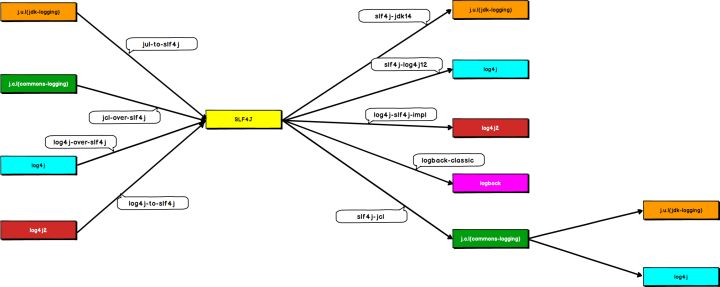

<span class="title">日志库</span>

# 日志库及其发展历史

我们可以对众多的日志相关Jar包进行分类，主要分为三类：

- 接口类：只提供 API 定义，没有提供具体实现。目的是为应用层提供标准化的使用方式。既所谓的面向接口编程。
    - commons-logging（也称 `J.C.L`）
    - SLF4J

- 实现类：具体的日志实现类，提供对日志的收集/管理功能。受不同需求/不同历史环境影响，各框架功能上有许多不同。但遵循进化论规律。
    - Log4j 
    - jdk-logging（也称，`J.U.L`）
    - Logback
    - Log4j2

- 桥接类：多种日志实现框架混用情况下，需要借助桥接类进行日志的转换，最后统一成一种进行输出。
    - slf4j-jdk14
    - slf4j-log4j12 
    - log4j-slf4j-impl 
    - logback-classic 
    - slf4j-jcl 
    - jul-to-slf4j 
    - log4j-over-slf4j 
    - icl-over-slf4j 
    - log4j-to-slf4j

> <small>整个 Java 日志库领域绕不开的人物是 Ceki Gülcü，大半个日志库领域都与他有关。</small>

- Java 1.4 之前 JDK 中并没有日志相关功能。Apache 基金会的 Log4j 是整个 Java 世界的唯一选择。<small>Ceki Gülcü 是其作者。</small>

- 2002 发布的 Java 1.4 自带了自己的日志库：jdk-logging，也称为 `J.U.L`

- Log4j 和 jdk-logging 两种日志库选择，导致了日志使用的混乱。所以 Apache 推出了commons-logging。它只是定义了一套日志接口，支持运行时动态加载日志组件。它的出现解决了多种日志框架共存的尴尬，也是面向接口编程思想的一种具体体现。

- 2006 年，Ceki Gülcü（Log4j 的作者）觉得 commons-logging 这套接口设计的不好，容易让开发者写出有性能问题的代码。他离开 Apache 后，又搞出来一套类似 commons-loggin 的接口类的日志库：Slf4j 。

- 在搞出来 Slf4j 之后，Ceki Gülcü 又顺带开发了 Logback，做为 Slf4j 的默认实现。在功能完整度和性能上，Logback 超越了当时所有已有的日志实现框架。

- 鉴于 logback 的更优秀的设计思路，Apache 基金会重写了 Log4j 库，推出其 2.0 版本。习惯性称为 Log4j2 。



# Logback

**pom.xml**

```xml
<dependency>
  <groupId>org.slf4j</groupId>
  <artifactId>slf4j-api</artifactId>
  <version>1.7.25</version>
</dependency>

<dependency>
  <groupId>ch.qos.logback</groupId>
  <artifactId>logback-core</artifactId>
  <version>1.2.3</version>
</dependency>

<dependency>
  <groupId>ch.qos.logback</groupId>
  <artifactId>logback-classic</artifactId>
  <version>1.2.3</version>
</dependency>

<!-- 由于 logback-classic 依赖于 slf4j-api 和 logback-core，因此 slf4j-api 和 logback-core 的 dependency 可以省略掉 -->
```

使用 logback 需要在 classpath 下提供一个 `logback.xml` 配置文件。

该文件最精简的基本格式如下：

```xml
<?xml version="1.0" encoding="UTF-8"?>
<configuration debug="false">

    <appender name="CONSOLE" class="ch.qos.logback.core.ConsoleAppender">
        <encoder>
            <pattern>%5p | %-40.40logger{39} : %m%n</pattern>
            <charset>utf8</charset>
        </encoder>
    </appender>

    <logger name="包名" level="DEBUG" additivity="false">
        <appender-ref ref="CONSOLE"/>
    </logger>

    <root level="WARN">
        <appender-ref ref="CONSOLE" />
    </root>

</configuration>
```

## Logback 的基本配置说明

```xml
<configuration debug="false">
```

logback 日志库本身也能输出关于它自身的日志信息。`debug="false"` 表示关闭 logback 自身的 debug 日志信息的输出。

```xml
<appender name="CONSOLE" class="ch.qos.logback.core.ConsoleAppender">
    <encoder>
        <pattern>...</pattern>
        <charset>utf8</charset>
    </encoder>
</appender>
```

这一段 `appender` 的配置表示这一个日志输出『目的地』为终端控制台的配置。`name="xxx"` 命名任意，可自定义。`class="ch.qos.xxx..."` 是『固定』写法。<small>logback 就是靠这里配置的这个类，将日志输出到终端控制台。</small>

`<pattern>...</pattern>` 中写入的是日志格式配置。例如：

```xml
<pattern>%d{yyyy-MM-dd HH:mm:ss} %5p ---- %-40.40logger{39} : %m%n</pattern>
```

logback 采用类似 C 语言中的 printf 函数的打印格式格式化日志信息。

基本的打印参数有：

| 占位符 | 说明 |
| :- | :- |
| `%d` or `%date`| 日志生产时间 |
|| `%d{yyyy-MM-dd HH:mm:ss}`	2012-11-02 14:34:02 |
|| `%d{yyyy-MM-dd HH:mm:ss,SSS}`	2012-11-02 14:34:02,123 |
| `%t` or `%thread` | 输出当前线程名称 |
| `%p` or `%level` | 输出日志级别，-5 表示左对齐并且固定输出 5 个字符，如果不足在右边补空格 |
| `%logger`| 输出 logger 的名称。这个名称就是创建 Logger 对象时所传入的字符串，通常就是类的完全限定名 |
|| `%logger{15}` 完全限定名超过 15 个字符，开始将包名缩写成单个字母。最右边的部分永远不会被简写 |
|| `%20.20logger` 至少占 20 个字符（多的补空格），右对齐。超过 20 个字符开始从左侧缩写 |
|| `%-20.20logger` 至少占 20 个字符（多的补空格），左对齐。超过 20 个字符开始从左侧缩写 |
|| `%10.-10logger` 至少占 10 个字符（多的补空格），左对齐。超过 20 个字符开始从右侧缩写 |
| `%m` or `%msg` | 输出日志的内容|
| `%n` | 换行符 |

这里是一段『配置』，后续会引用这一段配置。

```xml
<root level="WARN">
    <appender-ref ref="CONSOLE" />
</root>
```

这一段是在设置日志级别及其日志输出。除了 `<logger>` 元素『额外』指定的包之外，其它的包都遵守此处的配置。相等于就是『默认』的日志输出。

`level="xxx"` 表示日志输出级别，志信息的优先级从高到低有 ERROR、WARN、INFO、DEBUG，分别用来指定这条日志信息的重要程度。

`<appender-ref ref="CONSOLE" />` 表示引用一个名为 `CONSOLE` 的 `<appendder>` 配置。这个配置决定了日志信息以什么样的格式输出，输出到哪里。

```xml
<logger name="包名" level="DEBUG" additivity="false">
    <appender-ref ref="CONSOLE"/>
</logger>
```

`<logger>` 表示一个明确的单独的日志设置。用于专门指定某个包中的日志的输出。如果一个包及符合 `<logger>` 的设置，又因为它要准守默认的 `<root>` 的设置，所以使用 `additivity="false"` 表示它只用遵守 `<logger>` 的设置，`<root>` 的设置不起作用。


# 一个更复杂的样例

```xml
<?xml version="1.0" encoding="UTF-8"?>
<configuration debug="false">

  <property name="LOG_PATH" value="${catalina.base}/logs/webapps"/>
  <property name="LOG_FILE" value="${LOG_PATH}/spring.log"/>

  <appender name="CONSOLE" class="ch.qos.logback.core.ConsoleAppender">
    <encoder>
      <pattern>%d{yyyy-MM-dd HH:mm:ss} %5p | %-40.40logger{39} : %m%n</pattern>
      <charset>utf8</charset>
    </encoder>
  </appender>

  <appender name="FILE" class="ch.qos.logback.core.rolling.RollingFileAppender">
    <encoder>
      <pattern>%d{yyyy-MM-dd HH:mm:ss.SSS} %5p | [%15.15t] %-40.40logger{39} : %m%n</pattern>
      <charset>utf8</charset>
    </encoder>
    <file>${LOG_FILE}</file>
    <rollingPolicy class="ch.qos.logback.core.rolling.SizeAndTimeBasedRollingPolicy">
      <fileNamePattern>${LOG_FILE}.%d{yyyy-MM-dd}.%i.gz</fileNamePattern>
      <maxFileSize>10MB</maxFileSize>
      <maxHistory>0</maxHistory>
    </rollingPolicy>
  </appender>

  <!-- 指定类与<looger>的关联关系 -->
  <logger name="com.oracle" level="DEBUG" additivity="false">
    <appender-ref ref="CONSOLE"/>
    <appender-ref ref="FILE" />
  </logger>

  <root level="INFO">
    <appender-ref ref="CONSOLE" />
    <appender-ref ref="FILE" />
  </root>

</configuration>
```

# SLF4j

`slf4j` 是 `commons-logging` 的替代者。它们的目的都是一样的：希望用户调用它的方法，而它再去调用某个具体的日志库。从而实现日志代码的统一。即，直接使用 slf4j，间接使用 logback 或 slf4j2 。

在 SLF4J 中获得 Logger 对象的方式是：

```java
LoggerFactory.getLogger()
```

通过指定的名字获得记录器，如果必要的话，则为这个名字创建一个新的记录器。Name 一般取本类的名字，比如：

```java
static Logger logger = LoggerFactory.getLogger(ServerWithLog4j.class);
```

SLF4J 一个非常好的功能是，它提供了占位符（使用`{}`）的概念，以方便与在输出信息中“插入”数据。

```java
logger.info("Hello {} World {}", 100, "Goodbye");
```

另外，如果通过 slf4j 打印异常的堆栈信息，异常的堆栈信息不需要一个 `{}` ：

```java
logger.error("错误消息：{}", e.getMessage(), e);    // 注意，这里只需要有一个 {} 
```

# 如何正确打印日志

## 使用 slf4j

- 使用门面模式的日志框架，有利于维护和各个类的日志处理方式统一。
- 实现方式统一使用: Log4j2 或 Logback 框架

## 打日志的正确方式

### 什么时候应该打日志

1. 当你遇到问题的时候，只能通过 debug 功能来确定问题，你应该考虑打日志，良好的系统，是可以通过日志进行问题定为的。
2. 当你碰到 **`if ... else ...`** 或者 **`switch`** 这样的分支时，要在分支的首行打印日志，用来确定进入了哪个分支
3. 经常以功能为核心进行开发，你应该在提交代码前，可以确定通过日志可以看到整个流程

### 日志的基本格式

必须使用参数化信息的方式:

```java
logger.debug("Processing trade with id: {} and symbol: {} ", id, symbol);
```

不要进行字符串拼接，那样会产生很多 String 对象，占用空间，影响性能。

**反例 / 不要这么做**：

```java
logger.debug("Processing trade with id: " + id + " symbol: " + symbol);
```

### 使用 `[]` 进行参数变量隔离

如有参数变量，应该写成如下写法:

```java
logger.debug("Processing trade with id: [{}] and symbol: [{}] ", id, symbol);
```

这样的格式写法，可读性更好，对于排查问题更有帮助。

## 不同级别的日志的使用

### ERROR 级别日志

使用 ERROR 的场景：影响到程序正常运行、当前请求正常运行的异常情况

1. 打开配置文件失败
2. 所有第三方对接的异常(包括第三方返回错误码)
3. 所有影响功能使用的异常，包括：SQLException 和除了业务异常之外的所有异常（RuntimeException 和 Exception）

另外，如果有 Throwable 信息，需要记录完成的堆栈信息:

  > log.error("获取用户[{}]的用户信息时出错", userName, e);

但是，如果进行了抛出异常操作，请不要记录 error 日志，由最终处理方进行处理：

反例 / 不要这么做：

  ```java
  try {
      ....
  } catch (Exception e) {
      logger.error(...);
      throw new UserServiceException(errorMessage, ex);
  }
  ```

### WARN 级别日志

使用在不应该出现但是不影响 程序/当前请求 正常运行的异常情况:

1. 有容错机制的时候出现的错误情况
2. 找不到配置文件，但是系统能自动创建配置文件
3. 即将接近临界值的时候
4. 业务异常的记录

### INFO 级别日志

场景一：用于记录系统运行信息：

  > 1. Service 方法中对于 系统/业务 状态的变更
  > 2. 主要逻辑中的分步骤

需要说明的是：并不是所有的 service 都进行出入口打点记录，单一、简单 service 是没有意义的（job 除外，job 需要记录开始和结束）。

反例 / 不要这么做：

```java
public List listByBaseType(Integer baseTypeId) {

    log.info("开始查询xxx");

    ...
    ...
    ...
    ...

    log.info("查询xxx结束");

    return ...;
}
```

场景二：用于外部接口部分：

  > 1. 客户端请求参数（REST/WS）
  > 2. 调用第三方时的调用参数和调用结果

需要说明的是：

  > - 对于整个系统的提供出的接口（REST/WS），使用 info 记录入参；
  > - 调用其他第三方服务时，所有的出参和入参是必须要记录的（因为你很难追溯第三方模块发生的问题）

### DEBUG 级别日志

1. 可以填写所有的想知道的相关信息（但不代表可以随便写，debug 信息要有意义,最好有相关参数）
2. 生产环境需要关闭 DEBUG 信息
3. 如果在生产情况下需要开启 DEBUG，需要使用开关进行管理，不能一直开启。

### TRACE 级别日志

特别详细的系统运行完成信息，业务代码中，不要使用。（除非有特殊用意，否则请使用 DEBUG 级别替代）

## 规范示例说明

```java
@Override
@Transactional
public void createUserAndBindMobile(String mobile, User user) throws CreateConflictException {

    boolean debug = log.isDebugEnabled();

    if (debug) {
        log.debug("开始创建用户并绑定手机号. args[mobile=[{}],user=[{}]]", mobile, LogObjects.toString(user));
    }

    try {
        user.setCreateTime(new Date());
        user.setUpdateTime(new Date());
        userRepository.insertSelective(user);
        if (debug) {
            log.debug("创建用户信息成功. insertedUser=[{}]",LogObjects.toString(user));
        }

        UserMobileRelationship relationship = new UserMobileRelationship();
        relationship.setMobile(mobile);
        relationship.setOpenId(user.getOpenId());
        relationship.setCreateTime(new Date());
        relationship.setUpdateTime(new Date());
        userMobileRelationshipRepository.insertOnDuplicateKey(relationship);
        if (debug) {
            log.debug("绑定手机成功. relationship=[{}]",LogObjects.toString(relationship));
        }

        log.info("创建用户并绑定手机号. userId=[{}],openId=[{}],mobile=[{}]",user.getId(),user.getOpenId(),mobile); // 如果考虑安全，手机号记得脱敏
    } catch(DuplicateKeyException e) {
        log.info("创建用户并绑定手机号失败,已存在相同的用户. openId=[{}],mobile=[{}]",user.getOpenId(),mobile);
        throw new CreateConflictException("创建用户发生冲突, openid=[%s]",user.getOpenId());
    }
}
```