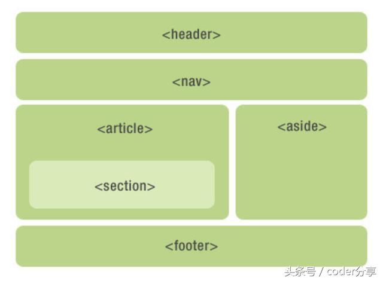

## 布局

布局最核心的问题是：**如何在一行中显示两个block元素？**

解决这个问题的方案有三种：

> - 使用`<table>`元素布局
> - 使用 `position:static` + `float` 布局
> - 使用 `position:relative` + `position: absolute` 布局

语义化是 HTML5 的一个重点，例如它提出 `<strong>` 来替代 `<b>`。对于常用于布局的无语义的 `
` 元素，HTML5 也提出了几个替代它的语义化元素：

