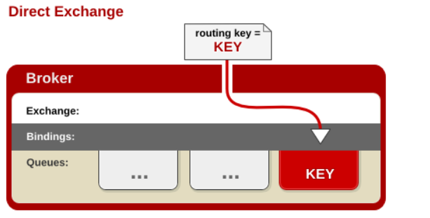
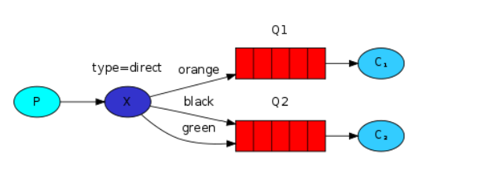
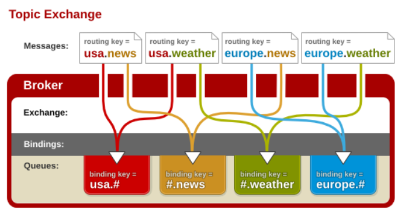
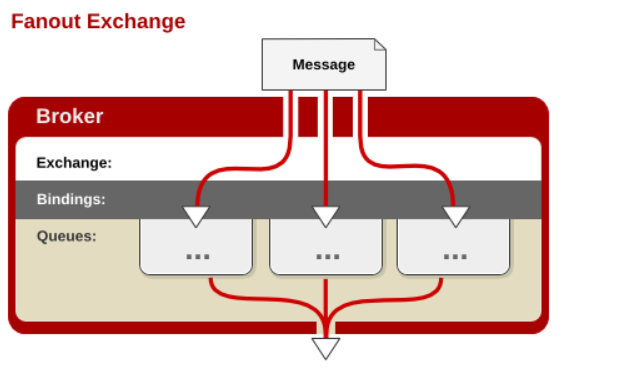

RabbitMQ 中的路由

RabbitMQ 是一个由 Erlang 语言开发的基于 AMQP 标准的开源实现。起源于金融系统，用于在分布式系统中存储转发消息，在易用性、扩展性、高可用性等方面表现不俗。

由于 Rabbit MQ 遵守/实现的是 AMQP 标准，而 AMQP 规范相较于 JMS 规范『多』了 ***`Exchange`*** 和 ***`Binding`*** 两个角色。消息的生产者需要把消息发布到 ***`Exchange`*** 上，消息最终到达队列并被消费者接收，而 ***`Binding`*** 决定交换器上的消息应该被发送到哪个队列中。

不同类型的交换器分发消息<small>（至队列）</small>的策略也不同，目前交换器有 4 种类型，除 `Headers` 类型功能有重复且性能较差，需要了解掌握的有：`Direct`、`Fanout`、`Topic` 。

| 类型 | 说明 |
| :- | :- |
| Direct | 其类型的行为是 `先匹配、再投送`，即在绑定时设定一个 `routing_key`，消息的 `routing_key` 与之匹配时，才会被交换器投送到所绑定的队列中去。|
| Topic | 按规则转发消息（最灵活）。|
| Headers | 设置 `header attribute` 参数类型的交换机。|
| Fanout | 转发消息到所有绑定队列。 |

# Direct 交换器

Direct 类型是 RabbitMQ 默认的交换机类型<small>（也是最简单的模式）</small>：根据 key 全文匹配去寻找队列。

以上图为例：

- X 和 Q1 的 binding key 是 `orange`；
- X 和 Q2 有 2 个 binding key，分别是 `black` 和 `green` 。
- 当 P 发送至 X 的消息中的路由键与这 3 个 binding key 中的某一个对应上时，那么消息就被路由器『转交』到了对应的队列<small>（交给了 `队列1`，从而 `消费者1` 收到了消息）</small>。

如果消息种的路由键<small>（routing key）</small>和 Binding 中的绑定键<small>（binding key）</small>一致，交换器就将消息发送到对应的队列中。路由键与队列名称要完全匹配。

相当于 SQL 中的 **`=`** 规则。

# Topic 交换器

`Topic` 类型交换机相当于是 `Direct` 类型的升级版：<strong>它允许使用通配符</strong>。

Topic 类型的交换机对于 Binding Key 的设置有一定的要求：

以上图为例：

- P 发送到 X 的消息的 binding key 符合 `xxx.orange.xxx` 规则，那么，该消息会被 X 转交给 Q1 。
- P 发送到 X 的消息的 binding key 符合 `xxx.xxx.rabbit` 规则，那么，该消息会被 X 转交给 Q2 。
- P 发送到 X 的消息的 binding key 符合 `lazy.xxx.xxx.xxx....` 规则，那么，该消息会被 X 转交给 Q2 。

# Fanout 交换器

Fanout 就是消息广播，完全不考虑 key 的情况，交换器 X 将它收到的所有消息发送给所有与之绑定的消息队列<small>（无一例外）</small>。

Fantout 交换器不处理路由键<small>（有也当作没看见）</small>，只是简单地将队列绑定到交换器，发送到交换器的每条消息都会被转发到与该交换器绑定的所有队列中。

相当于子网广播，子网内的每个主机都获得了一份复制的消息。

通过 Fanout 交换器转发消息是最快的。

# Headers 交换器

Headers 类型交换器是早期的一种交换器，其工作机制与上述三者完全不一样，而且性能最低。所以现在基本不再使用。

# Default 交换器 

Default 交换器是一种特殊的 Direct 交换器。当你手动创建一个队列时，后台会自动将这个队列绑定到一个名称为空的 Direct 交换器上，绑定建与队列名称同名。

