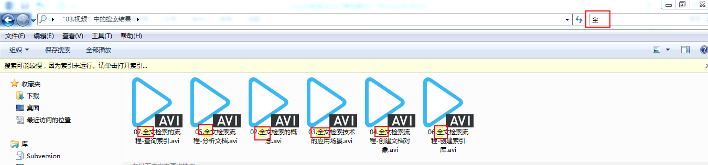
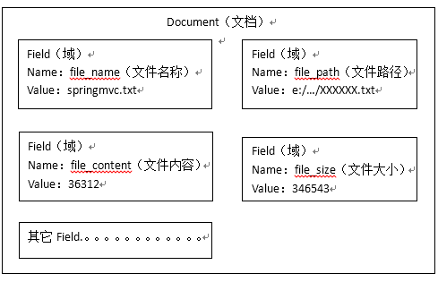
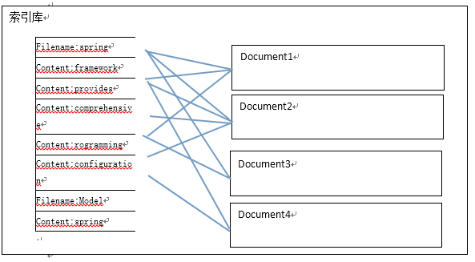
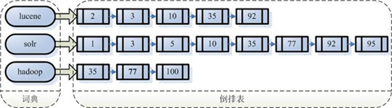
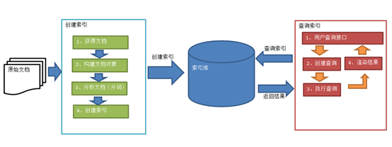
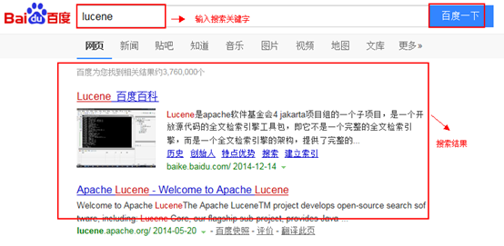
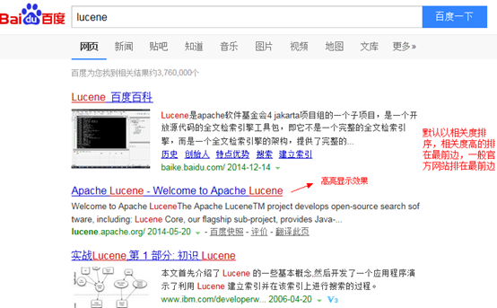

# Lucene 基本概念

## 1. 索引和搜索流程图


- 绿色表示索引过程，对要搜索的原始内容进行索引构建一个索引库，索引过程包括：确定原始内容即要搜索的内容 -> 采集文档 -> 创建文档 -> 分析文档 -> 索引文档

- 红色表示搜索过程，从索引库中搜索内容，搜索过程包括：用户通过搜索界面 -> 创建查询 -> 执行搜索，从索引库搜索 -> 渲染搜索结果

## 2. 创建索引步骤

对文档索引的过程，将用户要搜索的文档内容进行索引，索引存储在索引库（index）中。这里我们要搜索的文档是磁盘上的文本文件，根据案例描述：凡是文件名或文件内容包括关键字的文件都要找出来，这里要对文件名和文件内容创建索引。

### 2.1. 获得原始文档

**原始文档** 是指要索引和搜索的内容。原始内容包括互联网上的网页、数据库中的数据、磁盘上的文件等。

- 原始文档：要基于那些数据来进行搜索，那么这些数据就是原始文档。
- 搜索引擎：使用爬虫获得原始文档
- 站内搜索：数据库中的数据。
- 案例：直接使用io流读取磁盘上的文件。



### 2.2. 创建文档对象

获取原始内容的目的是为了索引，在索引前需要将原始内容创建成文档（Document），文档中包括一个一个的域（Field），域中存储内容。

这里我们可以将磁盘上的一个文件当成一个 Document，Document 中包括一些 Field（file_name 文件名称、file_path 文件路径、file_size 文件大小、file_content 文件内容）



> 注意：每个 Document 可以有多个 Field，不同的 Document 可以有不同的 Field，同一个 Document 可以有相同的 Field（域名和域值都相同）每个文档都有一个唯一的编号，就是文档 id 。

### 2.3. 分析文档

分析文档就是分词的过程

1. 根据空格进行字符串拆分，得到一个单词列表
2. 把单词统一转换成小写。
3. 去除标点符号
4. 去除停用词（停用词：无意义的词）

比如下边的文档经过分析如下：

原文档内容：

```txt
Lucene is a Javafull-text search engine. Lucene is not acomplete application, butrather a code library and API that can easily be used to add searchcapabilities to applications.
```

分析后得到的 **语汇单元**：

```txt
lucene、java、full、search、engine。。。。
```

每个单词叫做一个 **Term**，不同的域中拆分出来的相同的单词是不同的 term 。term 中包含两部分内容：一部分是文档的域名，另一部分是单词的内容。

例如：文件名中包含 apache 和文件内容中包含的 apache 是不同的 term 。

### 2.4. 创建索引

对所有文档分析得出的语汇单元进行索引，索引的目的是为了搜索，最终要实现只搜索被索引的语汇单元从而找到 Document（文档）。

简单来说创建索引就是基于关键词列表创建一个索引。保存到索引库中

索引库中包含：索引、document 对象、关键词和文档的对应关系



> 注意：创建索引是对语汇单元索引，通过词语找文档，这种索引的结构叫 **倒排索引结构** 。
> 
> 传统方法是根据文件找到该文件的内容，在文件内容中匹配搜索关键字，这种方法是顺序扫描方法，数据量大、搜索慢。

**倒排索引结构** 是根据内容（词语）找文档，如下图:



倒排索引结构也叫反向索引结构，包括索引和文档两部分，索引即词汇表，它的规模较小，而文档集合较大。

### 2.5. 总结创建引步骤

- step 1. 获得文档
    > 原始文档：要基于那些数据来进行搜索，那么这些数据就是原始文档。<br>
    > 搜索引擎：使用爬虫获得原始文档<br>
    > 站内搜索：数据库中的数据。<br>
    > 案例：直接使用io流读取磁盘上的文件。
- step 2. 构建文档对象
    > 对应每个原始文档创建一个Document对象<br>
    > 每个document对象中包含多个域（field）<br>
    > 域中保存就是原始文档数据。<br>
    > - 域的名称<br>
    > - 域的值<br>
    > 
    > 每个文档都有一个唯一的编号，就是文档 id
- step 3. 分析文档
    > 就是分词的过程<br>
    > 1. 根据空格进行字符串拆分，得到一个单词列表<br>
    > 2. 把单词统一转换成小写。<br>
    > 3. 去除标点符号<br>
    > 4. 去除停用词<br>
    > 
    > 停用词：无意义的词<br>
    > 每个关键词都封装成一个 Term 对象中。<br>
    > Term 中包含两部分内容：<br>
    > - 关键词所在的域
    > - 关键词本身
    >
    > 不同的域中拆分出来的相同的关键词是不同的 Term 。
- step 4. 创建索引
    > 基于关键词列表创建一个索引。保存到索引库中。<br>
    > 索引库中：
    > - 索引
    > - document 对象
    > 
    > 关键词和文档的对应关系<br>
    > 通过词语找文档，这种索引的结构叫倒排索引结构。

### 2.6. 查询索引



查询索引也是搜索的过程。搜索就是用户输入关键字，从索引（index）中进行搜索的过程。根据关键字搜索索引，根据索引找到对应的文档，从而找到要搜索的内容（这里指磁盘上的文件）。

#### 2.6.1、用户查询接口

​全文检索系统提供用户搜索的界面供用户提交搜索的关键字，搜索完成展示搜索结果如下图:

​

> Lucene 不提供制作用户搜索界面的功能，需要根据自己的需求开发搜索界面

#### 2.6.2、创建查询

​用户输入查询关键字执行搜索之前需要先构建一个查询对象，查询对象中可以指定查询要搜索的 Field 文档域、查询关键字等，查询对象会生成具体的查询语法，

例如：`fileName:lucene` 表示要搜索 Field 域的内容为 lucene 的文档

#### 2.6.3、执行查询

搜索索引过程：根据查询语法在倒排索引词典表中分别找出对应搜索词的索引，从而找到索引所链接的文档链表。比如搜索语法为 `fileName:lucene` 表示搜索出 fileName 域中包含 Lucene 的文档。搜索过程就是在索引上查找域为 fileName，并且关键字为 Lucene 的 term，并根据 term 找到文档 id 列表。


#### 2.6.4、渲染结果

​以一个友好的界面将查询结果展示给用户，用户根据搜索结果找自己想要的信息，为了帮助用户很快找到自己的结果，提供了很多展示的效果，比如搜索结果中将关键字高亮显示，百度提供的快照等。



#### 2.6.5、总结查询索引步骤

1. 用户查询接口
    > 用户输入查询条件的地方<br>
    > 例如：百度的搜索框
2. 把关键词封装成一个查询对象
    > 要查询的域<br>
    > 要搜索的关键词
3. 执行查询
    > 根据要查询的关键词到对应的域上进行搜索。<br>
    > 找到关键词，根据关键词找到 对应的文档
4. 渲染结果
    > 根据文档的id找到文档对象<br>
    > 对关键词进行高亮显示<br>
    > 分页处理<br>
    > 最终展示给用户看。
