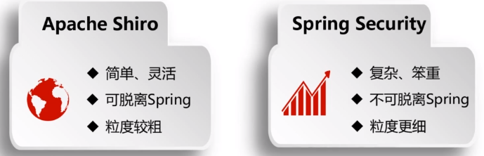
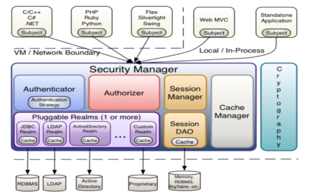
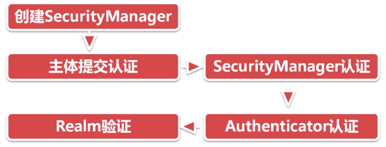
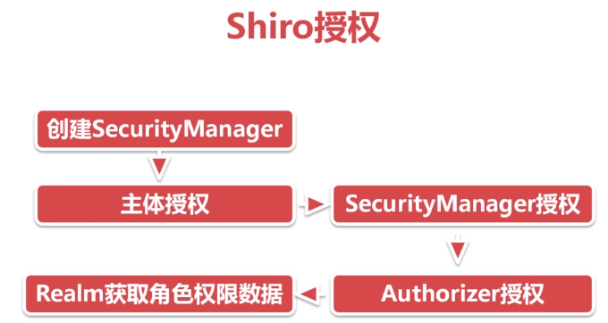
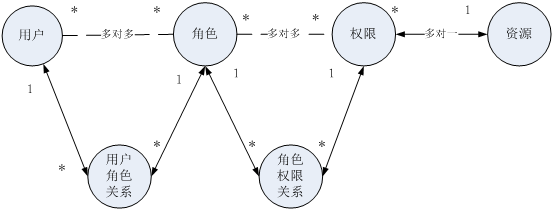

# Shiro

- 什么是 Shiro

  Shiro 是 apache 基金会旗下一个开源框架，它将软件系统的安全认证相关的功能抽取出来，实现用户身份认证，权限授权、加密、会话管理等功能，组成了一个通用的安全认证框架。使用 shiro 就可以非常快速的完成认证、授权等功能的开发，降低系统成本。

  Apache Shiro 是一个强大易用的 Java 安全框架，提供了认证、授权、加密和会话管理功能，可为任何应用提供安全保障。

- Shiro 与 Spring Security 比较

  

  > 严格说起来，Spring Security 功能比 Shiro 更丰富（因此也就更复杂），但是绝大多数使用场景中，用不到如此丰富/复杂的功能，因此有很多人认为 Spring Security “把简单的事情搞复杂了”，所以，Shiro 的市场使用率反而比 Spring Security 更高。

- 整体架构

  

  - 上面 Subject 是操作用户
  - 下面 Security Manager 是 Shiro 的核心
  - Authenticator 认证器，管理登录和登出
  - Authorizer 授权器赋予主体 Subject 有哪些权限
  - Session Manager 是 session 管理器
  - Session DAO 提供对 Session 的 crud 操作
  - Cache Manager 是缓存管理器
  - Realms 是 shiro 和数据库之间的桥梁，shiro 获取认证信息和权限数据就是通过 realms 获取
  - Cryptography是用于加密

- Shiro 认证过程

  

  先创建 SecurityManager 对象，然后主体会提交认证请求到SecurityManager，SecurityManager 使用 Authenticator 做认证，认证时要通过 Realm 获取认证数据做最终的认证。

- Shiro 授权过程

  

  先创建 SecurityManager 对象，然后主体会提交认证请求到SecurityManager，SecurityManager 使用 Authorizer 做授权，认证时要通过 Realm 获取认证数据做最终的认证。

---

基本上涉及到用户参与的系统都要进行权限管理，权限管理属于系统安全的范畴，权限管理实现对用户访问系统的控制，按照安全规则或者安全策略 **控制** 用户可以访问而且只能访问自己被 **授权** 的资源。

权限管理包括用户 **身份认证** 和 **授权** 两部分，简称认证授权。对于需要访问控制的资源用户首先经过身份认证，认证通过后用户具有该资源的访问权限方可访问。

如何管理/控制某个用户对某个资源的访问，有两种思路：基于角色的访问控制 和 基于资源访问控制 两种。其中基于角色的访问控制，控制粒度较粗，不容易扩展，使用较少。

  

通常企业开发中将资源和权限表合并为一张权限表。
