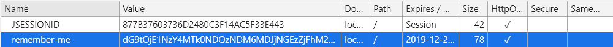

# 自动登陆

自动登陆是将用户的登陆信息保存在用户浏览器的 cookie 中，当用户下次访问时，自动实现校验并建立登陆状态的一种机制。

启用散列加密方案十分简单，在配置中多加一项配置即可:

```java
@Override
protected void configure(HttpSecurity http) throws Exception {
    ...

    http.rememberMe();
}
```

在登陆页面勾选 `Remember me on this computer.` 可选矿，按照正常的流程登陆，并在开发者工具中查看浏览器 cookie，可以看到除了 `JESESSIONID` 外，多了一个值：`remember-me` 。



remember-me 的值的由来：

```java
md5Hex(username + ":" + expirationTime + ":" + password + ":" + key)
```

这里的 key 指的就是盐。

在不配置的情况下，过期时间就是两个星期。默认值定义在了 *`AbstractRememberMeServices`* 中。

Spring Security 会在每次登陆成功之后更新此令牌。

<font color="red">**需要注意的是**</font>：在你没有指定盐值（key）的时候，它是一个 UUID 的字符串。这将导致每次重启服务后，key 都会重新生成，使得重启之前所有自动登陆 cookie 失效。此外，在多实例部署时，由于实例间生成的 key 值并不相同，所以当用户访问系统的另一个实例时，自动登陆策略就会失效。<font color="#0088dd">**合理的用法是指定 key** 。</font>

```java
http.rememberMe().key("hello world");
```

总的来说，这种方式不需要服务器花费空间来存储自动登陆的相关信息，实现简单，安全性较高。但存在潜在风险，级如果该令牌在有效期内被盗用，那么用户的身份将完全暴露。
