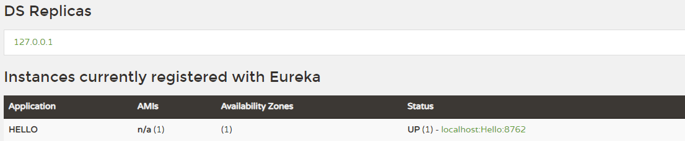

# 初识 Spring Cloud

## 什么是 Spring Cloud

Spring Cloud 是微服务架构思想的一个具体实现，它为开发人员提供了快速构建分布式系统中一些常见模式的工具（如，配置管理、服务发、断路器、智能路由、微代理、控制总线等）。

Spring Cloud 基于 Spring Boot 框架，它不重复造轮子，而是将第三方实现的微服务应用的一些模块集成进去。准确的说，Spring Cloud 是一个容器。

## 最简单的 Spring Cloud 项目

最简单的 Spring Cloud 微服务架构包括 <strong>服务发现</strong> 和 <strong>服务提供者</strong><small>（即，一个大型系统拆分出来的子模块）</small>，最极端的微服务可以做到一个方法就是一个服务，一个方法就是一个项目。

> <small>在一个系统中，服务怎么拆分，要具体问题具体分析，也取决于系统的并发性、高可用性等因素。</small>

首先是服务发现，这里我们采用 <strong>Eureka</strong>。

*`pom.xml`* 文件添加如下内容:

```xml
<parent>
    <groupId>org.springframework.boot</groupId>
    <artifactId>spring-boot-starter-parent</artifactId>
    <version>2.1.5.RELEASE</version>
    <relativePath/> <!-- lookup parent from repository -->
</parent>

...

<properties>
    <java.version>1.8</java.version>
    <spring-cloud.version>Greenwich.SR1</spring-cloud.version>
</properties>

<dependencies>
    <dependency>
        <groupId>org.springframework.boot</groupId>
        <artifactId>spring-boot-starter-web</artifactId>
    </dependency>
    <dependency>
        <groupId>org.springframework.cloud</groupId>
        <artifactId>spring-cloud-starter-netflix-eureka-server</artifactId>
    </dependency>
</dependencies>

<dependencyManagement>
    <dependencies>
        <dependency>
            <groupId>org.springframework.cloud</groupId>
            <artifactId>spring-cloud-dependencies</artifactId>
            <version>${spring-cloud.version}</version>
            <type>pom</type>
            <scope>import</scope>
        </dependency>
    </dependencies>
</dependencyManagement>

<build>
    <plugins>
        <plugin>
            <groupId>org.springframework.boot</groupId>
            <artifactId>spring-boot-maven-plugin</artifactId>
        </plugin>
    </plugins>
</build>
```

增加 *`application.properties`* 文件，添加如下内容:

```properties
spring.application.name=eureka-server
server.port=8761

eureka.server.enable-self-preservation=false

eureka.instance.preferIpAddress=true
eureka.instance.hostname=127.0.0.1
eureka.instance.instanceId=127.0.0.1:${server.port}

eureka.client.registerWithEureka=false
eureka.client.fetchRegistry=false
eureka.client.serviceUrl.defaultZone=http://127.0.0.1:${server.port}/eureka

logging.level.root=WARN
logging.level.xxx.yyy.zzz=DEBUG
logging.pattern.console=${CONSOLE_LOG_PATTERN:\
  %clr(${LOG_LEVEL_PATTERN:%5p}) \
  %clr(|){faint} \
  %clr(%-40.40logger{39}){cyan} \
  %clr(:){faint} %m%n\
  ${LOG_EXCEPTION_CONVERSION_WORD:%wEx}}
```

<small>以上配置暂不深究（后续详细讲解），先看整体运行效果。</small>

添加一个启动类 ***`RegistryApplication.java`***

```java
@SpringBootApplication
@EnableEurekaServer // 看这里
public class RegistryApplication {
    public static void main(String[] args) {
        SpringApplication.run(
            RegistryApplication.class, 
            args
        );
    }
}
```

然后再创建一个项目，实现 <strong>服务提供者</strong>，在 *`pom.xml`* 添加如下内容:

在 Spring Initializer 中引入两项依赖：

- `Web` > `Spring Web`
- `Spring Cloud Discovery` > `Eureka Discovery Client`

```xml
<parent>
    <groupId>org.springframework.boot</groupId>
    <artifactId>spring-boot-starter-parent</artifactId>
    <version>2.1.5.RELEASE</version>
    <relativePath/> <!-- lookup parent from repository -->
</parent>

<properties>
    <java.version>1.8</java.version>
    <spring-cloud.version>Greenwich.SR1</spring-cloud.version>
</properties>

<dependencies>
    <dependency>
        <groupId>org.springframework.boot</groupId>
        <artifactId>spring-boot-starter-web</artifactId>
    </dependency>
    <dependency>
        <groupId>org.springframework.cloud</groupId>
        <artifactId>spring-cloud-starter-netflix-eureka-client</artifactId>
    </dependency>
</dependencies>

<dependencyManagement>
    <dependencies>
        <dependency>
            <groupId>org.springframework.cloud</groupId>
            <artifactId>spring-cloud-dependencies</artifactId>
            <version>${spring-cloud.version}</version>
            <type>pom</type>
            <scope>import</scope>
        </dependency>
    </dependencies>
</dependencyManagement>

<build>
    <plugins>
        <plugin>
            <groupId>org.springframework.boot</groupId>
            <artifactId>spring-boot-maven-plugin</artifactId>
        </plugin>
    </plugins>
</build>
```

增加 *`application.properties`*，并增加如下内容:

```properties
spring.application.name=Hello
server.port=8762

eureka.client.serviceUrl.defaultZone=http://127.0.0.1:8761/eureka/

logging.level.root=WARN
logging.pattern.console=${CONSOLE_LOG_PATTERN:\
    %clr(${LOG_LEVEL_PATTERN:%5p}) \
    %clr(|){faint} \
    %clr(%-30logger{1}){cyan} \
    %clr(:){faint} %m%n\
    ${LOG_EXCEPTION_CONVERSION_WORD:%wEx}}
```

增加一个启动类:

```java
@SpringBootApplication
@EnableEurekaClient // 看这里
@RestController
public class EurekaProducer1Application {

    public static void main(String[] args) {
        SpringApplication.run(EurekaProducer1Application.class， args);
    }

    @Value("${server.port}")
    String port;

    @RequestMapping("/hello")
    public String home(String name) {
        return "hi " + name + ", i am from port:" + port;
    }
}
```

这时，分别启动服务发现和服务提供者，浏览器输入: [http://localhost:8761](http://localhost:8761)，即服务发现的地址:



可以发现,服务提供者 Hello 已经注册到服务发现中了,然后我们请求 hello 接口地址: [http://localhost:8762/hello?name=tom](http://localhost:8762/hello?name=tom)，即可以看到下面返回数据:

```
hi tom, i am from port: 8762 
```

以上只是 Spring Cloud 的入门实例，是为了给大家展示什么是 Spring Cloud 。
