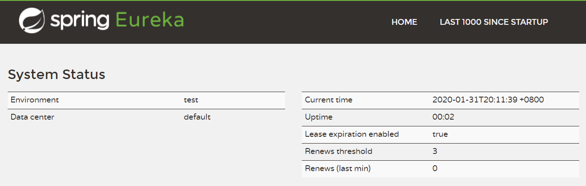
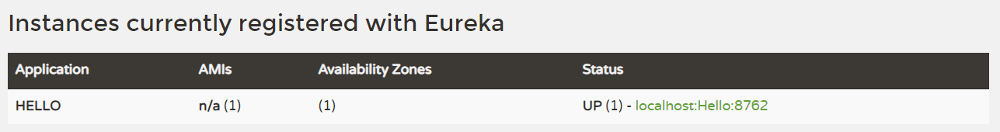

# 服务注册与发现（Eureka）

Spring Cloud Netflix 的 <strong>Eureka</strong> 组件是服务于发现模块。

服务注册与发现模块分为 <strong>服务注册中心</strong> 和 <strong>服务提供者</strong> 。

> &nbsp;&nbsp;&nbsp;&nbsp;&nbsp;&nbsp;&nbsp;&nbsp;Eureka 就好比是滴滴，负责管理、记录服务提供者的信息。服务调用者无需自己寻找服务，而是把自己的需求告诉 Eureka，然后 Eureka 会把符合你需求的服务告诉你。
> 
> &nbsp;&nbsp;&nbsp;&nbsp;&nbsp;&nbsp;&nbsp;&nbsp;同时，服务提供方与 Eureka 之间通过 `心跳` 机制进行监控，当某个服务提供方出现问题，Eureka 自然会把它从服务列表中剔除。
> 
> &nbsp;&nbsp;&nbsp;&nbsp;&nbsp;&nbsp;&nbsp;&nbsp;这就实现了服务的自动注册、发现、状态监控。


- 基本架构：

  


## 服务注册中心（Registry Center）

首先，创建一个 Maven 工程，工程的 *`pom.xml`* 添加如下内容：

```xml
<parent>
    <groupId>org.springframework.boot</groupId>
    <artifactId>spring-boot-starter-parent</artifactId>
    <version>2.1.5.RELEASE</version>
    <relativePath/> <!-- lookup parent from repository -->
</parent>

...

<properties>
    <java.version>1.8</java.version>
    <spring-cloud.version>Greenwich.SR1</spring-cloud.version>
</properties>

<dependencies>
    <dependency>
        <groupId>org.springframework.boot</groupId>
        <artifactId>spring-boot-starter-web</artifactId>
    </dependency>
    <dependency>
        <groupId>org.springframework.cloud</groupId>
        <artifactId>spring-cloud-starter-netflix-eureka-server</artifactId>
    </dependency>
</dependencies>

<dependencyManagement>
    <dependencies>
        <dependency>
            <groupId>org.springframework.cloud</groupId>
            <artifactId>spring-cloud-dependencies</artifactId>
            <version>${spring-cloud.version}</version>
            <type>pom</type>
            <scope>import</scope>
        </dependency>
    </dependencies>
</dependencyManagement>

<build>
    <plugins>
        <plugin>
            <groupId>org.springframework.boot</groupId>
            <artifactId>spring-boot-maven-plugin</artifactId>
        </plugin>
    </plugins>
</build>
```

创建启动类 ***`RegistryApplication.java`***：

```java
@SpringBootApplication
@EnableEurekaServer // 看这里
public class RegistryApplication {
    public static void main(String[] args) {
        SpringApplication.run(
            RegistryApplication.class, 
            args);
    }
}
```

这里，我们注意到除了前面提到的 **`@SpringBootApplication`** 外，这个类还增加了一个注解：**`@EnableEurekaServer`**，这个注解的作用就是标注该应用程序是一个注册中心，只是添加这个注解还不够，还需要增加配置。

在 *`resources`* 下面创建 *`application.properties`* 并添加如下内容：

```properties
server.port=8761
spring.application.name=eureka-server

eureka.server.enable-self-preservation=false
eureka.instance.preferIpAddress=true
eureka.instance.hostname=127.0.0.1
eureka.instance.instanceId=127.0.0.1:${server.port}
eureka.client.registerWithEureka=false
eureka.client.fetchRegistry=false
eureka.client.serviceUrl.defaultZone=http://127.0.0.1:${server.port}/eureka

logging.level.root=WARN
logging.level.xxx.yyy.zzz=DEBUG
logging.pattern.console=${CONSOLE_LOG_PATTERN:\
    %clr(${LOG_LEVEL_PATTERN:%5p}) \
    %clr(|){faint} \
    %clr(%-30logger{1}){cyan} \
    %clr(:){faint} %m%n\
    ${LOG_EXCEPTION_CONVERSION_WORD:%wEx}}
```

启动该应用程序，打开浏览器并访问: [http://localhost:8761](http://localhost:8761)。如果看到如下界面，说明注册中心已经启动起来了:



下面说明一下注册中心各个配置项的含义:

<dl>
    <dt><big>eureka.server.enable-self-preservation</big></dt>
    <dd>是否开启自我保护，默认为 true，在开启自我保护的情况下，注册中心在丢失客户端时，会进入自动保护模式，注册中心并不会将该服务从注册中心删除掉。</dd>
    <dd>这里设置为 false，即关闭自我保护。 </dd>
    <dd>根据经验，如果设置为 true，在负载均衡条件下，一个服务挂掉后，注册中心并没有删掉该服务，会导致客户端请求的时候可能会请求到该服务，导致系统无法访问，所以推荐将这个属性设置为 false。</dd>
</dl>
<dl>
    <dt><big>eureka.instance.preferIpAddress</big></dt>
    <dd>是否以 IP 注册到注册中心，Eureka 默认是以 hostname 来注册的。</dd>
</dl>
<dl>
    <dt><big>client.serviceUrl.defaultZone</big></dt>
    <dd>注册中心默认地址。</dd>
</dl>

建议按照以上的配置项写就行了。

## 服务提供者（Service Producer）

我们有了注册中心，那么就可以创建一个服务提供者（即客户端）注册到注册中心去了。

同样地，按照注册中心的创建方式，创建一个项目，并且在 *`pom.xml`* 添加如下内容:

```xml
<parent>
    <groupId>org.springframework.boot</groupId>
    <artifactId>spring-boot-starter-parent</artifactId>
    <version>2.1.5.RELEASE</version>
    <relativePath/> <!-- lookup parent from repository -->
</parent>

<properties>
    <java.version>1.8</java.version>
    <spring-cloud.version>Greenwich.SR1</spring-cloud.version>
</properties>

<dependencies>
    <dependency>
        <groupId>org.springframework.boot</groupId>
        <artifactId>spring-boot-starter-web</artifactId>
    </dependency>
    <dependency>
        <groupId>org.springframework.cloud</groupId>
        <artifactId>spring-cloud-starter-netflix-eureka-client</artifactId>
    </dependency>
</dependencies>

<dependencyManagement>
    <dependencies>
        <dependency>
            <groupId>org.springframework.cloud</groupId>
            <artifactId>spring-cloud-dependencies</artifactId>
            <version>${spring-cloud.version}</version>
            <type>pom</type>
            <scope>import</scope>
        </dependency>
    </dependencies>
</dependencyManagement>

<build>
    <plugins>
        <plugin>
            <groupId>org.springframework.boot</groupId>
            <artifactId>spring-boot-maven-plugin</artifactId>
        </plugin>
    </plugins>
</build>
```

然后创建 ***`EurekaProducer1Application.java`***：

```java
@SpringBootApplication
@EnableEurekaClient
@RestController
public class EurekaProducer1Application {

    public static void main(String[] args) {
        SpringApplication.run(EurekaProducer1Application.class, args);
    }

    @Value("${server.port}")
    String port;

    @RequestMapping("/hello")
    public String home(String name) {
        return "hi " + name + ", i am from port:" + port;
    }
}
```

这里用到了一个注解：***`@EnableEurekaClient`***，标注了此注解，说明该项目是一个服务提供者。

然后创建配置文件 *`application.properties`* :

```properties
server.port=8762
spring.application.name=eurekaclient
eureka.client.serviceUrl.defaultZone=http://127.0.0.1:8761/eureka/


logging.level.root=WARN
logging.level.xxx.yyy.zzz=DEBUG
logging.pattern.console=${CONSOLE_LOG_PATTERN:\
    %clr(${LOG_LEVEL_PATTERN:%5p}) \
    %clr(|){faint} \
    %clr(%-30logger{1}){cyan} \
    %clr(:){faint} %m%n\
    ${LOG_EXCEPTION_CONVERSION_WORD:%wEx}}
```

其中，*`spring.application.name`* 为该服务的名字，*`eureka.client.serviceUrl.defaultZone`* 的作用是指定注册中心的地址。

然后启动该工程，重新访问：[http://localhost:8761](http://localhost:8761)，即可看到如下界面:



我们可以看到，刚刚创建的服务提供者 eurekaclient 已经被注册到注册中心了。

以上就是本文关于 Eureka 服务注册与发现的全部内容<small>（仅仅只学习上面的知识还远远不够）</small>。
