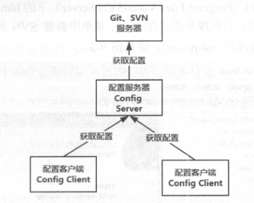

# 配置中心（Spring Cloud Config）

在实际使用场景中，集群中会存在多个服务（Service），而每个服务又有可能存在多个实例（Instance）。如果每一个微服务都是靠自己的 ***`application.properties`*** 或 ***`application.yml`*** 进行配置，那么整个项目的配置就会繁琐为混乱。

> <small>例如，多个 Service Producer 使用的是用一个数据库。理论上，可以在各个项目中配置数据库连接相关配置。但是，如果一旦有变动，如数据库所在主机的 IP 变动了，那么你需要改很多处地方，而且还必须确保无一遗漏。</small>

因此 SpringCloud 为我们集成了『配置中心』：***`spring-cloud-config`*** 组件。

Spring Cloud Config 是一个高可用的分布式配置中心，专门用于管理系统的所有配置，也就是我们将所有配置文件放到统一的地方进行管理。。它支持将配置存放到 Git 仓库进行统一管理。

Config Server 的主要功能：

- 提供访问配置的服务接口

Config Client 的主要功能：

- 绑定 Config Server，使用远程的属性来初始化自己。

- 属性改变时，对它们重新加载。

## Config Server

在 spring starter 中引入：

- `Web` > `Spring Web`
- `Spring Cloud Config` > `Config Server` 

实现原理：

我们都知道当 Spring Boot 的程序启动时，会加载 classpath 下的 ***`application`*** 配置文件的属性用于初始化 Spring 容器。其实，在此之前，Spring Boot 会加载一个名为 ***`bootstrap`*** 的配置文件。如果两个配置文件都存在，且存在 key 相同的配置，则 ***`application`*** 的配置会覆盖 ***`bootstrap`*** 的配置。

Spring Config Client 就是利用加载 ***`bootstrap`*** 这个阶段去外部（即，Spring Config Server）读取外部的属性，而又『故意』在 ***`applicaiton`*** 阶段缺省这些配置，从而达到统一配置的效果。

## Config Client

1. /{name}-{profile}.yml
2. /{label}-{name}-{profile}.yml

『』

