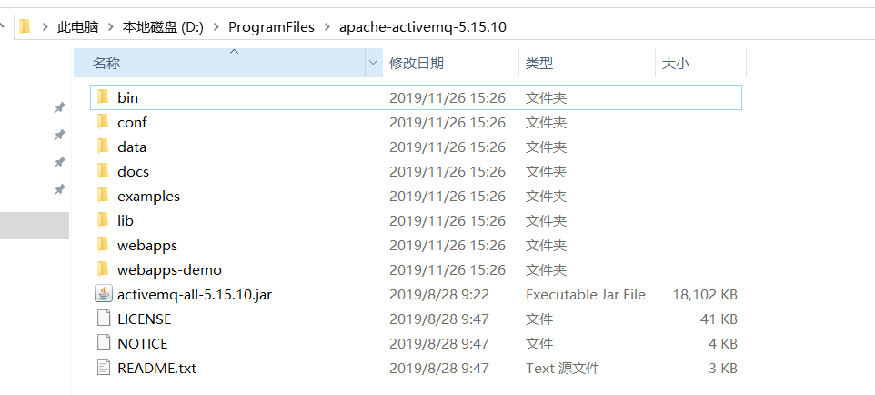
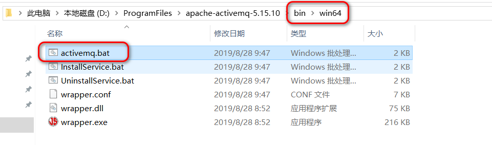
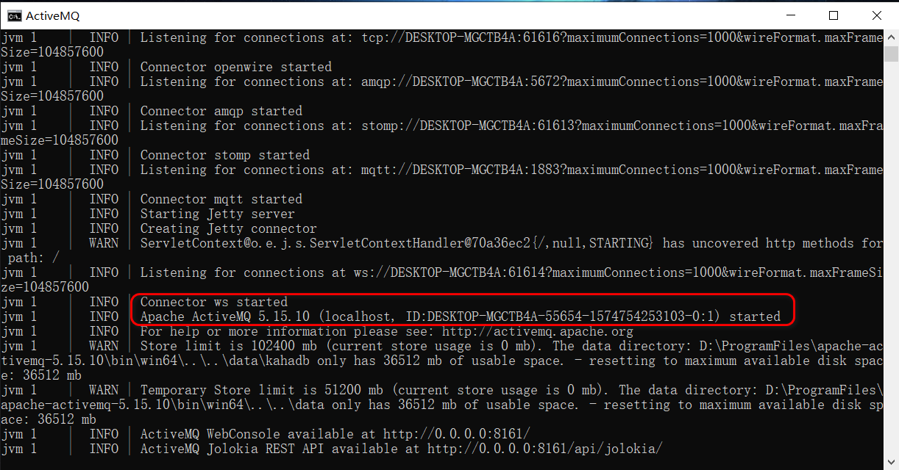
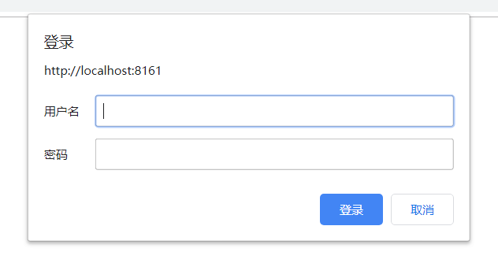
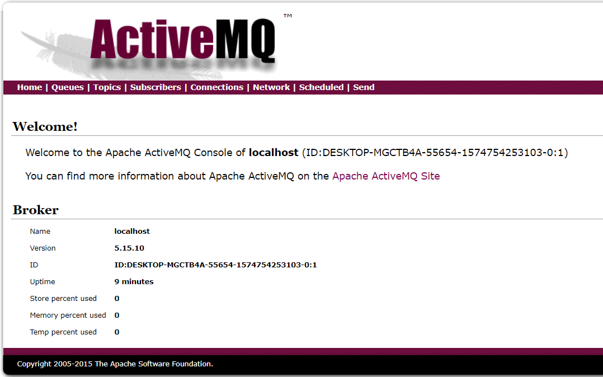

# ActiveMQ 解压版的安装（Windows）

## 前言

有些软件对于安装路径有一定的要求，例如：路径中不能有空格，不能有中英文，不能有特殊符号，等等。

为了避免不必要的麻烦，也懒得一一辨别踩坑，我们认为作出约定：

- 安装版的软件，一律安装在 Windows 系统自带的目录：`C:\Program Files` 目录下。<small>注意，不是那个带`(x86)`的目录。</small>
- 解压版的软件，一律安装在：`D:\ProgramFiles`。<small>注意，这里我们故意去掉了两个单词间的空格。</small>

## ActiveMQ 在 windows 环境下的安装启动

### step 1：下载

当前 ActiveMQ 最新版本<small>（5.15.0）</small>下载地址：[http://activemq.apache.org/components/classic/download/](http://activemq.apache.org/components/classic/download/)

### step 2：解压

解压后，得到如此的目录：



### step 3：启动

根据自己的操作系统，选择进入与操作系统对应的那个文件夹，双击 `activemq.bat`，activemq 就启动了。

如果黑色窗口一闪而过，那么就是 jdk 的环境变量没有配置的原因。



### step 4：查看启动日志



### step 5：浏览器登陆后台页面

打开浏览器访问 [http://localhost:8161/admin/](http://localhost:8161/admin/)，会弹出登录窗口



用户名和密码在 `D:\ProgramFiles\apache-activemq-5.15.10\conf\jetty-realm.properties`，默认值如下：

```
admin: admin, admin
user: user, user
```

可修改，或添加。

登录成功后，进入 activeMQ 的欢迎页


