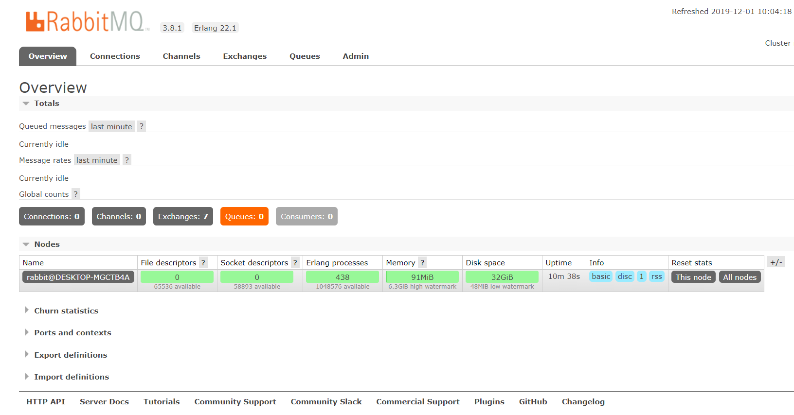

<span class="title">RabbitMQ 安装</span>

# 安装 Erlang

由于 RabbitMQ 是用 Erlang 语言编写的，因此需要先安装 Erlang 。

1. 通过 [*http://www.erlang.org/downloads*](http://www.erlang.org/downloads) 获取对应安装文件进行安装。安装到默认路径。

2. 增加环境变量 *`ERLANG_HOME=C:\Program Files\erl10.5`*<small>（这里的目录是我的安装目录，你要换成自己的目录）</small>

3. 修改环境变量 Path，在原来的值后面加上 *`;%ERLANG_HOME%\bin`*


# 安装 RabbitMQ

下载 RabbitMQ ，当前<small>（2019-12-1）</small>最新版本是 [3.8.1](https://github.com/rabbitmq/rabbitmq-server/releases/download/v3.8.1/rabbitmq-server-windows-3.8.1.zip) 。

解压到 *`D:\ProgramFiles\`* 目录下。<small>（这是我的解压目录。各人根据各自情况可调整，或创建此目录和我保持一致）。</small>

双击 *`sbin\rabbitmq-server.bat`*，启动 RabbitMQ Server，会看到类似如下信息：

```
...

Starting broker... completed with 0 plugins.
```

# 启动管理页面

我们可以通过 Web 进行管理 RabbitMQ 。

在命令行上运行 RabbitMQ 解压/安装目录下的 *`sbin`* 目录下的 *`rabbitmq-plugins.bat`* 命令。<strong>由于执行该命令需要附带参数，因此不能靠双击运行。</strong>

```sh
> rabbitmq-plugins.bat enable rabbitmq_management
```

会看到类似如下内容:

```
Enabling plugins on node xxx:
...

started 3 plugins.
```

通过浏览器访问 [*http://localhost:15672*](http://localhost:15672)，并通过默认用户 *`guest`* 进行登录，密码也是 *`guest`*，登录后的页面：



比如 channels / exchanges / queues 等，可以逐个点进去看下详细情况。

<small>如果要添加新用户的话，点击 Admin 选项卡，进行添加。</small>
